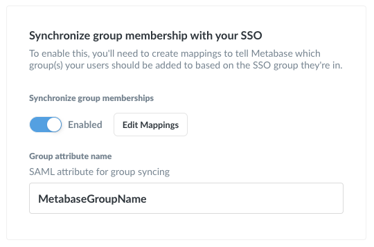

## Authenticating with SAML

The open source edition of Metabase includes the option to set up single sign-on (SSO) with [Google Sign-in or LDAP](../administration-guide/10-single-sign-on.md), but the Enterprise edition of Metabase additionally lets you connect your SAML- or JWT-based SSO. Integrating your SSO with Metabase allows you to:

- automatically pass user attributes from your SSO to Metabase in order to power data sandboxes
- let your users access Metabase without re-authenticating.

There are slightly different steps to take depending on whether your SSO solution uses SAML or JWT. We'll cover SAML first.

> **Tip:** Before beginning your SAML set-up, make sure you know the password for your Metabase admin account. If anything becomes misconfigured during the set-up process, an "Admin backup login" option on the sign-in screen is available.

### Turning on SAML-based SSO

To get started, head over to the Settings section of the Admin Panel, then click on the Authentication tab. Click the `Configure` button in the SAML section of the Authentication page, and you'll see this form:


At the top, **make sure to click the toggle to enable SAML authentication**, otherwise things won't work even if all of your settings are right.

The form itself is broken up into three parts: information about Metabase that you'll have to input into your identity provider (IdP); information about your IdP that you'll need to tell Metabase about; and some optional settings at the bottom.

**Note:** If you change any of the settings of an existing SAML active setup, then you will need to restart Metabase for them to take effect.

### Setting up SAML with your IdP

So, first you'll need to make sure things are configured correctly with your IdP. Each provider handles SAML setup differently, so here are some documentation links that may help:

- [Okta](https://developer.okta.com/docs/guides/saml-application-setup/overview/)
- [Auth0](https://auth0.com/docs/protocols/saml/saml-idp-generic)
- [OneLogin](https://onelogin.service-now.com/support?id=kb_article&sys_id=83f71bc3db1e9f0024c780c74b961970)

The top portion of the form in Metabase has some of the information you'll need, with buttons to make copying the information easy.

**URL the IdP should redirect back to:** this is called something different in each IdP. Okta calls it "Single Sign On URL," Auth0 calls it the "Application Callback URL," and OneLogin calls it the "ACS (Consumer) URL." This is the URL that your IdP should redirect users back to after they authenticate, and it needs to be the URL where Metabase is hosted, with `/auth/sso` at the end.

**SAML attributes:** Metabase will automatically log in users authenticated with your SAML
identity provider, but in order to do so the SAML assertion _must_
contain attributes for each user's first name, last name, and email. The assertion should look something like the following:

```
<saml2:Assertion
    xmlns:saml2="urn:oasis:names:tc:SAML:2.0:assertion" ID="id4170618837332381492734749" IssueInstant="2019-03-27T17:56:11.067Z" Version="2.0">
    <saml2:Issuer Format="urn:oasis:names:tc:SAML:2.0:nameid-format:entity">http://www.okta.com/Issuer</saml2:Issuer>
    <saml2:Subject>
        <saml2:NameID Format="urn:oasis:names:tc:SAML:1.1:nameid-format:emailAddress">userName</saml2:NameID>
        <saml2:SubjectConfirmation Method="urn:oasis:names:tc:SAML:2.0:cm:bearer">
            <saml2:SubjectConfirmationData NotOnOrAfter="2019-03-27T18:01:11.246Z" Recipient="https://metabase.mycompany.com/auth/sso"/>
        </saml2:SubjectConfirmation>
    </saml2:Subject>
    <saml2:Conditions NotBefore="2019-03-27T17:51:11.246Z" NotOnOrAfter="2019-03-27T18:01:11.246Z">
        <saml2:AudienceRestriction>
            <saml2:Audience>my-metabase-app</saml2:Audience>
        </saml2:AudienceRestriction>
    </saml2:Conditions>
    <saml2:AuthnStatement AuthnInstant="2019-03-27T17:56:11.067Z">
        <saml2:AuthnContext>
            <saml2:AuthnContextClassRef>urn:oasis:names:tc:SAML:2.0:ac:classes:PasswordProtectedTransport</saml2:AuthnContextClassRef>
        </saml2:AuthnContext>
    </saml2:AuthnStatement>
    <saml2:AttributeStatement>
        <saml2:Attribute Name="http://schemas.xmlsoap.org/ws/2005/05/identity/claims/givenname" NameFormat="urn:oasis:names:tc:SAML:2.0:attrname-format:uri">
            <saml2:AttributeValue xmlns:xs="http://www.w3.org/2001/XMLSchema" xmlns:xsi="http://www.w3.org/2001/XMLSchema-instance" xsi:type="xs:string">
              Cam
            </saml2:AttributeValue>
        </saml2:Attribute>
        <saml2:Attribute Name="http://schemas.xmlsoap.org/ws/2005/05/identity/claims/surname" NameFormat="urn:oasis:names:tc:SAML:2.0:attrname-format:uri">
            <saml2:AttributeValue xmlns:xs="http://www.w3.org/2001/XMLSchema" xmlns:xsi="http://www.w3.org/2001/XMLSchema-instance" xsi:type="xs:string">
              Saul
            </saml2:AttributeValue>
        </saml2:Attribute>
        <saml2:Attribute Name="http://schemas.xmlsoap.org/ws/2005/05/identity/claims/emailaddress" NameFormat="urn:oasis:names:tc:SAML:2.0:attrname-format:uri">
            <saml2:AttributeValue xmlns:xs="http://www.w3.org/2001/XMLSchema" xmlns:xsi="http://www.w3.org/2001/XMLSchema-instance" xsi:type="xs:string">
              cam@metabse.com
            </saml2:AttributeValue>
        </saml2:Attribute>
    </saml2:AttributeStatement>
</saml2:Assertion>
```

Most SAML identity providers we've used already include these assertions by default, but some (such as Okta) must be configured to include them. Here's an example of what your assertions configuration should look like in Okta. (You can find this page by going to Admin > Applications > Metabase > General > SAML Settings > Edit).


You can use other attribute names for these attributes if so desired; see the section below. The important thing is that first name (given name), last name (surname), and email address are included as attributes of the first assertion returned in the identity provider's SAML response.

We've pulled the attributes out of the XML above for easy copy/pasting into your SAML identity provider. We've found that generally you need to paste this into a field labelled "Name," but the location of the field may vary depending on the provider. Look for it in a section labeled "Attributes" or "Parameters."

| Name                                                                 | Value          |
| -------------------------------------------------------------------- | -------------- |
| `http://schemas.xmlsoap.org/ws/2005/05/identity/claims/givenname`    | user.firstName |
| `http://schemas.xmlsoap.org/ws/2005/05/identity/claims/emailaddress` | user.email     |
| `http://schemas.xmlsoap.org/ws/2005/05/identity/claims/surname`      | user.lastName  |

**Important note:** the email address _attribute_ is used to log in an end-user into a corresponding Metabase account (creating it if needed). So it's extremely critical that this email address **must not be editable** by end-users themselves. Otherwise they could potentially access Metabase accounts other than their own by changing their email address.

That should be all the info you'll need to get from Metabase while setting up SAML in your IdP, but keep your IdP open for the next step — you'll need to get some information there to put into Metabase now.

##### ACS URL

Your SAML provider may ask for an "ACS URL". This the URL that your SAML provider will redirect your users to after they authenticate. The ACS URL for Metabase is the base URL of where you are hosting Metabase plus "/auth/sso". For example, if you are hosting your Metabase at "https://metabase.mycompany.com" then the ACS URL would be "https://metabase.mycompany.com/auth/sso".

#### Settings for signing SSO requests (optional)

These are additional settings you can fill in to sign SSO requests to
ensure they don’t get tampered with.

### Enabling SAML authentication in Metabase

Metabase will now need to know some things about your IdP. Here's a breakdown of each of the settings:

**SAML Identity Provider URL:** This is where Metabase will redirect login requests. That is, it's where your users go to log in to your SSO. Your IdP may label it a little differently. Here are some of the names we've found:

| Provider | Name                                 |
| -------- | ------------------------------------ |
| Auth0    | Identity Provider Login URL          |
| Okta     | Identity Provider Single-Sign On URL |
| OneLogin | Issuer URL                           |

**SAML Identity Provider Certificate:** This is an encoded certificate that Metabase will use when connecting to the IdP URI. This will look like a big blob of text that you'll want to copy and paste carefully — the spacing is important! Your IdP might have you download this certificate as a file, which you'll then need to open up in a text editor in order to copy the contents to then paste into the box in Metabase. Again, different providers may have slightly different labels for this:

| Provider | Name                |
| -------- | ------------------- |
| Auth0    | Signing Certificate |
| Okta     | X.509 Certificate   |
| OneLogin | X.509 Certificate   |

### Settings for signing SSO requests (optional)

These are additional settings you can fill in to sign SSO requests to ensure they don’t get tampered with. In addition, if your IdP encrypts SAML responses, you'll need to ensure this section is filled out.

_Important note:_ If you change any of these settings, either during initial setup or after editing an existing value, you will need to restart Metabase due to the way the keystore file is read.

**SAML keystore path:** the absolute path to the keystore file to use for signing SAML requests.

**SAML keystore password:** if it wasn't already self-evident, this is just the password for opening the keystore.

**SAML keystore alias:** the alias for the key that Metabase should use for signing SAML requests.

### Synchronizing group membership with your IdP

This setting allows you to assign users to Metabase groups based on an attribute of your users in your IdP. Please note that this may not correlate to group functionality provided by your IdP — you may need to create a separate attribute on your users to set their Metabase group, like `metabaseGroups`.

#### Configuring the group schema in your IdP

First, you will need to create a user attribute that you will use to indicate which Metabase groups the user should be a part of. Different IdPs have different ways of handling this, but you will likely need to edit your user profiles. For the rest of this example, let's say that you named your attribute `metabaseGroups`.

Once you've created your `metabaseGroups` attribute, you will need to update it for each user you would like to be automatically added to a Metabase group. For ease of use, we recommend using the same name for the groups you would use in Metabase.

After that, you will need to add an additional SAML attribute to the ones we added above. The screenshot below is for Okta, but may vary depending on your SAML provider.


#### Configuring the group schema in Metabase

Once you've gotten everything set up in your SAML provider, there are just a few simple steps on the Metabase side.

To start, make sure the toggle to synchronize group memberships is set to "Enabled." Then, click Edit Mappings > Create a Mapping. Enter in the name of one of the groups you entered as your `metabaseGroups` attribute values, then click the Add button. Next click the dropdown that appears under the `Groups` heading to select the Metabase group(s) that users with this particular `metabaseGroups` value should be added to. Then click Save.

After that, type in the name of the user attribute you added in your SAML provider. In this case, we told Okta that the `metabaseGroups` attribute should be named `MetabaseGroupName`, so that's what we'll enter in the Group Attribute Name field in Metabase.



### Troubleshooting Tips

Here are a few things to double check if you're experiencing issues setting up your SAML connection:

- Verify that the application you created in your IdP supports SAML. Sometimes other options are presented during the app creation process.
- Read all field labels and tooltips carefully. Since SAML providers each use different labeling for their fields, it's important to make sure the correct information is being placed into the correct fields.
- Set your attributes and check your assertions! Many SAML providers make this pretty easy to do - just look for a button marked "Preview the SAML assertion."
- Verify that the Single Sign On URL (or equivalent) that you enter on your SAML provider's website has `/auth/sso` appended to it. For instance, if you want your users to end up at `https://metabase.mycompany.com`, the full URL should be `https://metabase.mycompany.com/auth/sso`

### Disabling password log-in

Once you have configured SAML authentication, you can choose to disable the option for users to log in via email and password. To do this, return to the main Authentication settings page and scroll to the bottom. A toggle will now be visible allowing you to disable password authentication.


### New user notification emails

When users log in to Metabase for the first time via SSO, this will automatically create a Metabase account for them, which will trigger an email notification to Metabase administrators. If you don't want these notifications to be sent, you can turn this toggle off at the bottom of the Authentication page.

---

## Next: JWT-based SSO

If SAML isn’t your bag, find out how to enable [JWT-based SSO](authenticating-with-jwt.md).
