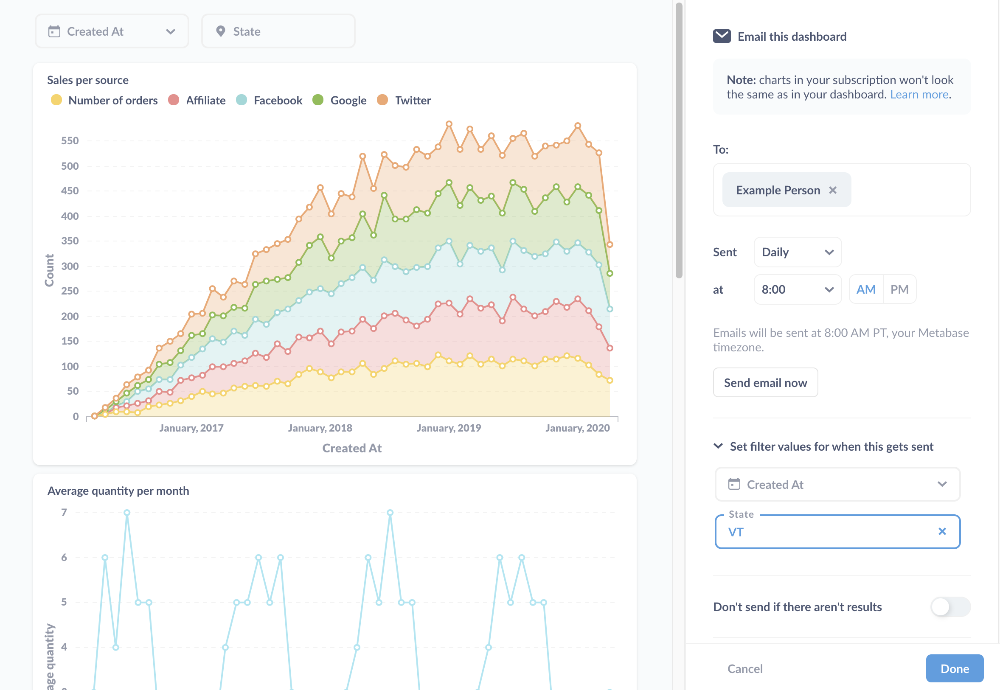

## Customize filter values for each dashboard subscription

This page covers the Enterprise Edition features for [dashboard subscriptions](../users-guide/dashboard-subscriptions.md).

The Enterprise Edition lets you customize which filter values to apply to each subscription. That way you can send different groups of people an email (or Slack message) the contents of the dashboard with different filters applied. You only need to maintain one dashboard, which you can use to send results relevant to each subscriber.

### Setting filter values

You can set values for each filter on the dashboard. If you have any dashboard filters with default values, you can override those defaults for a given subscription, or leave them as-is.

Here's the sidebar in Enterprise Edition where you can set the filter values:

The section to call out here is the **Set filter values for when this gets sent**. Here we've set "VT" as the value for the dashboard's State filter to scope results to records from Vermont. We didn't set a value for the Created_At filter, so the subscription will send the results without a filter applied. If you've set a default value for the filter, the subscription will list the value here.

