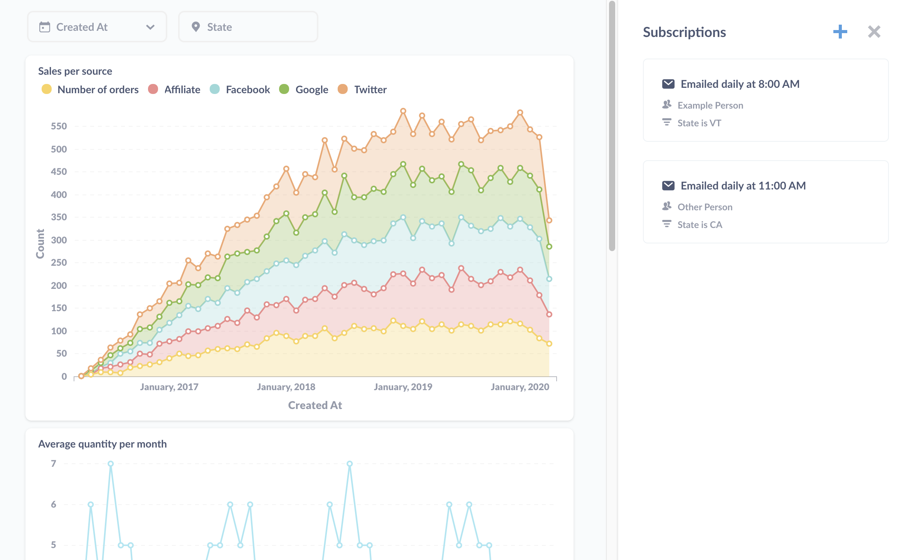

## Customize filter values for each dashboard subscription

This page covers the Enterprise Edition features for dashboard subscriptions. Our User's Guide can give you an introduction to [dashboard subscriptions](../users-guide/dashboard-subscriptions). 

Enterprise Edition lets you set up multiple subscriptions for a single dashboard, and lets you customize which filter values to apply to each subscription. That way you can send one group of people an email (or Slack message) the contents of the dashboard with one filter value applied, and set up another subscription to send the dashboard's contents with a different filter applied. You only need to maintain one dashboard, and you can set up different subscriptions to give different groups of people the info they need. 

### Adding a subscription

To add a subscription, click on the **+** icon in the dashboard subscription panel.

Here we have one dashboard with two subscriptions set up: the first subscription sent to Example Person with "VT" as the value for the State Filter, and the second sent to Other Person with "CA" as the State filter value. Both subscriptions lack a value to apply to the Created_At filter.

### Setting filter values

You can set values for each filter on the dashboard. Any values you set for the subscription will override the dashboard's default filter values. If you don't set a filter value for the subscription, the dashboard will run with the default filter values applied, if any are set.

Here's the sidebar in Enterprise Edition where you can set the filter values:

The section to call out here is the **Set filter values for when this gets sent**. Here we've set "VT" as the value for the dashboard's State filter to scope results to records from Vermont. We didn't set a value for the Created_At filter, so the subscription will send the results with the default value.

### Deleting a subscription

To remove a subscription from a dashboard, select the subscription you'd like to remove. At the bottom of the sidebar, select **Delete this subscription**. Follow the instructions on the modal that pops up to confirm you'd like to delete the subscription.