## Sandboxing your data

Data sandboxes are a powerful and flexible permissions tool in Metabase Enterprise Edition that allow you to grant filtered access to specific tables.

Say you have users who you want to be able to log into your Metabase instance, but who should only be able to view data that pertains to them. For example, you might have some customers or partners who you want to let view your Orders table, but you only want them to see their orders. Sandboxes let you do just that.

The way they work is that you first pick a table that you want to sandbox for users in a certain group, then customize how exactly you want to filter that table for those users. For this to work in most cases you’ll first need to add attributes to your users, manually or via SSO, so that Metabase will know how to filter things for them specifically.

### Getting user attributes

For Metabase to be able to automatically filter tables based on who's viewing them, your users will need to have distinct attributes associated with their accounts to differentiate them — something like `User_ID`. We'll then use these attributes as the basis for filtering the tables you choose. There are two ways to add these attributes to your users:

1. If you've already [connected your SSO](authenticating-with-saml.md) to Metabase, any user attributes you set there can be automatically passed to Metabase.
2. You can also add attributes manually to a user by going to the People section of the Admin Panel, and clicking on the “…” menu on the far right of a user’s name in the table you’ll see there. Click on Edit Details from that menu to add and edit a user’s attributes.

Now that your users have attributes, you’ll be able to sandbox tables, and automatically filter them based on these user attributes.

### Filtering a sandboxed table

Metabase gives you two options for filtering a sandboxed table:

#### Option 1: filter using a column in the table

The simplest way to filter a sandboxed table is to pick a column in the sandboxed table and match it up with a user attribute so that any time a user with sandboxed access to this table views it, they’ll only see rows in the table where that column’s value is equal to the value that user has for that attribute.

#### Option 2: create a custom view of the table with a saved question

Metabase also gives you the option of creating a custom view for a sandboxed table using a saved question.  For example, you might have columns in your Orders table that you don’t want any of your users to see. You can create a SQL-based saved question that only returns the columns you want users to see. For even more surgical access controls, you can map variables in a SQL question to user attributes in order to customize the view for that user. For example, if you only want users to see _their_ order data, you could map a variable in the `where` clause of the filtering saved question to one of their user attributes, like `where orders.user_id = {{user_id_attr_var}}`, and the user would only have access to order information related to that user ID.

### An example setup

That was a mouthful, so here’s an example. (The example happens to use a group called "Customers" but this works the same whether you're doing this for internal or external folks.) We’ll sandbox our Orders table so that any user in our Customers group will only be able to see rows in the Orders table where the `User ID` column matches the user’s `user_id` attribute.

First we’ve made sure our example user has an attribute that we’ll be able to use in our filter:

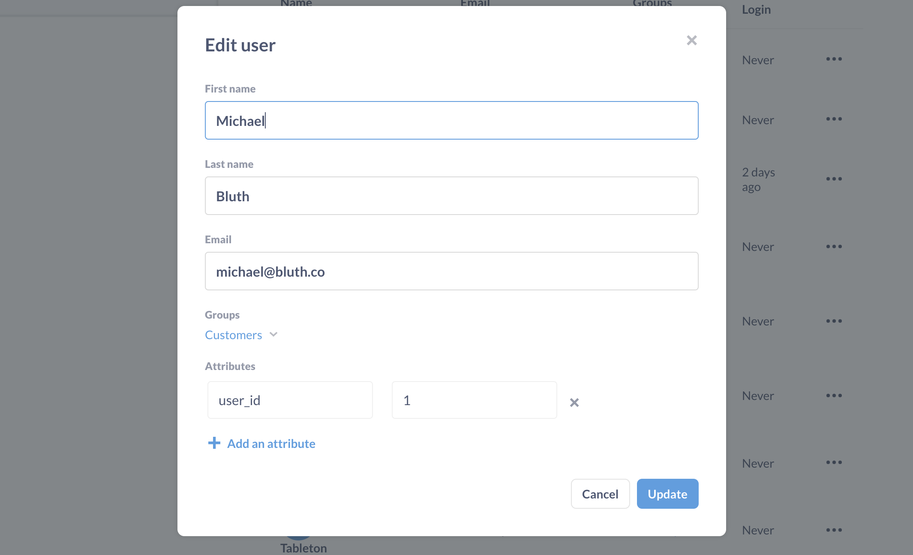

Then we’ll head over to the Permissions section of the Admin Panel, and we’ll click on View Tables next to the Sample Dataset to see the permissions our user groups have for the tables in this database. We want to give the Customers group sandboxed access to the Orders table, so we’ll click on that box in the permissions grid and choose “Grant sandboxed access:”

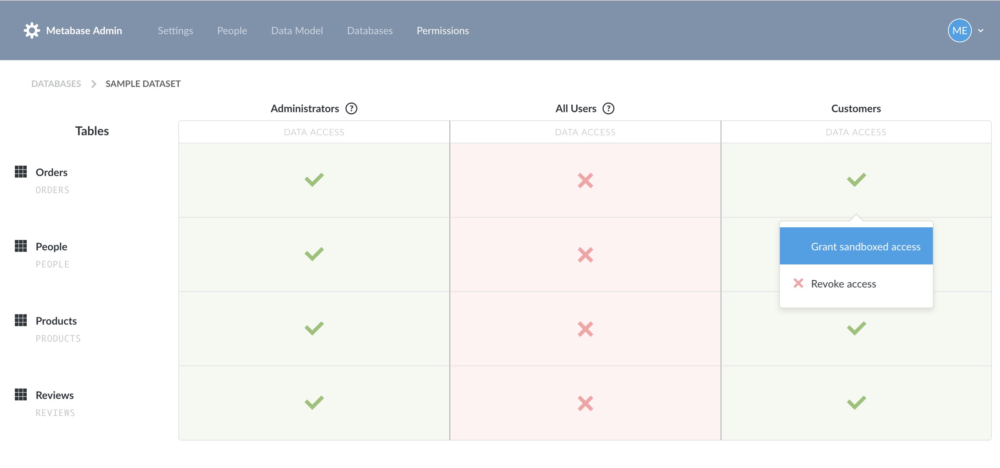

Metabase will ask us first if we want to restrict this user group to “limited access” to this database. That just means they won’t have full access to all of the tables in this database, which is exactly what we want.

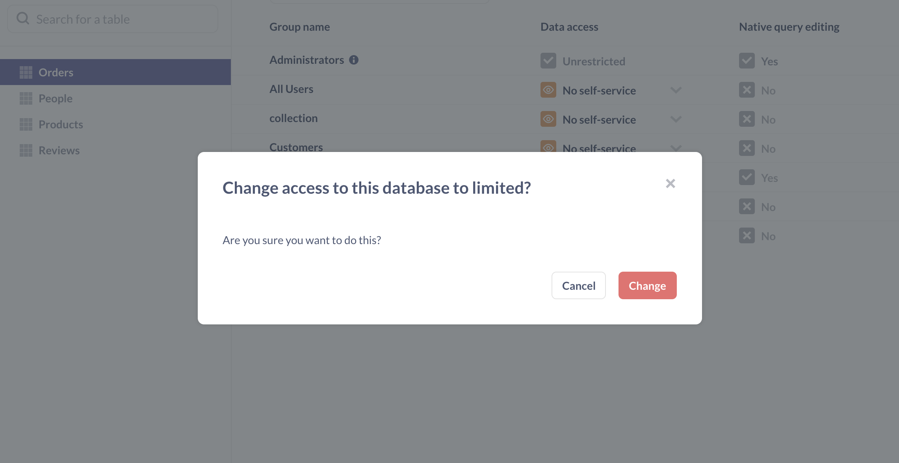

Next we’ll see a worksheet that will ask us how we want to filter this table for these users. We’ll leave it on the default selection. Below that, there’s an area where we get to add our filters. We want to filter using the User ID column in the Orders table where the column equals each user’s user_id attribute. So we’ll select that column and that user attribute from the dropdown menus. At the bottom of the worksheet, there’s a summary of how things will work.

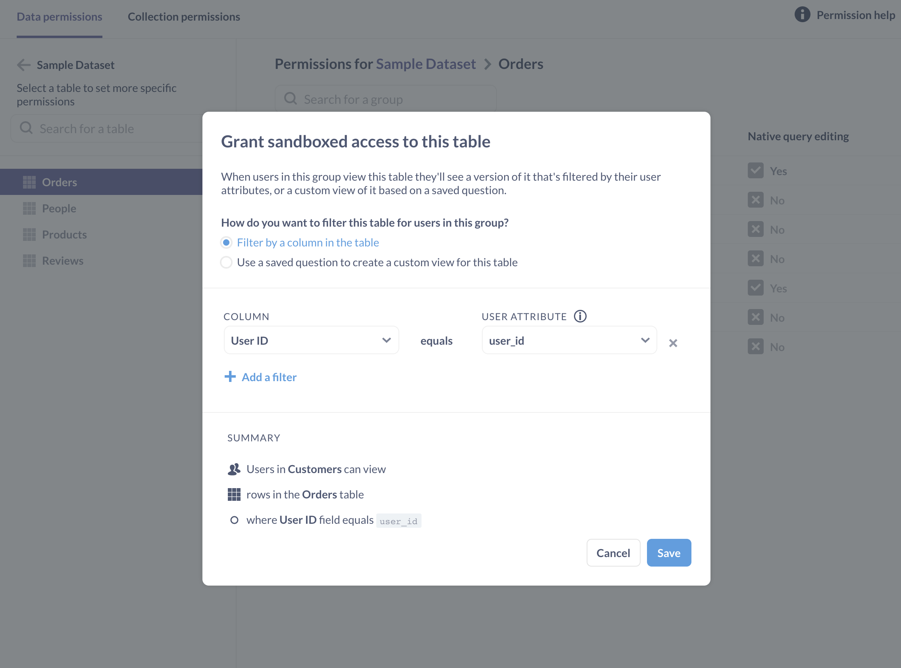

We’ll click Done, then we’ll click Save Changes at the top of the screen to save the changes we’ve made to our permissions. If we ever want to edit how this table should be filtered for users in this group, we can just click on the blue box and select “Edit sandboxed access.”

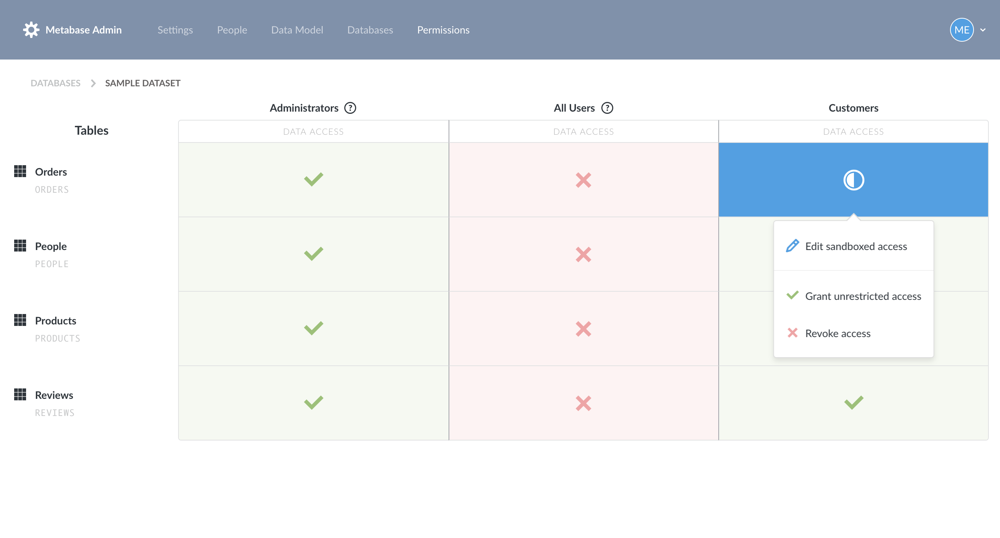

To test this out, we’ll open up a new incognito browser window and log in with our test user account. We’ll click on the Sample Dataset on the home page and then pick the Orders table. As you can see here, this user correctly only sees orders where the User ID column is equal to 1, because that’s what this user’s user_id attribute is.

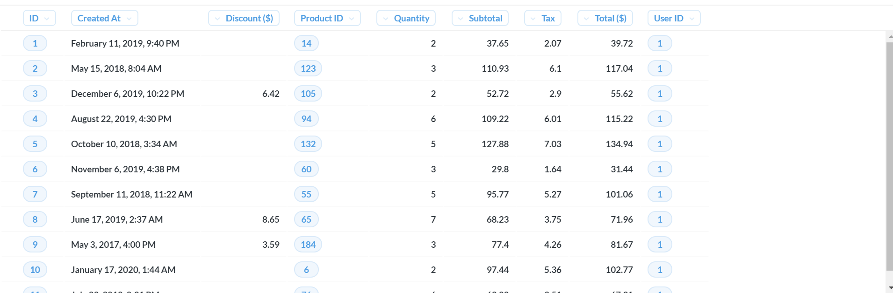

If this user views any charts, dashboards, or even automated x-ray explorations that include this sandboxed Orders data, those will also be correctly filtered to only show the data they’re allowed to see.

Another great thing about sandboxing is that this user can still use all of the easy and powerful exploration and charting features of Metabase to explore this sandboxed data. For example, they can create a chart like this one to see a breakdown of their orders by product type:

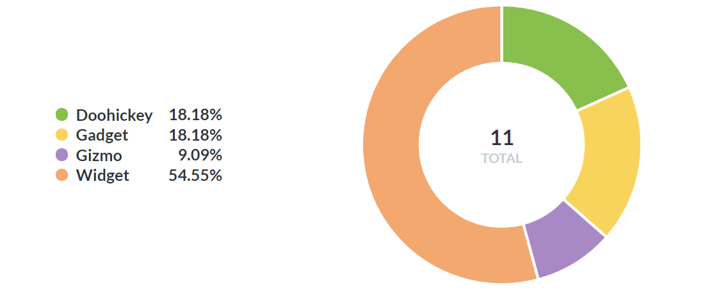

### Advanced sandbox examples

As we mentioned above, the second way you can create a sandbox is by using a saved question to define a customized view of a table to display. When a user with sandboxed access to a table queries that table, behind the scenes they'll really be using that saved question as the source data for their query.

#### Example 1: hiding specific columns

In this example I have a table called `People` that I want users in my Marketing team to be able to see, but I don't want them to see most of these sensitive columns that have personal information in them:

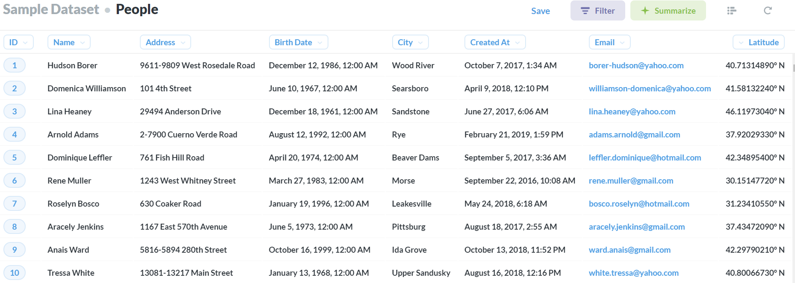

So what I can do is create a query that only returns the columns in that table that I _do_ want them to see, like this:

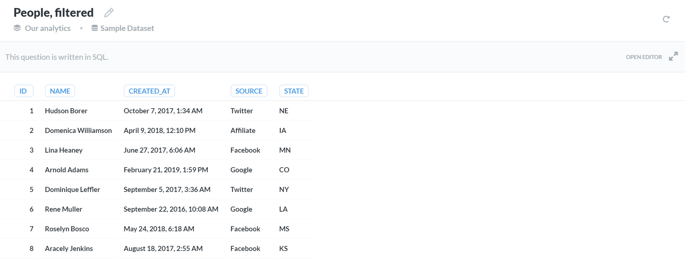

Now, when I go to the Permissions section and grant this group sandboxed access to this table, I'll select the second option and select the saved question I just created, like so:

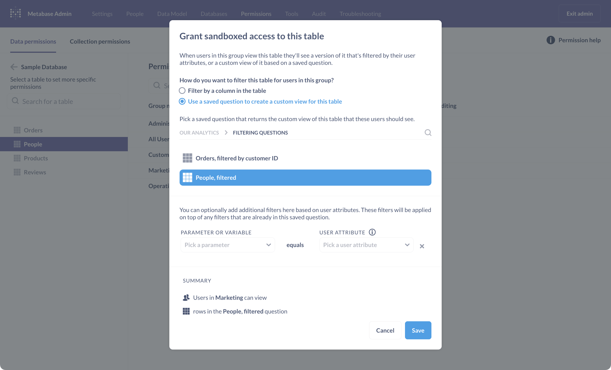

To verify things are working correctly, I'll log in as a test user in the Marketing group, and when I go to open up the `People` table, you'll see that I actually am shown the results of the filtering question instead:

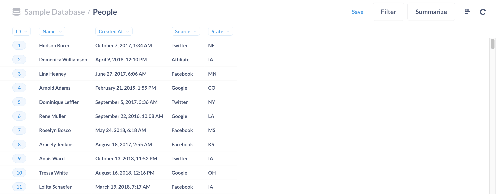

**Note:** this filtering will also happen when a user with sandboxed access goes to look at a chart that uses data from the sandboxed table. If the chart uses any columns that aren't included in the sandboxed version of the table, the chart will not load for that user.

#### Example 2: using variables in a saved question

To create even more powerful and nuanced filters, you can use variables in a filtering question in conjunction with user attributes.

In this example, I'm going to give users in a specific group access to my `Orders` table, but I'll filter out which columns they can see, and I'll also make it so that they only see rows where the "Customer ID" column equals the user's `customer_id` attribute.

Here's the table I'm going to filter:

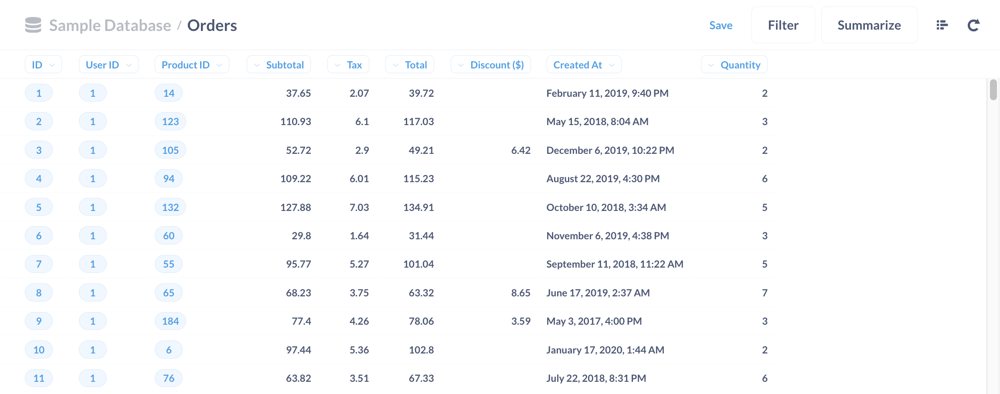

The filtering question that I'll create will exclude columns that I don't want these users to see, and I'll also add in an optional `WHERE` clause which defines a variable, `cid`, that I can then reference in my sandbox. Here's what it looks like:

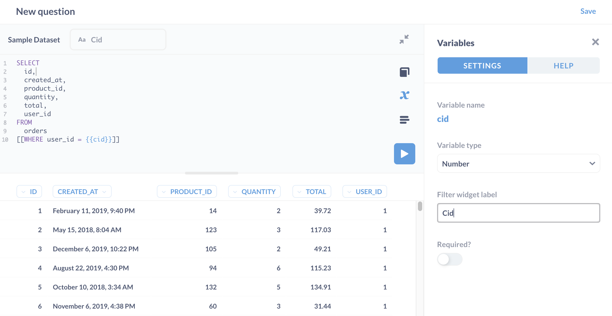

Going back over to the Permissions section, when I open up the sandboxed access modal and select the second option and select my filtering question, I'll see an additional section which allows me to map the variable I defined in my question with a user attribute:

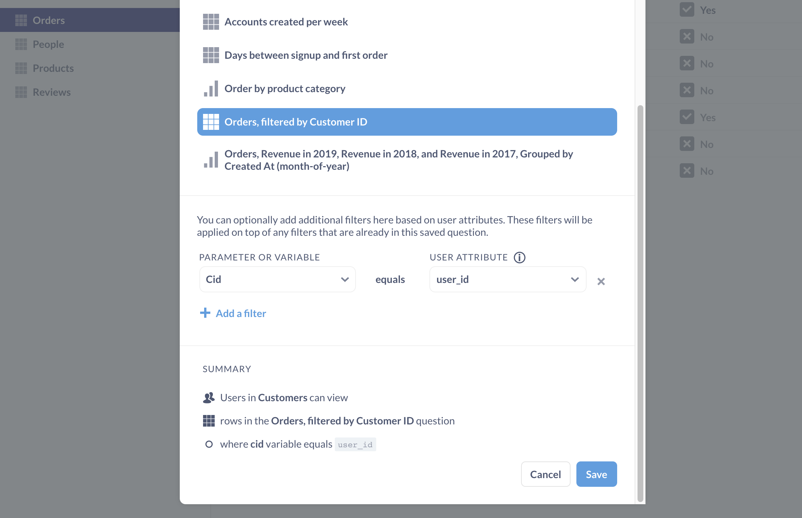

My user's attribute is defined like this, and I got here by clicking on the `…` icon next to this user's name in the People section:

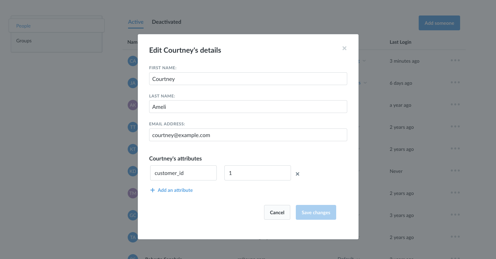

Now, when I log in as this user and look at the `Orders` table, I only see the columns I included in the filtering question, and the rows are filtered as I specified in my `WHERE` clause:

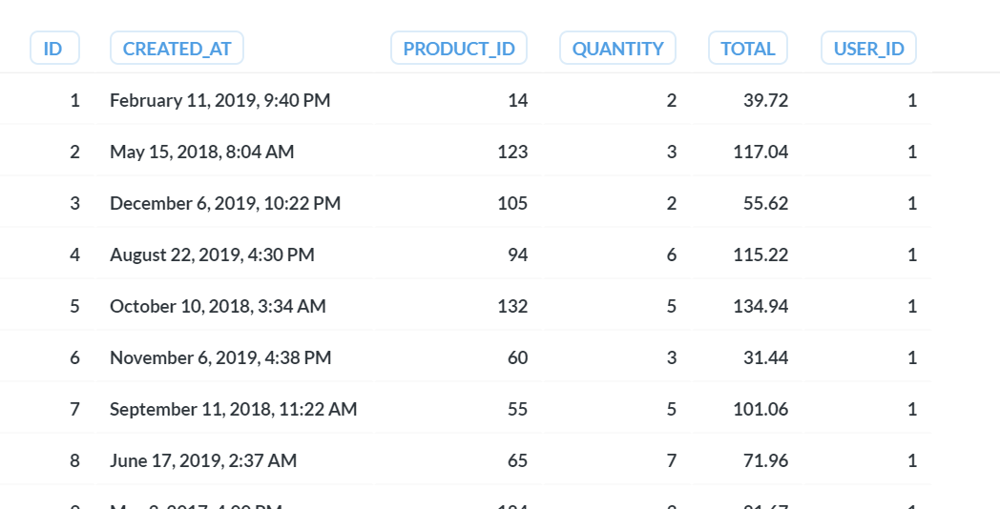

### Current limitations

#### A user can only have one sandbox per table

I.e., if a user belongs to two user groups, both of which have been given sandboxed access to the same table, that user will not be able to access data from that table. You will either need to remove that user from one of those groups, or remove the sandboxed access from one of those groups.

#### Data sandboxes do not support non-SQL databases

You can't currently create data sandboxes with non-SQL databases such as Google Analytics, Apache Druid, or MongoDB .

#### Data sandboxes do not work on SQL/native queries

This goes for both saved or unsaved SQL queries. The reason is that Metabase does not currently parse the contents of SQL queries, and therefore can't know conclusively which table(s) are referenced in a query. There are three specific situations to be aware of when it comes to SQL and sandboxes:

1. If a user has SQL editor access for a given database, they are able to query any table in that database, and will see unfiltered results for any table included in the query. Admins can grant SQL editor access for some databases but prohibit it on others as needed.
2. If a user views a saved SQL/native query, data sandboxes will not filter the results of that query, even if the query includes data from a table for which the user only has sandboxed access.
3. A user can start a new Custom GUI question using any saved question they have access to as the starting data for that new question (a "nested" question). If they have access to view any saved SQL questions, they can use such a question as starting data for their new question, and this new question will not be filtered by data sandboxes.

An important distinction to make is that you can use a saved SQL query in the _creation_ of a sandbox. One of the options for setting up a data sandbox allows you to display the results of a saved question instead of the raw table. In this situation, you might choose to use a SQL query to supply the results that you'd like to display to a specific user group instead of the raw table itself.

---

## Next: embedding Metabase in your web app

The next section will explain [how to embed](full-app-embedding.md) interactive dashboards and charts, or even whole sections of Metabase within your app.
