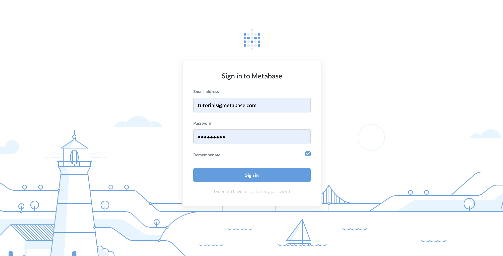
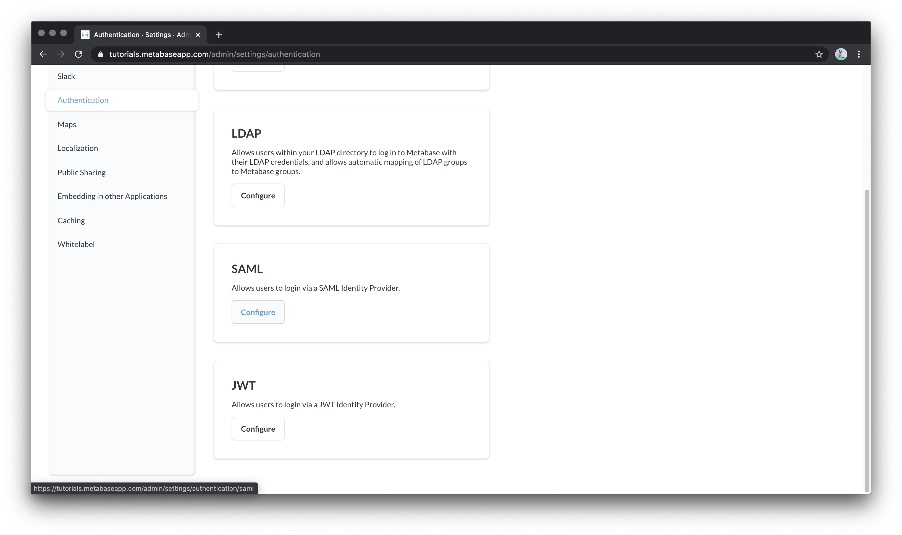
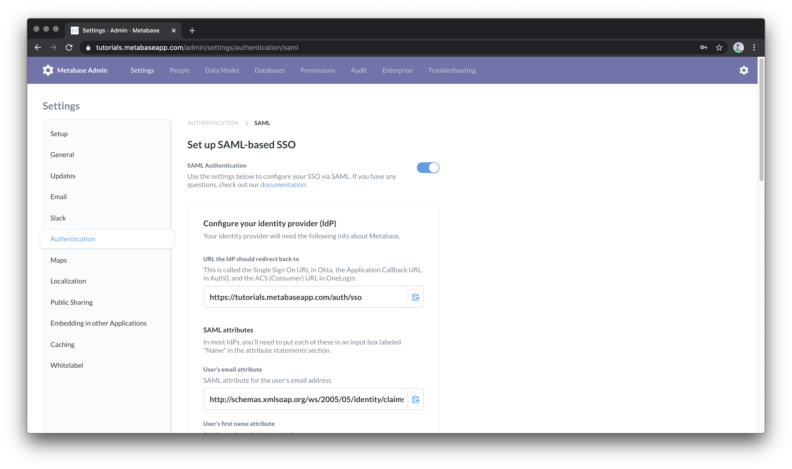

# Auth0 Walkthrough

Setup Metabase
Metabase uses SAML protocol to connect Auth0. Since SAML is an Enterprise feature, you will need to either have an Enterprise license or download a trial key. 

> You can learn more about activating an enterprise trial metabase instance here.  You can download a docker container or run a .jar locally, or you can start a 2 week trial of our hosted feature and enter the trial token under Settings -> Admin -> Enterprise.

Activate SAML in Metabase
Once you have your enterprise edition of metabase up, login with an admin account.

Once you are logged in as an administrator, navigate to Settings (⚙️) -> Admin

In the Admin Dashboard, in the left navigation panel, select “Authentication”

The Authentication Settings, you can select which SSO protocol you want to set up.  For Auth0, we’re going to use SAML protocol.  If you select “Configure” you’ll be taken to the SAML settings.

In the SAML Settings, you will see four different sections with settings you can configure.  You do not need to fill out every section to successfully link your Auth0 connection.  The first thing we need to change is we need “Activate” SAML by clicking on the button at the very top of the page.   If you don’t enable SAML, your SSO provider will not be connected, even if the settings are all correct.

To continue setting up your Auth0 connection, we’ll need to log in to your Auth0 account in a new window or tab.

Configure Auth0

After you log in to your Auth0 account, navigate to “Applications” and select “Create Application”

Auth0 will ask you to name your application (I recommend “Metabase” for clarity) and to select a type.  You should select “Regular Web Applications”

Once you have created your new application, you will want to edit the “Settings”

In the Settings page, there are many fields available to customize the settings in your Auth0 Metabase application, but many of these fields can be left blank.  

We will need to fill in a value for “Allowed Callback URLs”.  If you scroll down in the settings you will see this field under “Application URIs”

To get these we are going to go back to our Metabase settings tab.  The first section under “Configure your identity provider” gives you the Metbase Callback URL we need to paste into Auth0.  You can click on the small clipboard icon next to the URI to copy it to your clipboard.

Navigate back to your Auth0 settings tab and paste in the Allowed Callback URLs section.

Scroll to the bottom of the page and click “Save Changes”

Next we need to activate the SAML2 Web App Addon.  Scroll back to the top of the settings page and select “Addons” from the navigation menu.

In the “Addons” section, select the “SAML 2 Web App” to load the settings popup.

If you’ve entered multiple Callback URLs, you may be confused to see only one of the callback URLs listed on this page.  The field “Application Callback URL” on this page is just an example, it only shows the first of the Callback URLs entered.  The other Callback URLs you have entered are still saved and valid, they simply don’t show up on this page.

In the “Settings” section on this page, you can see the mappings for the SAML protocol.  Metabase specifically needs the User’s email, first name, and last name.  Auth0 refers to these attributes as “email”, “given_name”, and “family_name”.  Copy the URL for the “email” attribute to your clipboard. Your metabase instance should already have the correct variables mapped, but you can double check by comparing the values in Auth0’s addon settings and Metabase’s Auth0 SAML Attributes.

“email”
http://schemas.xmlsoap.org/ws/2005/05/identity/claims/emailaddress
“given_name”
http://schemas.xmlsoap.org/ws/2005/05/identity/claims/givenname
“family_name”
http://schemas.xmlsoap.org/ws/2005/05/identity/claims/surname

Next, in the Auth0 Addon: SAML2 Web App popup, navigate to “Usage”.  

In “Usage”, look for the “Identity Provider Login URL”. We’re going to copy this URL and go back to our Metabase tab. Under the section “Tell Metabase about your identity provider”, there is a field “SAML Identity Provider URL” where you want to paste the copied URL.

Back in the Auth0 tab, we’ll need to download the Auth0 certificate.  

Once your certificate has downloaded, you’ll need to use a text editor to open it.  Then you need to copy the entire certificate. It’s okay to include the “Begin certificate” and “End certificate”.

In your metabase settings, paste the certificate into the section “SAML Identity Provider Certificate”.  

Now you have all of the necessary fields to connect to your Auth0 account to Metabase.  Scroll down to the bottom of the Metabase SAML settings and click “Save changes”.

In your Auth0 app popup, navigate back to “Settings”, scroll down to the bottom and click “Enable”.

You should now be able to log in to your Metabase instance with your Auth0 users.

