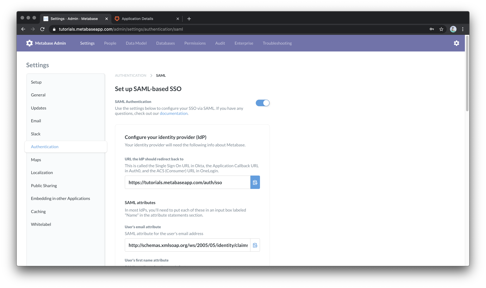
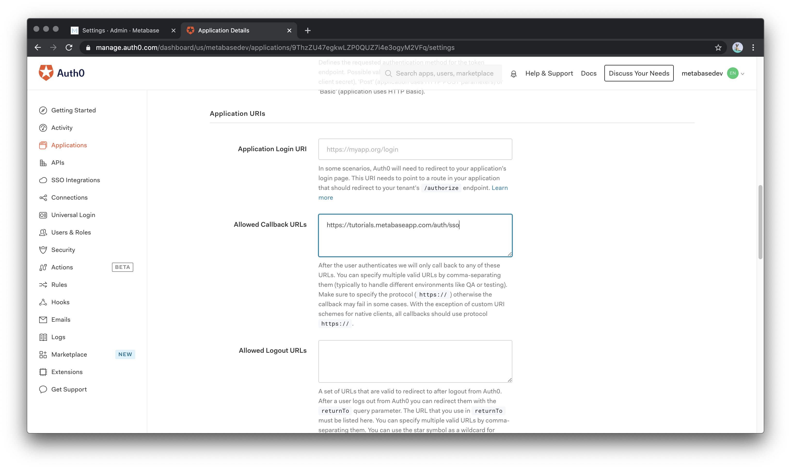
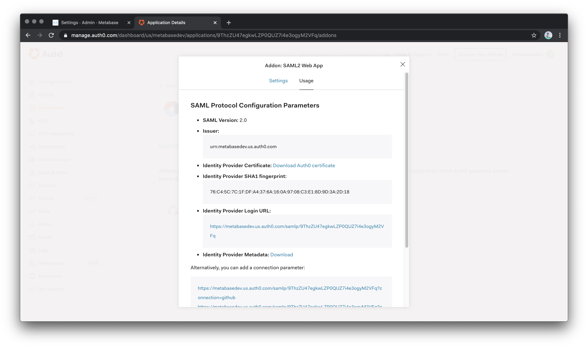
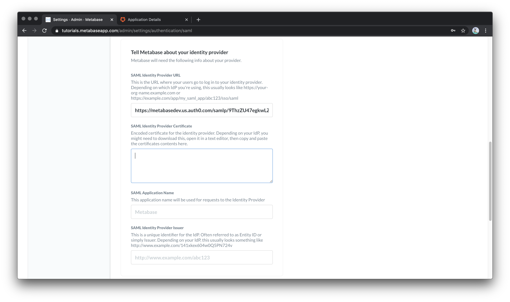
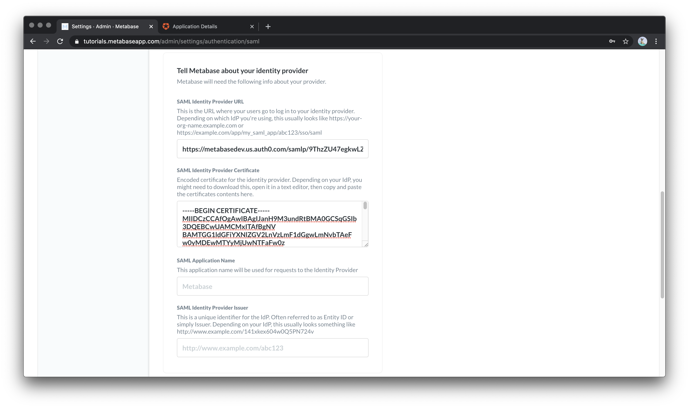

# Setting up SAML with Auth0

## Mapping Metabase Fields to Auth0

If you 

To continue setting up your Auth0 connection, we’ll need to log in to your Auth0 account in a new window or tab.

## Configure Auth0

After you log in to your Auth0 account, navigate to **Applications** and select **Create Application*

Auth0 will ask you to name your application (I recommend “Metabase” for clarity) and to select a type.  You should select “Regular Web Applications”

Once you have created your new application, you will want to edit the “Settings”

In the Settings page, there are many fields available to customize the settings in your Auth0 Metabase application, but many of these fields can be left blank.  

We will need to fill in a value for “Allowed Callback URLs”.  If you scroll down in the settings you will see this field under “Application URIs”

To get these we are going to go back to our Metabase settings tab.  The first section under “Configure your identity provider” gives you the Metbase Callback URL we need to paste into Auth0.  You can click on the small clipboard icon next to the URI to copy it to your clipboard.

Navigate back to your Auth0 settings tab and paste in the Allowed Callback URLs section.

Scroll to the bottom of the page and click “Save Changes”

Next we need to activate the SAML2 Web App Addon.  Scroll back to the top of the settings page and select “Addons” from the navigation menu.

In the “Addons” section, select the “SAML 2 Web App” to load the settings popup.

If we've entered multiple Callback URLs, we'll only see one of the callback URLs listed on this page. The other Callback URLs we've entered are still saved and valid, this field simply shows a URL as an example.

In the Settings section on this page,  we can see the mappings for the SAML protocol.  Metabase needs the User’s email, first name, and last name.  Auth0 refers to these attributes as “email”, “given_name”, and “family_name”.  We'll copy the URL for the “email” attribute to our clipboard. Our Metabase should already have the correct variables mapped, but we can double check by comparing the values in Auth0’s addon settings and Metabase’s Auth0 SAML Attributes.

- **email**: http://schemas.xmlsoap.org/ws/2005/05/identity/claims/emailaddress
- **given_name**: http://schemas.xmlsoap.org/ws/2005/05/identity/claims/givenname
- **family_name**: http://schemas.xmlsoap.org/ws/2005/05/identity/claims/surname

## Mapping Auth0 Fields to Metabase
Next, in the Auth0 Addon: SAML2 Web App popup, click on the **Usage** tab. 

In the popup's Usage tab, look for the **Identity Provider Login URL**. Let's copy this URL and return to our  Metabase. In the **Tell Metabase about your identity provider** section, paste the URL in the **SAML Identity Provider URL** field.

We'll return to our Auth0 tab, to download the Auth0 certificate. Once your certificate has downloaded, open it with a text editor and copy the entire certificate. It’s okay to include the “Begin certificate” and “End certificate”. Return to your Metabase browser tab and, paste the certificate into the section **SAML Identity Provider Certificate**. 

Scroll down to the bottom of the Metabase SAML settings and click **Save changes**. Next, we'll return to our Auth0 app popup, and, under the Settings tab, scroll down to the bottom and click **Enable**. 
You should now be able to log in to your Metabase instance with your Auth0 users!

