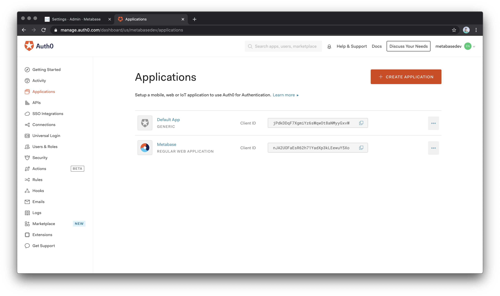
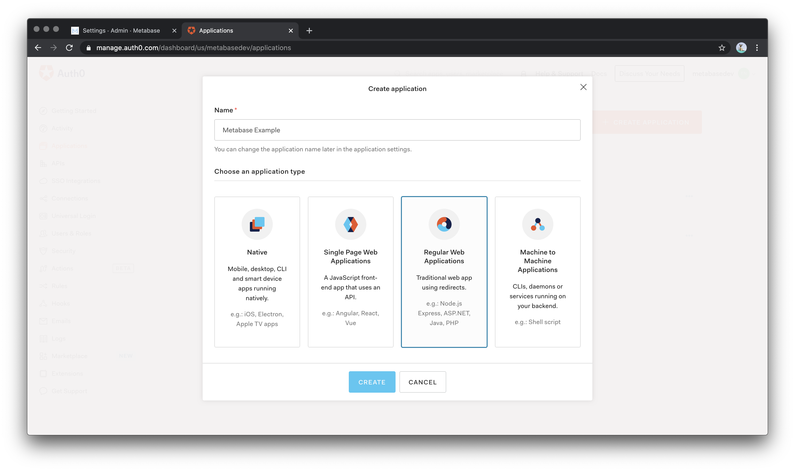
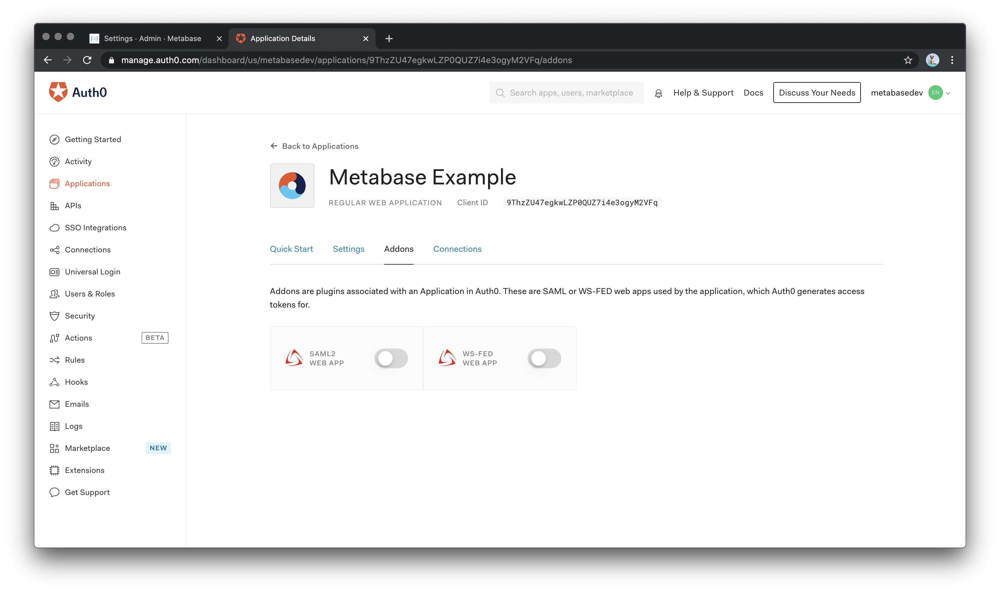
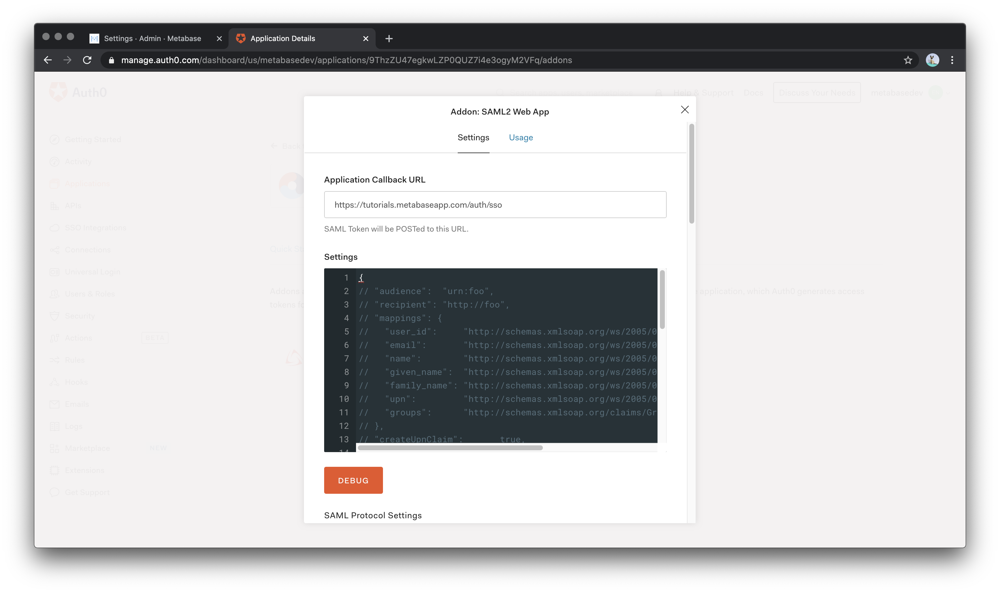

# Setting up SAML with Auth0

Setting up Metabase with Auth0 is extremely easy. Just follow this configuration guide and you'll be ready to go in a few couple of minutes.

For starting the configuration in Metabase, please follow the guide for [authenticating with SAML](authenticating-with-saml.html)

## Steps

## Create an Application

After you log in to your Auth0 account, navigate to **Applications** and select **Create Application*



Enter “Metabase” as the application name with type “Regular Web Applications”.



Now go to Settings tab inside Auth0's Metabase App and fill in the following values:
- Application Login URI: the URL of your Metabase instance
- Allowed Callback URLs: the URL that's below **Configure your identity provider (IdP)** in SAML settings inside Metabase (it ends with /auth/sso)


Scroll to the bottom of the page and click “Save Changes”

## Enable SAML in Auth0

Next we need to activate the SAML2 Web App Addon. Scroll back to the top of the settings page and select “Addons” from the navigation menu.

In the “Addons” section, select the “SAML 2 Web App” to load the settings popup.



### Mapping fields from users in Auth0 to Metabase

On the top of the the `Settings` section on this page, you need to re-enter the value you included in "Allowed Callback URLs" in the field named **Application Callback URL**. On the black box below copy and paste the following JSON file in the settings box so Auth0 can send the correct mappings to Metabase once a user logs in:

```
{
    "mappings": {
        "email":"http://schemas.xmlsoap.org/ws/2005/05/identity/claims/emailaddress",
        "given_name":"http://schemas.xmlsoap.org/ws/2005/05/identity/claims/givenname",
        "family_name":"http://schemas.xmlsoap.org/ws/2005/05/identity/claims/surname",
        "groups":"http://schemas.xmlsoap.org/claims/Group"
    }
}
```

If you need to send more data from the user properties later, you can always return to this step and see which field you want to map and add.



### Configuring Metabase
Next, in the Auth0 Addon: SAML2 Web App popup, click on the **Usage** tab and then configure in Metabase (column on the left) the values that this tab provides (column on the right)

[!Auth0 SAML usage](images/saml-auth0/auth0samlusage.png)

---
| Metabase | Auth0 |
| --- | --- |
| SAML Identity Provider URL | Identity Provider Login URL |
| SAML Identity Provider Issuer | Issuer |
| SAML Identity Provider Certificate | Open the Identity Provider Metadata link and copy the string under the X509Certificate tag
---

The "SAML Application Name" value can be left as the default one (Metabase)

Click in Save and enable SAML in Metabase with the toggle in the top of the page and you are good to go!