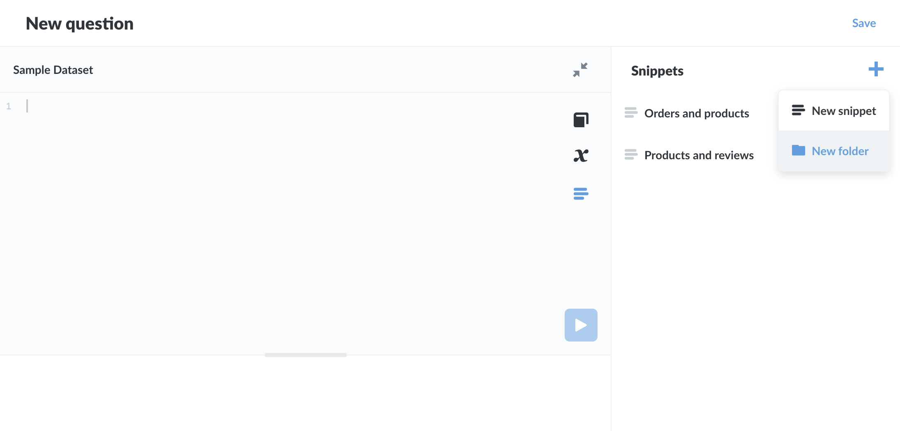
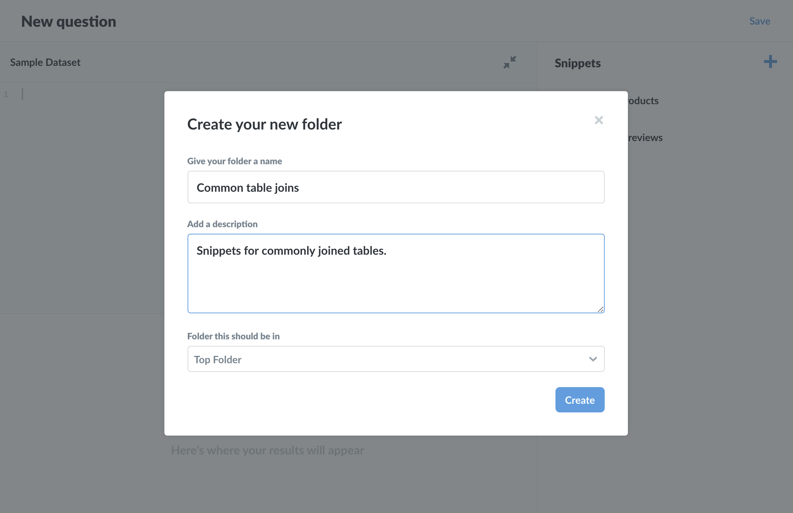
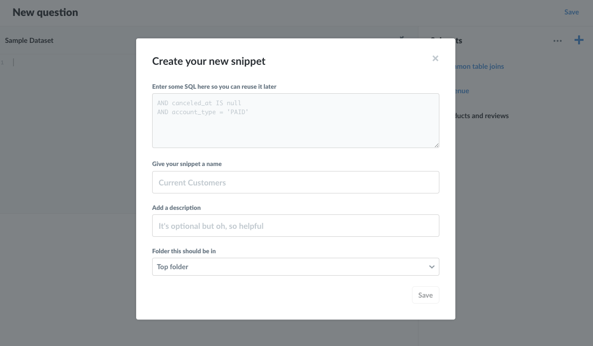
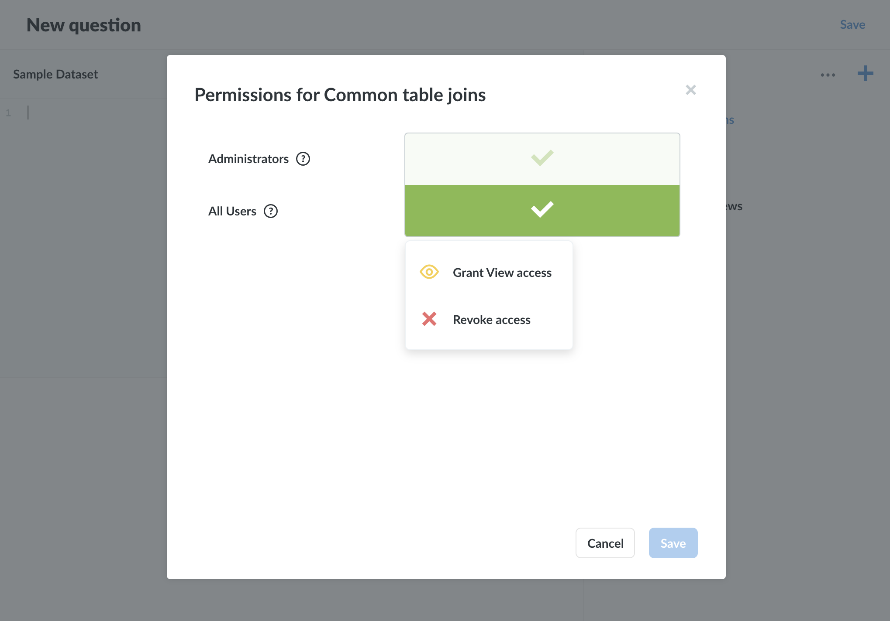

# SQL snippet folders and permissions

This article covers **SQL snippet folders**, which are an Enterprise feature for organizing and permissioning snippets. You can learn more about [how SQL snippets work in our User Guide](../users-guide/sql-snippets.md).

Folder permissions should not be considered a security feature, but instead a feature that helps organize and standardize snippets. Although folders are distinct and separate from Collections, they both serve an organizational function: Collections gather and permission dashboards and questions; folders gather and permission snippets. For more info, see the [discussion on permissions below](#permissions).

## Folders

Folders work similarly to a file system. You can add snippets to folders, and put folders inside of other folders. You can nest as many folders as your Metabase instance can handle or the laws of physics allow (whichever yields first).

The **Top folder** is the snippet sidebar's default folder. It is the root folder that contains all folders and snippets.

### Creating a new SQL snippet folder

You can create a SQL snippet folder from the **Snippets** menu in the [SQL editor](../users-guide/writing-sql.html).

1. Click on the **Snippets** menu icon (the snippet icon looks like a block of text or code with three uneven horizontal lines).
2. Click on the **+** icon and select **New folder**.
3. Give your folder a name, and optionally **Add a description** and/or place the folder in an existing folder (the **Folder this should be in** option).

### Creating a new SQL snippet

When creating a SQL snippet in the Enterprise Edition, you'll also see an additional option to add that snippet to an existing folder (the **Folder this should be in** option).

The default location is the **Top folder**, which is the root folder for all snippets and folders. You can add a snippet to a folder at any time (or relocate a snippet to another folder, provided you have Edit permission to both folders).

Note that snippet names must be unique; folders do not affect this requirement.

## Permissions

Administrators (and only administrators) can set snippet visibility and editability by placing snippets in **folders**, then granting groups one of three permission levels with respect to those folders. If you're familiar with [collection permissions](/docs/latest/administration-guide/06-collections.html#setting-permissions-for-collections), the functionality is similar. For more on how collection and folder permissions work together, see [how folder permissions work](#how-folder-permissions-work) below.

### Changing permissions on a folder

Administrators can set the permissions on a folder by clicking on the ellipsis (**...**) next to a folder, and selecting **Change permissions**.

You can additionally change the currently selected folder by mousing over to the top of the Snippets sidebar, clicking on the ellipsis (**...**) to the left of the **+**, and selecting **Change permissions**. When at the **Top folder**, selecting the **...** at the top of the sidebar will give Administrators the option to set permissions for all snippets, folders, and sub-folders.

When changing permissions on a folder that has sub-folders, you have an option to extend those permissions to that folder's sub-folders by toggling the **Also change sub-folders** setting.

### Options for folder permissions

There are three options for changing snippet folder permissions:

- **Edit access (green checkmark icon)**. The default setting. When a folder is created, all users (who have SQL editor permissions for at least one database) can view, edit, and archive or unarchive the folder's snippets.
- **View access (yellow eye icon)**. Users in groups with view access can view snippets in the folder, but not edit or archive/unarchive them. They can, of course, copy snippet code and create new snippets, with no effect on the existing snippets.
- **Revoke access (red X icon)**. Users in groups with neither edit nor view permissions to a snippet folder will not see that folder's snippets in the sidebar, nor will any snippets in that folder appear in typeahead suggestions for those users. Note that if people have access to a question with a snippet they don't have permission to, they will still be able to get results from that question. See the discussion below on [how folder permissions work](#how-folder-permissions-work).

### Archiving does not affect permissions

Archiving or unarchiving snippets does not affect a snippet's permissions. If, for example, only one group, say the Accounting group, has edit permissions on a folder, only people in the Accounting group (and admins) would be able to archive and unarchive snippets in that folder, as archiving and unarchiving is considered editing the snippet.

### How folder permissions work

As with collection permissions, folder permissions are additive, meaning that the more permissive access overrules less permissive access. See [Setting permissions](../administration-guide/05-setting-permissions.html) for a more detailed discussion.

But snippet folder permissions require some more effort to unpack, as permissions for snippet folders must work in conjunction with permissions for data and collections.

Here's the basic rule: data is more sensitive than code, so permissions that apply to data will take precedence over permissions that apply to code. Let's work through an example to illustrate how this works in practice.

#### Permissions example

Consider the following scenario (and here's a sentence that merits slow reading): a group could have permission to a Collection that contains a question that uses a snippet housed in a folder that the group does _not_ have permissions to. To rephrase: people in that group have permissions to run questions in a collection, but they do not have permission to a folder containing a snippet used in one of the collection's questions. How will Metabase resolve permissions in this case?

In three parts:

1. **People in that group can run the question and get results**. They have permission to see that data (the question results), so they should be able to see that data. The group's permission to the collection takes precedence over permissions to the folder (the snippet code).
2. **The snippet would not show up in the Snippet sidebar**. However, just because people in that group can run the question without issue, they still don't have permission to the snippet's folder, so they wouldn't be able to see or edit that snippet (or the snippet's folder) in the Snippet sidebar.
3. **People with SQL query access can still run the snippet if they know its name, regardless if they have permissions to the snippet's folder**. They wouldn't be able to view or edit the snippet, but they could include it in a query if they knew its name, e.g, `{{snippet: Example snippet I don't have permissions to but can still use }}`.

Because of how snippet folder permissions work, we recommend that you consider snippet folder permissions as an additional tool for snippet organization, not as method of preventing access to the SQL code those snippets contain. Use folder permissions to keep the snippet sidebar tidy by exposing teams to folders relevant to their analytical domain, and restrict editing permissions to key snippets in your organization to keep important SQL code accurate and safe from bugs introduced by unvetted edits.
