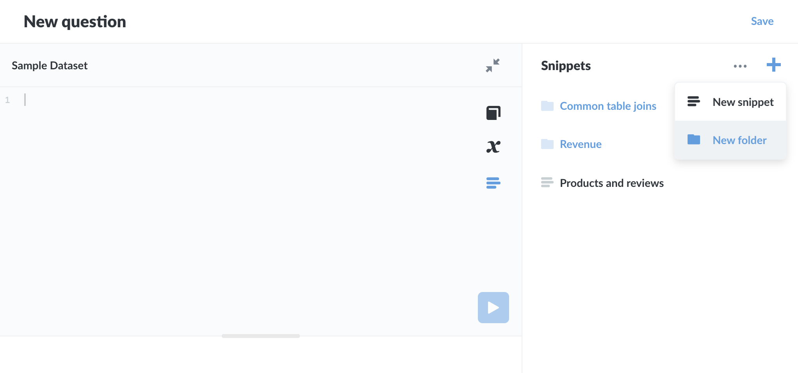

# SQL snippet folders 

SQL snippet **folders** are an Enterprise feature for keeping snippets organized. 

## Folders

Folders work as you would expect. You can add snippets to folders, and nest folders (i.e. create a folder, and put a subfolder in that folder, which itself has a subfolder, etc.).

### Create new SQL snippet folder

You can create a SQL snippet folder from the SQL Snippet menu in the SQL editor.

1. Click on the SQL Snippet menu icon (looks like paragraph text with three uneven horizontal lines).
2. Click on the `+` and select `New folder`
3. Give your folder a name, add a description, and place the folder (if you want to nest that folder in an existing folder.)

## Searching for snippets

If you've saved over 15 snippets, a **Search** icon (the classic magnifying glass) will appear to the left of the `+` button. Click on the search icon and type up your search. Note that search results only includes snippets the user has permissions for. SQL snippet folders do not populate the search results.

## Permissions

Administrators can restrict access to snippets by placing snippets in **folders**, and assigning permissions to groups of people with respect to those folders. If you're familiar with [collection permissions](/docs/latest/administration-guide/06-collections.html#setting-permissions-for-collections), the functionality is similar.

Observe:

Click on the ellipsis (...) next to a folder, and select **Permissions**.

- **Execute**.
- **Revoke**. 

You can nest as many folders as your Metabase instance can handle or the laws of physics allow (whichever yields first).

