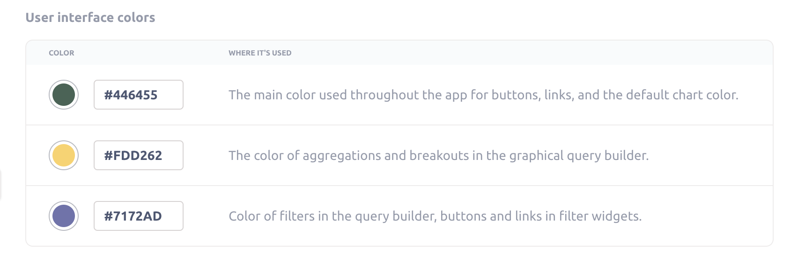
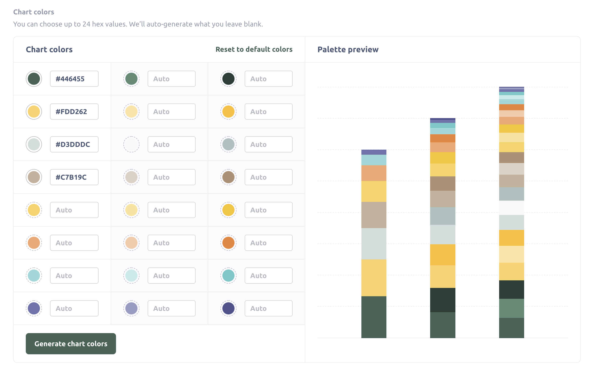

# White labeling Metabase



White labeling lets you customize Metabase's appearance so that it matches your company’s branding.

## Changing Metabase's appearance

Click on the gear icon at the bottom of the navigation sidebar and select **Admin settings** > **Settings** > **Appearance**. Here’s what you can do:

## Application name

You can change every place in the app that says “Metabase” to something like “Acme Analytics,” or whatever you want to call your Metabase app.

## Font

This is the primary font used in charts and throughout Metabase.

You can choose from a curated set of Google Fonts that accommodate the regular and bold font weights that Metabase relies on for its various UI elements.

- [Lato](https://fonts.google.com/specimen/Lato)
- [Lora](https://fonts.google.com/specimen/Lora)
- [Merriweather](https://fonts.google.com/specimen/Merriweather)
- [Montserrat](https://fonts.google.com/specimen/Montserrat)
- [Noto Sans](https://fonts.google.com/specimen/Noto+Sans)
- [Open Sans](https://fonts.google.com/specimen/Open+Sans)
- [Oswald](https://fonts.google.com/specimen/Oswald)
- [Playfair Display](https://fonts.google.com/specimen/Playfair+Display)
- [Poppins](https://fonts.google.com/specimen/Poppins)
- [PT Sans](https://fonts.google.com/specimen/PT+Sans)
- [PT Serif](https://fonts.google.com/specimen/PT+Serif)
- [Raleway](https://fonts.google.com/specimen/Raleway)
- [Roboto](https://fonts.google.com/specimen/Roboto)
- [Roboto Condensed](https://fonts.google.com/specimen/Roboto+Condensed)
- [Roboto Mono](https://fonts.google.com/specimen/Roboto+Mono)
- [Roboto Slab](https://fonts.google.com/specimen/Roboto+Slab)
- [Slabo 27px](https://fonts.google.com/specimen/Slabo+27px)
- [Source Sans Pro](https://fonts.google.com/specimen/Source+Sans+Pro)
- [Ubuntu](https://fonts.google.com/specimen/Ubuntu)

You might need to refresh your browser to see your changes take effect.

## Color palette

You can customize colors in both the application UI and in the Metabase charts.

### User interface colors

You can customize the colors that Metabase uses throughout the app:

- **First color:** The main color used throughout the app for buttons, links, and the default chart color.
- **Second color:** The color of aggregations and breakouts in the graphical query builder.
- **Third color:** Color of filters in the query builder, buttons and links in filter widgets.

### Chart colors

You can choose up to 24 hex values. If you choose fewer than 24 colors, Metabase will auto-generate colors to fill in the rest of the values.

## Logo

You can replace Metabase’s familiar, tasteful, inspired-yet-not-threateningly-avant-garde dotted M logo with your very own logo. For things to work best, the logo you upload should be an SVG file that looks good when it’s around 60px tall. (In other words, ask the nearest designer for help.)

## Favicon

The url or image that you want to use as the favicon.

## Landing page

The landing page is what people will see whenever they login. You can set the URL to a collection, question, dashboard or whatever, just make sure that everyone has access to that URL.

## Loading message

This message is the text Metabase presents when it's loading a query. Options include:

- "Doing science..." (the default)
- "Running query..."
- "Loading results..."

## Further reading

To learn more, check out this article on [branding your Metabase instance](https://www.metabase.com/blog/white-label/index.html).
