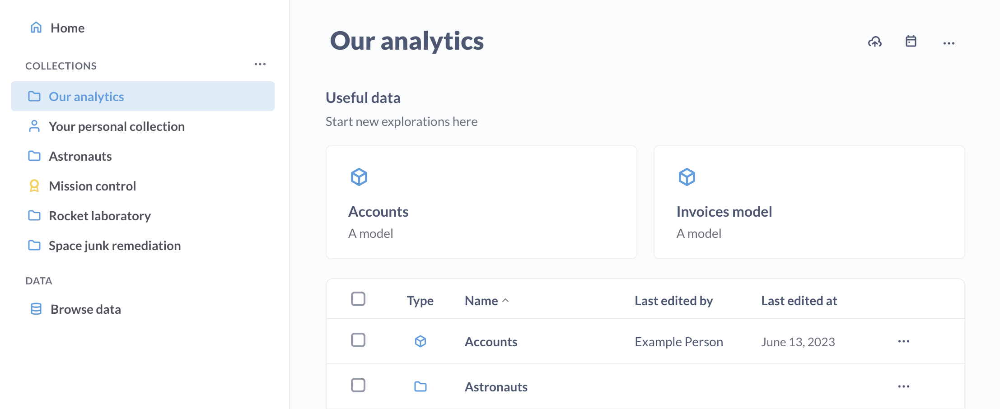
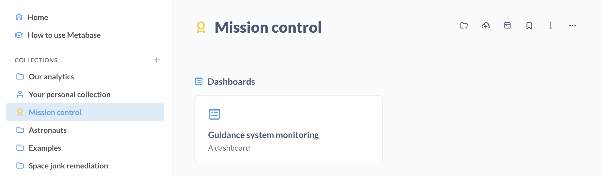
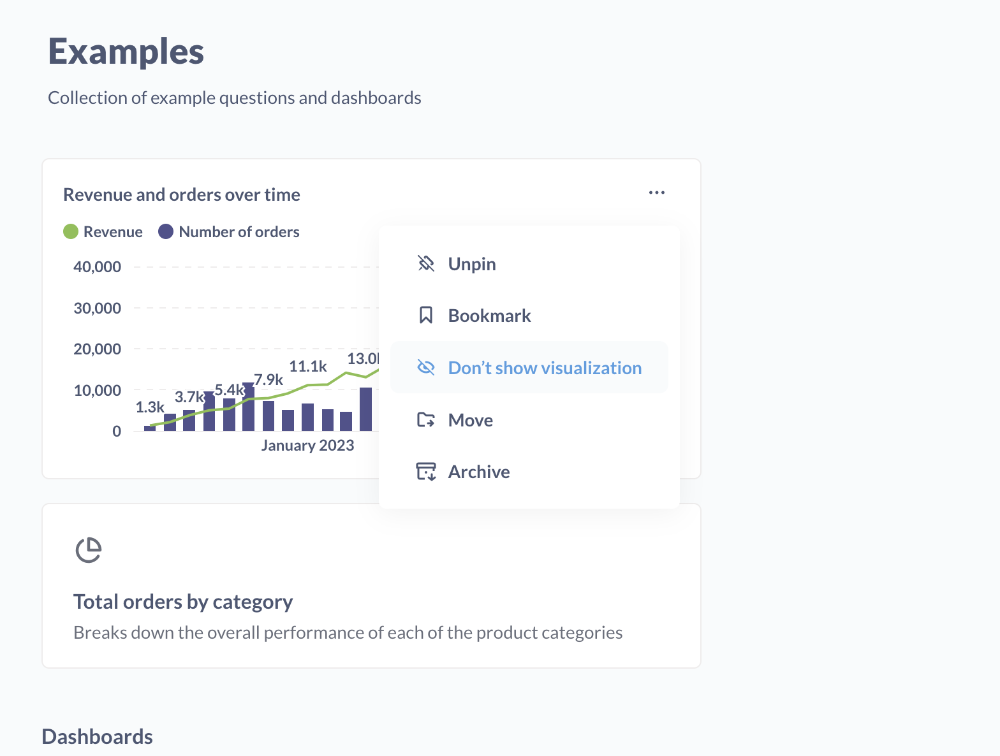
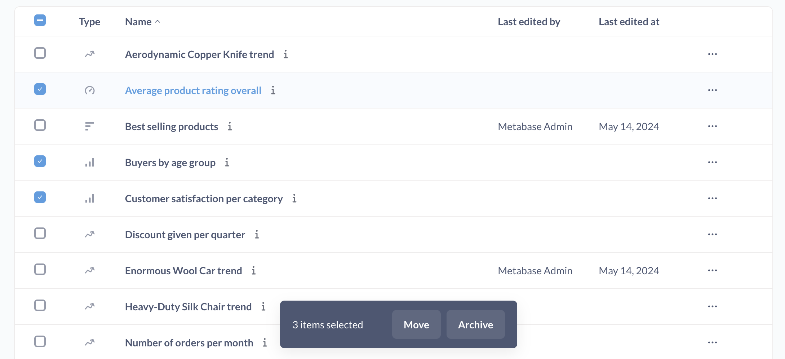

# Collections

After your team has been using Metabase for a while, you’ll probably end up with lots of saved questions and dashboards.

Collections are the main way to organize questions, dashboards, and [models][models]. You can think of them like folders or directories. You can nest collections in other collections, and move collections around. One thing to note is that a single item, like a question or dashboard, can only be in one collection at a time (excluding parent collections).

## Collection types

### Regular collections

They're like file-system folders. You can put stuff in them.

### Official collections



Metabase admins can designate collections as "official" with the following effects:

- These collections have a yellow badge to let people know that the items in the collection are the ones people should be looking at (or whatever "official" means to you).
- Questions in Official collections added to Dashboards that are not in Official collections will show an Official badge next to their name on the Dashboard.
- Questions and dashboards in Official collections are also more likely to show up at the top of search results.

Pairing Official badges with [verified items](./exploration.md#verified-items) can help everyone in your Metabase sort out which questions people can trust.

To add an Official badge to a collection, an admin can visit the collection and click on the dot dot dot menu (**...**) and select **Make collection official**. Admins can also remove an Official badge in the same menu. Admins can also mark a collection as Official or not when they first create the collection.

## Collection permissions

[Administrators can give you different kinds of access](../permissions/collections.md) to each collection:

- **View access:** you can see the collection and its contents, but you can't modify anything or put anything new into the collection.
- **Curate access:** you can edit, move, or archive the collection and its contents. You can also move or save new things in it and create new collections inside of it, and can also pin items in the collection to the top of the screen. Only administrators can edit permissions for collections, however.
- **No access:** you can't see the collection or its contents. If you have access to a dashboard, but it contains questions that are saved in a collection you don't have access to, those questions will show a permissions notification instead of the chart or table.

## Your personal collection

In addition to the collections you and your teammates have made, you'll also always have your own personal collection that only you and administrators can see. To find it, click on the "browse all items" button on the homepage and click on "my personal collection" in the list of collections.

You can use your personal collection as a scratch space to put experiments and explorations that you don't think would be particularly interesting to the rest of your team, or as a work-in-progress space where you can work on things and then move them to a shared place once they're ready.

To share items in your personal collection, for example to add a question in your personal collection to a dashboard in a public collection, you'll first need to move that item to a public collection.

## Pinned items

In each collection, you can pin important or useful dashboards, models, and questions to make them stick to the top of the screen. Pinned items will also be displayed as large cards to make them stand out well.

To pin and un-pin things in a collection, you need to have **Curate** permissions for that collection.

- To pin an item, find the item on the collection page, go into the three dot menu (**...**), and select **Pin this**.

- To unpin a pinned item, hover over the pinned card, go to the three dot menu (**...**), and select **Unpin**.

For pinned questions, you can also choose whether to display the visualization from the three dot menu (**...**).

Pinned items will appear pinned for all people looking at the collection. If you just want to organize _your_ favorite items, you should [bookmark them](./exploration.md#bookmarks) (only you can see your bookmarks).

## Moving items from collection to collection

To move an item from one collection to another, just click and drag it onto the collection where you want it to go.
You can also click on the the three dot menu (**...**) menu to the right of the item and pick the **Move** action.

If you're trying to move several things at once, click on the checkboxes next to the items' icons to select them, then click the Move action that pops up at the bottom of the screen.

Note that you have to have Curate permission for the collection that you're moving a question into _and_ the collection you're moving the question out of. Metabase admins can move items into (and out of) anyone's [personal collection](#your-personal-collection).

## Events and timelines

You can add events to collections, and organize those events into timelines. See [Events and timelines](events-and-timelines.md).

## Uploading data

You can upload data to collections. See [Uploading data](./uploads.md)]

## Further reading

- [Keeping your analytics organized](https://www.metabase.com/learn/administration/same-page)
- [Multiple environments](https://www.metabase.com/learn/metabase-basics/administration/administration-and-operation/multi-env#one-collection-per-environment)

[dashboards]: ../dashboards/introduction.md
[models]: ../data-modeling/models.md
