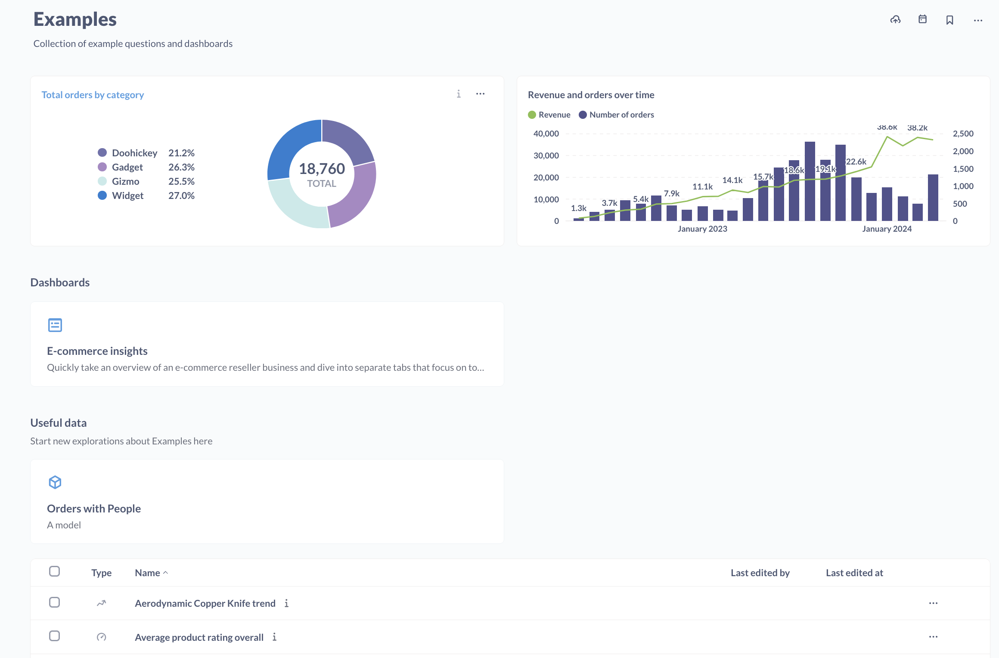

# Collections

Collections are the main way to organize [questions](../questions/introduction.md), [dashboards](../dashboards/introduction.md), and [models][models]. You can think of collections like folders or directories. You can nest collections in other collections, and move collections around. One thing to note is that a single item, like a question or dashboard, can only be in one collection at a time (excluding parent collections).

## Create a collection

To create a collection, click on the **+** button in the left nav sidebar at the top of the **Collections** section.

You can also create a new collection from any collection page by clicking on the folder icon with the plus sign in the top right of the collection page.

## Collection types

### Regular collections

They're like file-system folders. You can put stuff in them.

### Official collections



Metabase admins can designate collections as "official" with the following effects:

- These collections have a yellow badge to let people know that the items in the collection are the ones people should be looking at (or whatever "official" means to you).
- Questions in Official collections added to Dashboards that are not in Official collections will show an Official badge next to their name on the Dashboard.
- Questions and dashboards in Official collections are also more likely to show up at the top of search results.

Pairing Official badges with [verified items](./content-verification.md) can help everyone in your Metabase sort out which questions people can trust.

To add an Official badge to a collection, an admin can visit the collection and click on the three-dot menu (**...**) and select **Make collection official**. Admins can also remove an Official badge in the same menu. Admins can also mark a collection as Official or not when they first create the collection.

## Collection permissions

[Administrators can give you different kinds of access](../permissions/collections.md) to each collection:

- **View access:** you can see the collection and its contents, but you can't modify anything or put anything new into the collection.
- **Curate access:** you can edit, move, or delete the collection and its contents. You can also move or save new things in it and create new collections inside of it, and can also pin items in the collection to the top of the screen. Only administrators can edit permissions for collections, however.
- **No access:** you can't see the collection or its contents. If you have access to a dashboard, but it contains questions that are saved in a collection you don't have access to, those questions will show a permissions notification instead of the chart or table.

## Your personal collection

You'll find your **Your personal collection** in the left side navbar under collections. Only you (and your admins) can view and edit this collection.

You can use your personal collection as a scratch space to put experiments and explorations that you don't think would be particularly interesting to the rest of your team, or as a work-in-progress space where you can work on things and then move them to a shared place once they're ready.

To share items in your personal collection, for example to add a question in your personal collection to a dashboard in a public collection, you'll first need to move that item to a public collection.

## Pinned items

In each collection, you can pin important or useful dashboards, models, and questions to make them stick to the top of the screen. Pinned items will also be displayed as large cards to make them stand out well.

To pin and un-pin things in a collection, you need to have **Curate** permissions for that collection.

- To pin an item, find the item on the collection page, go into the three-dot menu (**...**), and select **Pin this**.
- To unpin a pinned item, hover over the pinned card, go to the three-dot menu (**...**), and select **Unpin**.

For pinned questions, you can also choose whether to display the visualization from the three-dot menu (**...**).

Pinned items will appear pinned for all people looking at the collection. If you just want to organize your favorite items, you should [bookmark them](./exploration.md#bookmarks) (only you can see your bookmarks).

## Moving collections

To move a collection:

1. Visit the collection's page.
2. Click on the three-dot menu in the page.
3. Select **Move**.
4. Select a new collection to move to. To make the collection a top-level collection, select the **Our Analytics** collection.

## Moving items from collection to collection

To move items between collections:

1. To move one item:

   - Click and drag it onto the destination collection, or
   - Click the three-dot menu (**...**) next to the item and select **Move**

2. To move multiple items:
   - Click the checkboxes next to the items you want to move
   - Click the **Move** action that appears at the bottom of the screen
   - Select the destination collection

You must have Curate permission for the collection that you're moving a question into and the collection you're moving the question out of. Metabase admins can move items into (and out of) anyone's [personal collection](#your-personal-collection).

## Moving questions into dashboards

You can move any question from a collection to a dashboard (and vice versa). Visit a question, click on the three-dot menu (**...**) and select **Move**. Pick a destination and your question will enjoy its new home.

### Bulk-moving questions into dashboards

If a collection has questions that have been added to dashboards in that collection, you can move the questions into their dashboards to declutter the collection.

To bulk-move questions into their dashboards:

1. Visit a collection page
2. Click on the three-dot menu (**...**)
3. Select **Move questions into their dashboards**

A modal will appear explaining what will happen:

- If a question only appears in a single dashboard in this collection, it'll be moved into that dashboard to declutter the collection.
- Permissions won't change.

You can preview the changes before initiating the move. Hit the preview button to see which questions will be moved into which dashboards. No questions will be moved into dashboards they weren't already added to. All this move does is "save" the questions to the dashboard rather than the collection.

In general, you want to save questions to dashboards unless you know people will want to reuse that question in multiple dashboards.

## Cleaning up collections



It's possible to ask too many questions. Fortunately, you can clean up collections by [trashing items](./delete-and-restore.md) that people haven't even looked at for a period of time. Cleaning up old questions and dashboards can keep your Metabase from getting too cluttered, and you can always resurrect items from the trash if you need to.

On a collection page, click on the three-dot menu (**...**) and select **Clear out unused items**. Metabase will pull up a modal where you can select unused items to move to the trash. You can set how long items need to go unnoticed before they're culled by setting **Not used in over**, which you can set to trash items from one month ago to over two years ago. There's also a toggle to include/exclude items in sub-collections.

## Events and timelines

You can add events to collections, and organize those events into timelines. See [Events and timelines](events-and-timelines.md).

## Uploading data

You can upload data to collections. See [Uploading data](./uploads.md).

## Further reading

- [Keeping your analytics organized](https://www.metabase.com/learn/metabase-basics/administration/administration-and-operation/same-page)
- [Multiple environments](https://www.metabase.com/learn/metabase-basics/administration/administration-and-operation/multi-env#one-collection-per-environment)

[dashboards]: ../dashboards/introduction.md
[models]: ../data-modeling/models.md
