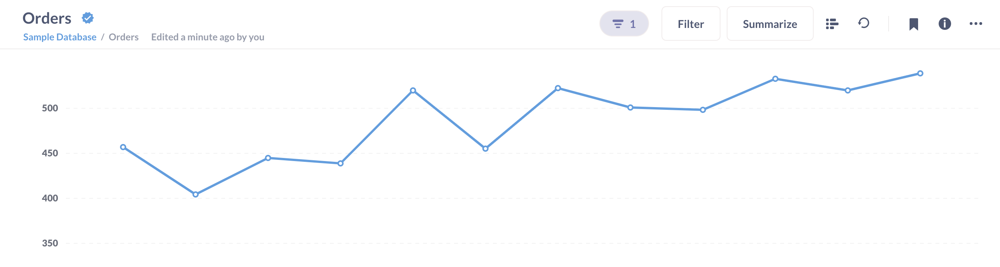

# Content verification



Admins can verify items to let others know that the content is accurate and up to date with the correct data source and query.

## Benefits of verifying an item

- Verified items get a fancy blue checkmark next to them.
- They're more likely to show up higher in search suggestions and results.
- The models and metrics browsers allow you to filter for verified items.

## Verifying items

To verify an item, an admin can click on the three-dot menu (**...**) in the upper right when viewing that item and select: **Verify this item**.

## Removing verification status

To remove verification from an item, Admins can visit the item, click on the three-dot menu (**...**) and select **remove verification**.

## Changes to queries require re-verification

If anyone makes any changes to a question, metric, or model's _query_, Metabase will remove the verification status (the check mark will disappear). The logic here is that changing the results in any way should require re-verification.

Dashboards verification works a little differently (since there's no underlying query). Dashboard verification is sticky; you can modify a verified dashboard and it'll retain its verified status.

## Verifiable items

Admins can verify the following items:

- [Questions](../questions/start.md)
- [Models](../data-modeling/models.md)
- [Metrics](../data-modeling/metrics.md)
- [Dashboards](../dashboards/introduction.md)
