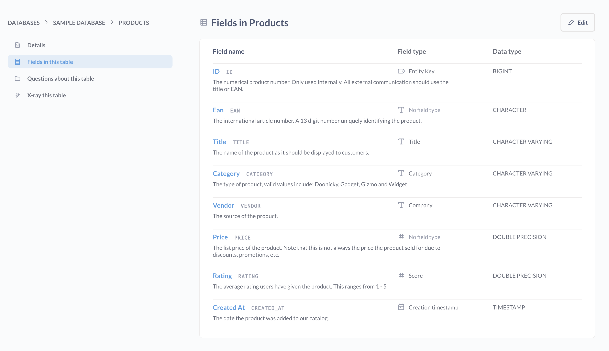
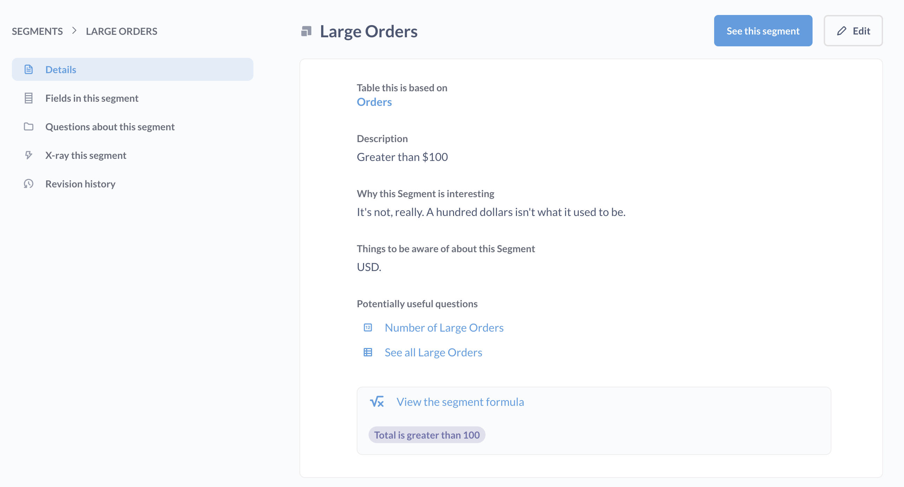

# Data reference

Metabase's data reference section is a way to browse your metadata.

The data reference includes:

- [Databases](#databases)
- [Glossary](#glossary)
- [Segments](#segments)

You can open the data reference from:

- The left sidebar > **Data** > **Databases** > **Learn about our data** (in the upper right).
- Hovering over a table in the data browser and clicking on the book icon.
- The native/SQL editor > **Book** icon.

You can also visit `https://[your metabase here]/reference`.

## Databases

The data reference is a collection of pages organized by database, then schemas in that database (if you have several schemas), and finally tables in that database - the same structure you use to [pick data](../questions/query-builder/editor.md#picking-data). The data reference section is a great place to find information about the [data types](https://www.metabase.com/learn/grow-your-data-skills/data-fundamentals/data-types-overview) of columns in your data.

### Database details

When you click into a database, you'll see:

- **Details tab**: Contains metadata about the database, including general description, why this database is interesting, and things to be aware of.
- **Tables tab**: Displays table names and descriptions. Click on a table to view its details and fields.

For each table, you can view:

- Table description and metadata
- Fields in the table with their types and descriptions
- Sample values for columns (when available)
- Questions about this table (if you have permission to view them)
- Option to create an X-ray of the table

Admins can edit the metadata in this reference by clicking the **Edit** button in the upper right. Admins can also edit metabadata in the [admin settings](../data-modeling/metadata-editing.md).

## Glossary

The glossary is a place where anyone can define terms relevant to your data. To add a new term, click **+ New term**. Add the term name and its definitions, then click the checkmark to save the term to the glossary.

The glossary is particularly useful for [Metabot](../ai/metabot.md). When Metabot gets a prompt, it can look up glossary terms to understand your request. For example, if you define "MRR" as "Monthly Recurring Revenue" in your glossary, Metabot will know what you mean when you ask "What's our MRR for Q4?"

## Segments

If your admins have created any [segments](../data-modeling/segments.md), you can browse them in this section.

## Data reference in the native editor

Sometimes when you're writing a query, you might forget the exact names of different tables or columns, or which table contains what. That’s where the **Data reference** comes in handy.

To bring up the data reference panel in the native/SQL editor, click on the open book icon.

This panel lists all the databases you have access to, and the [models](../data-modeling/models.md) and tables, and the fields inside of them.

Click the model or table to see a description of it and a list of all the columns it has. Each table or column will only contain a description if your admin wrote something in the table metadata section of the admin panel.

If you click on a column you’re interested in, you’ll see a description of its contents, as well as a list of sample values for columns that don't have a huge number of distinct values.

### Connections

In the data reference sidebar in the native editor, under **Connections**, you can find a list of table relationships (defined by [foreign keys](https://www.metabase.com/glossary/foreign-key)).

If a foreign key relationship exists in your database, but doesn't show up in your Metabase, your admin will need to update your [Metabase table metadata](../data-modeling/metadata-editing.md).
