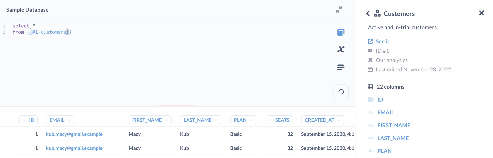

# Data reference

You can open the data reference from:

- The Metabase sidebar > **Browse** > **Databases** > **Learn about our data**.
- Hovering over a table in the data browser and clicking on the book icon that appears.
- The native/SQL > **Book** icon.

## Browse data reference

The data reference is a collection of pages organized by database, then tables in that database (the same structure you use to [pick data](../questions/query-builder/introduction.md#picking-data)). The data reference section is a great place to find information about the [data types](https://www.metabase.com/learn/databases/data-types-overview) of columns in your data.

## Data reference in the native editor

Sometimes when you're writing a query, you might forget the exact names of different tables or columns, or which table contains what. That’s where the **Data reference** comes in handy.

To bring up the data reference panel in the native/SQL editor, click on the open book icon.

This panel lists all the databases you have access to, and the [models](../data-modeling/models.md) and tables, and the fields inside of them.

Click on the model or table you would like to explore further to see a description of it and a list of all the columns it has. Each table or column will only contain a description if your admin wrote something in the Table Metadata section of the Admin Panel.

If you click on a column you’re interested in, you’ll see a description of its contents, as well as a list of sample values for columns that don't have a huge number of distinct values.

## Connections

In the data reference sidebar, under **Connections**, you can find a list of table relationships (defined by [foreign keys](https://www.metabase.com/glossary/foreign_key)).

If a foreign key relationship exists in your database, but doesn't show up in your Metabase, your Metabase admin will need to update your [Metabase Table Metadata](../data-modeling/metadata-editing.md).
