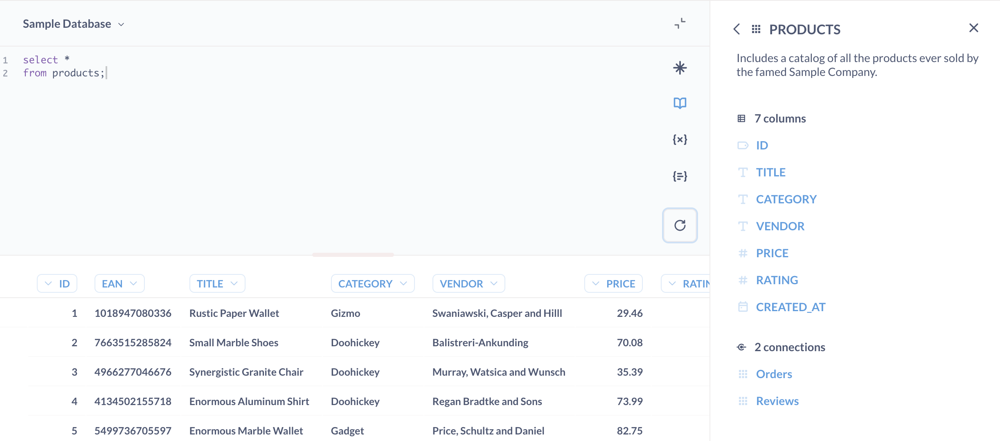

# Data reference

Sometimes when you're composing a question, you might forget the exact names of different tables or columns, or which table contains what. That’s where the _data reference_ comes in handy. You can open the data reference from:

- The Metabase sidebar > **Browse data** > **Learn about our data**.
- The SQL editor > **book** icon.

## Browse data reference

The data reference is a collection of pages organized by database, then tables (the same structure you use to [pick data](../questions/query-builder/introduction.md#picking-data)). This is the best place to find information about the [data types](https://www.metabase.com/learn/databases/data-types-overview) of columns in your data.

## SQL editor data reference

This panel lists all the databases you have access to and the tables and columns inside of them.

Click on the table you would like to explore further to see a description of it and a list of all the columns it has. Each table or column will only contain a description if your admin wrote something in the Data Model section of the Admin Panel.

If you click on a column you’re interested in, you’ll see a description of its contents, as well as a list of sample values for columns that don't have a huge number of distinct values.

## Foreign keys

You can find a list of table relationships ([foreign keys](https://www.metabase.com/glossary/foreign_key)) under **Connected to these tables**. If a Metabase admin has documented the relationship between your current table and another table in the database, Metabase will display this section in the sidebar. If a foreign key relationship exists in your database, but doesn't show up in your Metabase, your Metabase admin will need to update your [Metabase data model](../data-modeling/metadata-editing.md).
