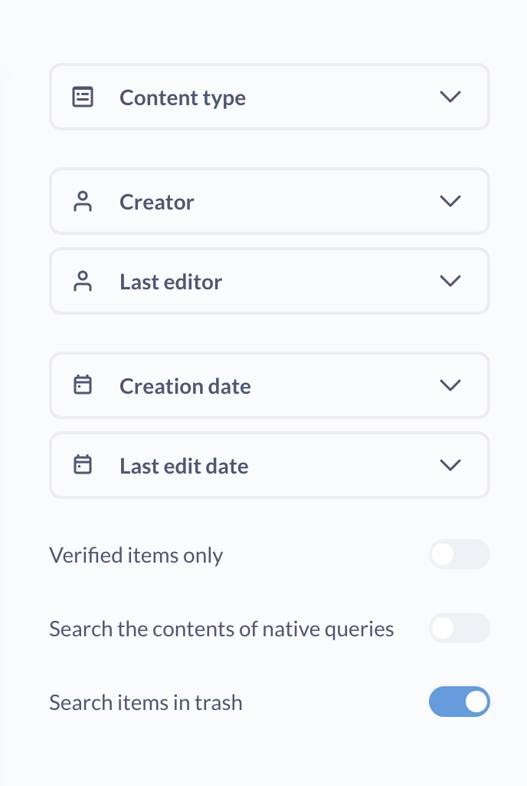

# Delete and recover items

Sometimes your questions, dashboards, or models outlive their usefulness. You can send outdated items to **Trash**.

Items in **Trash** won't show up in search, and you won't be able to use them to create new questions and dashboards.

Moving items to Trash is not permanent: you'll be able to restore them to their original parent collection, or move them to another non-deleted collection. But if you'd' like to delete items permanently, [you can do that too](#permanently-deleting-items).

Deleting an item will affect any [dashboards](../dashboards/introduction.md), [subscriptions](../dashboards/subscriptions.md), or [SQL questions](../questions/native-editor/referencing-saved-questions-in-queries.md) that depend on that item, so be careful!

## See items in Trash

You can find Trash at the bottom of the left navigation sidebar below all the collections:

You can think of Trash as a special type of collection. In **Trash**, you can see deleted items from the collections that you have [Curate permissions](../permissions/collections.md#collection-permission-levels) on. You can order deleted items by type (questions, dashboards, etc), time it was deleted, and who deleted it.

You;'ll be able to see the contents of deleted dashboards, questions, and models in Trash, but you won't be able to modify them.

## Search in Trash

Items in **Trash** will not show up in search results by default. You can use a search filter to find items in trash.

To search in Trash:

1. Open the search bar by clicking on **Search** at the top of the screen or pressing **Ctrl/Cmd+K**;
2. Enter your search term;
3. Click on **View and filter all results** under "Search results";
4. In the filter sidebar on the right, toggle **Search items in the trash**.

## Deleting and restoring questions

To delete a question:

1. Go to the question you want to delete;
2. Click on the three dots menu;
3. Select "Move to trash".

You'll still be able to see the results and the visualization for the the deleted question in Trash, but you won't be able to modify it or use it as a source for other questions.

To restore a question:

1. Go to Trash;
2. Find the question you'd like to delete. You can sort deleted items to make it easier to find the question, or [search for your question in Trash](#search-in-trash);
3. Click on the checkbox next to the question to select it;
4. Select "Restore".

If the question's original collection has been deleted as well, you won't see an option to **Restore**. You'll still be able to move the question from Trash to a different collection.

Deleting or restoring a question will affect other items that depend on that question:

- **Dashboards**: If a deleted question was included in any dashboards, then the card with the question results will be removed from those dashboards. If the question is restored from **Trash**, its card will be restored to the dashboards that used to contain it.

- **Derived questions**: If a trashed question was used as data source for a Query Builder question, or was [referenced in a SQL question](../questions/native-editor/referencing-saved-questions-in-queries.md), then the derived questions will continue to work while the base question is in **Trash**. If the base question is then [permanently deleted](#permanently-deleting-items), the derived questions will stop working, and you'll get a `Card not found` error.

- **Alerts**: If you delete a question, all alerts on that question will be deleted as well. You will get an email notification that the alert has been deactivated. If you restore the question from Trash, the alerts _will not_ be restored – you'll need to recreate them.

## Deleting and restoring dashboards

To delete a dashboard:

1. Go to the model you want to delete;
2. Click on the three dots menu;
3. Select "Move to trash".

You'll still be able to see the contents of the dashboard in **Trash**, but you won't be able to modify it.

To restore a dashboard:

1. Go to Trash;
2. Find the dashboard you'd like to delete. You can sort deleted items to make it easier to find the dashboard, or [search for your dashboard in Trash](#search-in-trash);
3. Click on the checkbox next to the dashboard to select it;
4. Select "Restore".

The dashboard will be restored to the parent collection that it was most recently saved in. If the dashboards's original collection has been deleted as well, you won't see an option to **Restore**, but you'll still be able to move the dashboard from Trash to a different collection.

Deleting or restoring a dashboard will affect other items that depend on that dashboard:

- **Dashboards subscriptions**: If a dashboard is deleted, any subscriptions to the dashboard will be deactivated. If a dashboard is restored from Trash, the subscriptions will be restored as well.

- [**Custom home page**](../configuring-metabase/appearance.md#landing-page): If a deleted dashboard was set as a custom home page, the home page will revert to the default Metabase home page. If a dashboard is restored, the custom home page will be restored as well.

## Deleting and restoring models

To delete a model:

1. Go to the model you want to delete;
2. Click on the three dots menu;
3. Select "Move to trash".

You'll still be able to see the model in Trash, but you won't be able to modify it.

To restore a model:

1. Go to Trash;
2. Find the model you'd like to delete;
3. Click on the three dot menu;
4. Select "Restore".

Deleting a model will affect other items that depend on that model:

- **Derived questions**: If a trashed model was used as data source for a Query Builder question, or was [referenced in a SQL question](../questions/native-editor/referencing-saved-questions-in-queries.md), then the derived questions will continue to work while the model is in Trash. If the model is [permanently deleted](#permanently-deleting-items), the derived questions will stop working, and you'll get a `Card does not exist` error.

- **Actions**: If a model is trashed, the actions in this model will still work. If a model is permanently deleted, the actions in the deleted model will be deleted as well.

- **Dashboards**: If a model is included as a card in any dashboards, then the card will be removed from those dashboards when the model is moved to Trash. If the model is restored from Trash, its card will be restored to the dashboards that used to contain it.

## Deleting and restoring collections

> When a collection is deleted, all items in the collection are deleted as well.

To delete a collection:

1. Go to the collection you want to delete;
2. Click on the three dots menu;
3. Select "Move to trash".

You'll still be able to browse the collection in Trash. Individual items from a deleted collection and can be restored or moved from Trash to a different collection.

To restore a collection:

1. Go to Trash;
2. Find the collection you'd like to delete. You can sort deleted items to make it easier to find the dashboard, or [search for your collection in Trash](#search-in-trash);
3. Click on the checkbox next to the collection to select it;
4. Select "Restore".

Restoring a collection will also restore all the items from that collection.

## Permanently deleting items

Moving an item to Trash is not permanent: you'll be able to restore them to the original parent collection, or move it to a non-deleted collection.

To permanently delete an item:

1. Go to Trash;
2. Find the item you'd like to delete;
3. Click on the checkbox next to the collection to select it;
4. Select "Permanently delete".

## Deleting and restoring events and timelines

Events and timelines can be archived. See [Archiving Events and timelines](events-and-timelines.md#archiving-timelines).

You won't see archived Events and Timelines in Trash. To see archived events and timelines, you need to [access them from the collection's page](events-and-timelines.md#view-archived-events-and-timelines).

## Deleting metrics and segments

Metrics and events can be retired. See [Retiring Metrics and Segments](../data-modeling/segments-and-metrics.md#editing-and-retiring-segments-and-metrics).

You won't see retired Metrics and Segments in Trash.

## Deleting subscriptions and alerts

See [Deleting a subscription](../dashboards/subscriptions.md#deleting-a-subscription) and [Deleting alerts](../questions/sharing/alerts.md#editing-and-deleting-alerts).

## Deleting databases

See [Deleting databases](../databases/connecting.md#deleting-databases).
