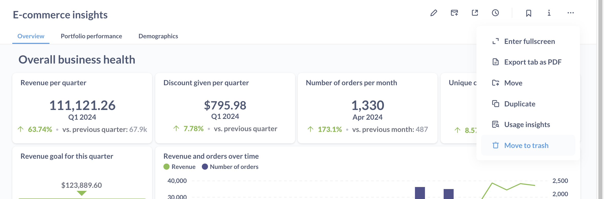

# Delete and restore

Sometimes your questions, dashboards, models, or collections outlive their usefulness. You can send outdated items to **Trash**.

Items in **Trash** won't show up in search (unless you use [advanced search filters](./exploration.md)), and you won't be able to use them to create new questions and dashboards.

Moving items to Trash is not permanent: you'll be able to restore them to their original parent collection, or move them to another non-deleted collection. But if you'd' like to delete items permanently, [you can do that too](#permanently-deleting-items).

Deleting an item will affect any [dashboards](../dashboards/introduction.md), [subscriptions](../dashboards/subscriptions.md), or [SQL questions](../questions/native-editor/referencing-saved-questions-in-queries.md) that depend on that item, so be careful!

## See items in Trash

You can find Trash at the bottom of the left navigation sidebar below all the collections:

You can think of Trash as a special type of collection. In **Trash**, you can see deleted items from the collections that you have [Curate permissions](../permissions/collections.md#collection-permission-levels) on. You can order deleted items by type (questions, dashboards, etc), time it was deleted, and who deleted it.

You;'ll be able to see the contents of deleted dashboards, questions, and models in Trash, but you won't be able to modify them.

## Search in Trash

You can use [advanced search](./exploration.md) with a "Search items in trash" toggle to find items in Trash

## Deleting and restoring items

To move an item (question, dashboard, model, or collection) to Trash:

1. Go to the question you want to delete;
2. Click on the three dots menu;
3. Select "Move to trash".

> When a collection is deleted, all items in the collection are deleted as well.

You'll still be able to see the contents of the items in Trash, but you won't be able to modify them or use them as a source for other questions.

To restore an item:

1. Go to Trash;
2. Find the item you'd like to delete. You can sort deleted items to make it easier to find the item, or [search for your question in Trash](#search-in-trash);
3. Click on the checkbox next to the item to select it;
4. Select "Restore".

> Restoring a collection will also restore all the items from that collection.

If the item's original parent collection has been deleted as well, you won't see an option to **Restore**. You'll still be able to move the it from Trash to a different collection.

## How deleting an item affects related items

Deleting or restoring an item will affect other items that depend on that item.

### Questions

| Affected item                      | In Trash       | Permanently deleted                | Restored       |
| ---------------------------------- | -------------- | ---------------------------------- | -------------- |
| Dashboard                          | Card removed   | Card removed                       | Card restored  |
| Question based on deleted question | Works normally | Breaks with `Card not found` error | Works normally |
| Alerts                             | Removed        | Removed                            | Not restored   |

### Dashboards

| Affected item   | In Trash                   | Permanently deleted        | Restored |
| --------------- | -------------------------- | -------------------------- | -------- |
| Subscriptions   | Deactivated                | Deactivated                | Restored |
| Custom homepage | Revert to default homepage | Revert to default homepage | Restored |

### Model

| Affected item                      | In Trash       | Permanently deleted                | Restored       |
| ---------------------------------- | -------------- | ---------------------------------- | -------------- |
| Question based on deleted question | Works normally | Breaks with `Card not found` error | Reactivated    |
| Dashboard                          | Card removed   | Card removed                       | Card restored  |
| Action                             | Works normally | Deleted                            | Works normally |

## Collections

| Affected item                                  | In Trash | Permanently deleted | Restored |
| ---------------------------------------------- | -------- | ------------------- | -------- |
| All items and subcollecitons in the collection | In Trash | Permanently deleted | Restored |

## Permanently deleting items

Moving an item to Trash is not permanent: you'll be able to restore it to the original parent collection, or move it to a non-deleted collection.

To permanently delete an item:

1. Go to Trash;
2. Find the item you'd like to delete;
3. Click on the checkbox next to the collection to select it;
4. Select "Permanently delete".

## Deleting and restoring events and timelines

Events and timelines can be archived and unarchived. See [Archiving Events and timelines](events-and-timelines.md#archiving-timelines).

You won't see archived Events and Timelines in Trash. To see archived events and timelines, you need to [access them from the collection's page](events-and-timelines.md#view-archived-events-and-timelines).

## Deleting and restoring SQL snippets

SQL snippets can be archived and unarchived. See [Archiving SQL snippets](../questions/native-editor/sql-snippets.md#archiving-snippets).

You won't see archived SQL snippets in Trash. To see archived SQL Snippets, you need to [access them from the cSnippet menu](../questions/native-editor/sql-snippets.md#snippet-menu).

## Deleting metrics and segments

Metrics and events can be retired. See [Retiring Metrics and Segments](../data-modeling/segments-and-metrics.md#editing-and-retiring-segments-and-metrics).

You won't see retired Metrics and Segments in Trash.

## Deleting subscriptions and alerts

See [Deleting a subscription](../dashboards/subscriptions.md#deleting-a-subscription) and [Deleting alerts](../questions/sharing/alerts.md#editing-and-deleting-alerts).

## Deleting databases

See [Deleting databases](../databases/connecting.md#deleting-databases).
