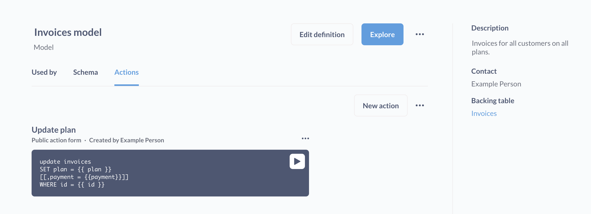
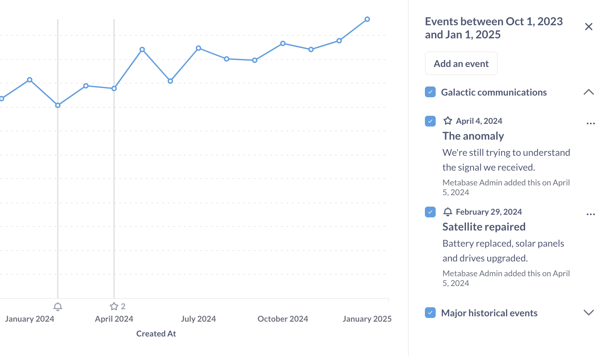
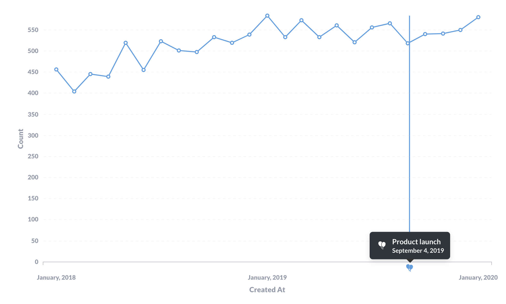
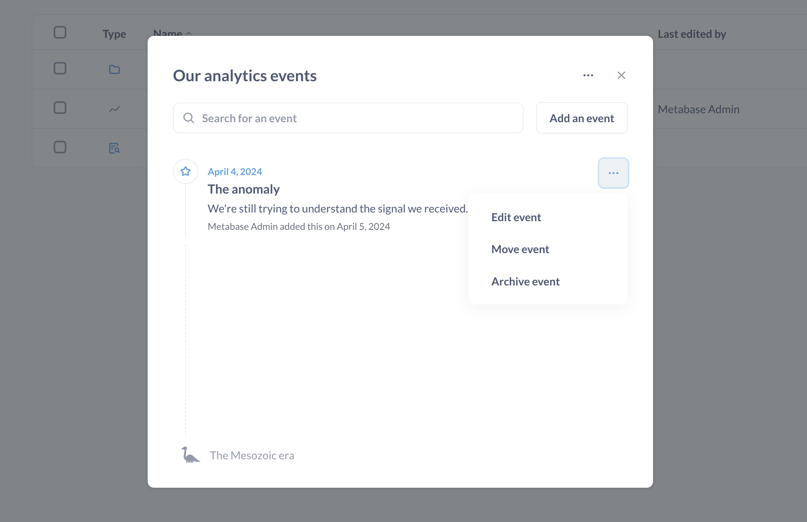

# Events and timelines

A lot of discussions around data have a moment when someone asks a question related to a specific point in time: "Wait, what's the spike in March again?", or "When did the new widget launch?"

Events and timelines are a way to capture that chronological knowledge and make it available when you need it, in context (that is, when you're viewing a chart). Events are a great way to store institutional knowledge about what happened and when, so people (including yourself three months from now) won't have to figure out (again) why the line chart spiked back in March.

## Events

An event is basically a date + a title + a description + an icon. You can add events to Metabase to show important milestones, launches, or anything else, right alongside your data.

Metabase will only display events on time series charts when viewing an individual question. Metabase won't display events on charts in dashboard cards.

## Timelines

Timelines are groups of events associated with a [collection](collections.md).

For example, you may want to have a timeline that contains important email or sales dates, or an outages timeline that tracks downtime. You can move events between timelines, and move timelines from collection to collection.

Collections can have timelines, and timelines can contain events. In practice what this means is that events you've added to a timeline will show up on time series questions stored in the same collection as that timeline.

- If you don't explicitly create a timeline yet, but you do create events, Metabase will automatically create a timeline for you (which acts as the default timeline for the collection).
- You can have multiple timelines for the same collection.
- Timelines associated with collections do not apply to that collection's sub-collections.

### Adding events when viewing a collection

When viewing a [collection](collections.md), you can view, add, or edit events by clicking on the **calendar** icon in the upper right.

Once you create an event, the event will show up in charts in the collection, provided:

- The date of the event falls within the chart's time range.
- The timeline is visible (more on that [below](#adding-events-when-viewing-a-question)).

You'll see an icon along the x-axis that plots the event. A vertical line will extend from the event to show when the data plotted on the chart intersects with the event.

## Adding events when viewing a question

If your question is a time series, you can click on the **Calendar** in the bottom right of the question, and Metabase will open the timeline sidebar. Metabase will list any timelines and their events that fall in the range of your time series. You can:

- Toggle timeline visibility (including timelines from other collections)
- Add a new event (even if you haven't saved the question yet).
- Edit, move, or archive an event.

## Viewing events and timelines on a chart from a different collection

If you're viewing a question with a time series chart from a _different_ collection, you can temporarily apply a timeline to the chart by clicking on the **calendar** icon in the bottom right of the question and selecting the timeline and events you want to display.

These selections are temporary; if you reload the question, Metabase will drop the events from the chart.

### To hide the timeline and its events on a chart

To temporarily hide the events from a chart:

1. Click on the **calendar** icon in the bottom right.
2. Uncheck the timeline or event.

Your selections will reset on reload.

To permanently hide the timeline and its events, you'll need to [archive the timeline](#archiving-timelines). Alternatively, you could move the question to a different collection.

## Edit an event

To edit an event:

1. Click the calendar icon in the top right of a collection.
2. Go to the timeline that contains the event, click on the event's three-dot menu (**...**).
3. Select:
   - **Edit event**: its title, description, and icon.
   - **Move event**: to another timeline.
   - **Archive event**: to hide the event from charts.

## Archiving timelines

To archive a timeline:

1. Go to the timeline's collection and click on the **calendar** icon in the top right.
2. Select the timeline, then click on the three-dot menu (**...**). If the collection only has one timeline, click on the three-dot menu (**...**).
3. Select **Edit timeline details**.
4. Click on the red **Archive timeline and all events**.

### View archived events and timelines

> Archived events and timelines can only be viewed from the collection. They don't show up in the [main archive](../exploration-and-organization/history.md).

To view (and resurrect) archived timelines and events:

1. Click on the **Calendar** icon in the relevant collection.
2. Click on the three-dot menu **...** menu.
3. Select **View archived timelines**. Metabase will display archived events or timelines.
4. If you want to unarchive an item, click on the three-dot menu **...** next to the event or timeline and select the **Unarchive** option.

To permanently delete an archived event or timeline, click on the three-dot menu (**...**) and select **Delete**.

Then you can delete the archived events from the **View archived events** modal, or timelines from the **View archived timelines** modal.

## Event and timeline permissions

Event and timeline permissions depend on your [collection permissions](../permissions/collections.md).

- **View access**: you can view the collection's events and timelines. You can also temporarily apply timelines and events to time series in other collections.
- **Curate access**. Anyone with curate access to a collection can add events and timelines to that collection.

### Make a timeline and its events available for everyone

If you want the event and timeline to be available to everyone, create the timeline in a collection that the [All Users group](../people-and-groups/managing.md#all-users) has access to, as by default everyone is in the All Users group.

Note that for questions outside of that collection, you can only temporarily apply those timelines to charts. The timelines won't appear automatically when you reload the chart.

## Further reading

- [Keeping your Metabase organized](https://www.metabase.com/learn/administration/same-page)
