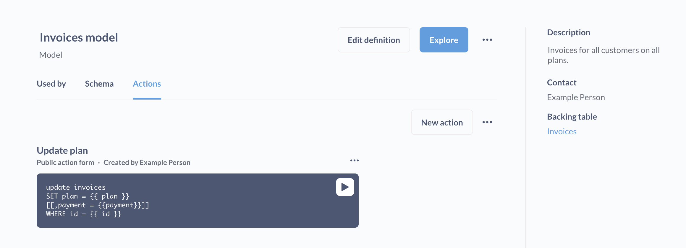
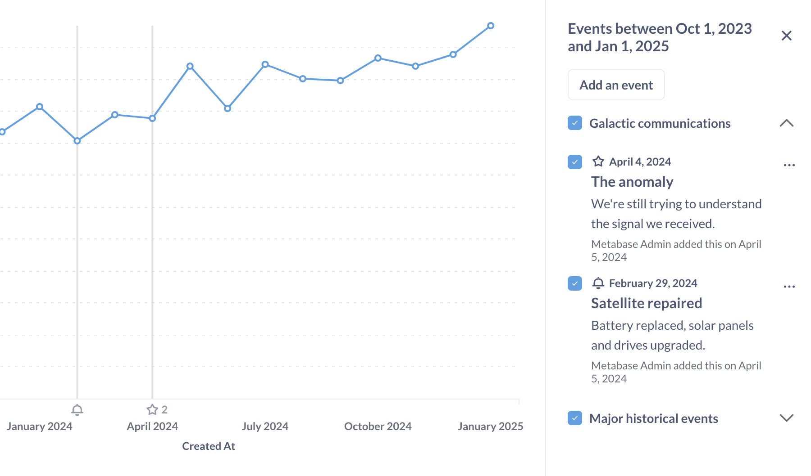
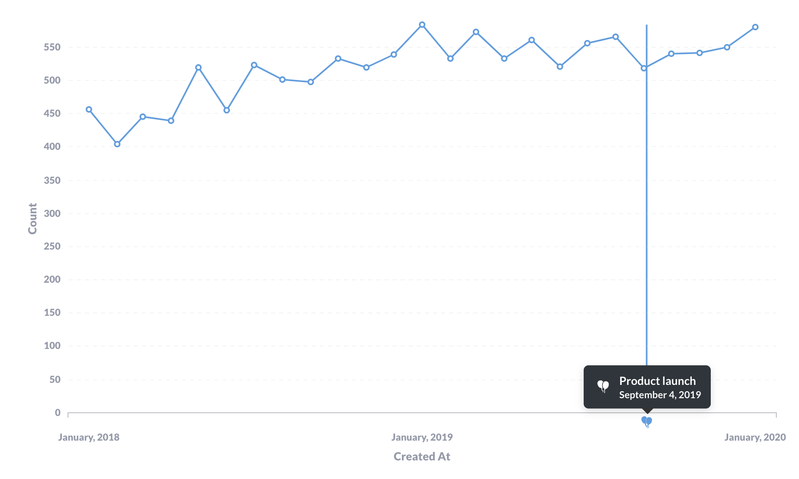
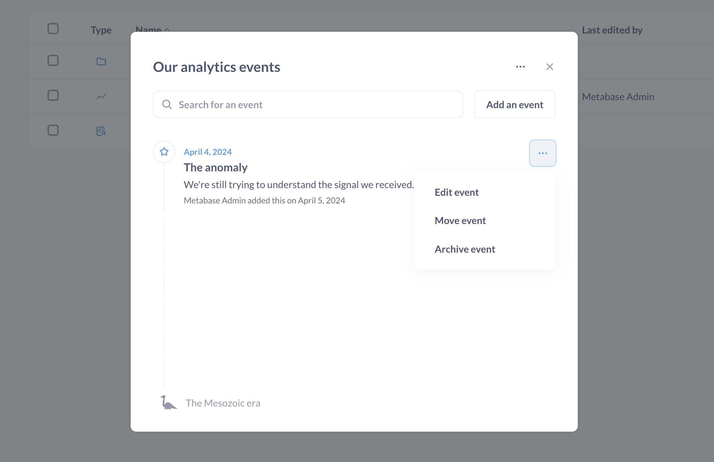

# Events and timelines

A lot of discussions around data have a moment when someone has a question related to a specific point in time: "Wait, what's the spike in March again?", or "When did the new widget launch?"

Events and timelines are a way to capture that chronological knowledge and make it available when you need it, in context (that is, when you're viewing a chart). Events are a great way to store institutional knowledge about what happened and when, so people (including yourself three months from now) won't have to figure out (again) why the line chart spiked back in March.

## Events

An event is basically a date + a title + a description + an icon. You can add events to Metabase to show important milestones, launches, or anything else, right alongside your data.

Metabase displays events on time series charts when viewing an individual question, and on dashboards for questions that were saved with events turned on. Dashboards shared via a public link, static embed, interactive embedding, or the embedded analytics SDK show the events each question was saved with, but people viewing them can't change which events are shown. Public or embedded questions and dashboard subscriptions don't show events. Public links and static embeds show a question's saved events to anyone viewing the dashboard, even people who can't access the timeline's collection, so only people who can view a timeline can add a question that uses it to a shared dashboard. In interactive embedding and the SDK, people only see events from timelines they have access to.

## Timelines

Timelines are groups of events associated with a [collection](collections.md).

For example, you may want to have a timeline that contains important email or sales dates, or an outages timeline that tracks downtime. You can move events between timelines, and move timelines from collection to collection.

Collections can have timelines, and timelines can contain events. In practice what this means is that events you've added to a timeline will show up by default on new or unsaved time series questions in the same collection as that timeline. A saved question shows only the timelines and events it was saved with, with one exception: a question saved before Metabase started recording that selection still shows its collection's timelines in the query builder.

- If you don't explicitly create a timeline yet, but you do create events, Metabase will automatically create a timeline for you (which acts as the default timeline for the collection).
- You can have multiple timelines for the same collection.
- Timelines associated with collections do not apply to that collection's sub-collections.

### Adding events when viewing a collection

When viewing a [collection](collections.md), you can view, add, or edit events by clicking on the **calendar** icon in the upper right.

Once you create an event, the event will show up in charts in the collection, provided:

- The date of the event falls within the chart's time range.
- The timeline is visible (more on that [below](#adding-events-when-viewing-a-question)).

You'll see an icon along the x-axis that plots the event. A vertical line will extend from the event to show when the data plotted on the chart intersects with the event.

You can't add a timeline with events to the [Library](../data-modeling/semantic-layer/library.md).

## Adding events when viewing a question

If your question is a time series, you can click on the **Calendar** in the bottom right of the question, and Metabase will open the timeline sidebar. Metabase will list any timelines and their events that fall in the range of your time series. You can:

- Toggle timeline visibility (including timelines from other collections)
- Add a new event (even if you haven't saved the question yet).
- Edit, move, or archive an event.

When you save a new question or change a question's event selection and save it, Metabase records which timelines and events are turned on, and shows those same events wherever the question appears, including on dashboards. Toggling events on a saved question counts as a change, so save the question to keep your selection.

## Events on dashboards

A time series chart on a dashboard shows the events its question was saved with. Questions saved with events turned off (or saved before Metabase started recording events) don't show any events on dashboards. Very small cards don't have room for events, so they won't show them even when a timeline is on, and their **three-dot menu** (**...**) leaves out the **Events** item.

To change which events a chart shows while viewing a dashboard, click on the **three-dot menu** (**...**) on the card and select **Events**. Metabase will open the same events sidebar you get on a question, listing every timeline you can view that has an event in the range of that chart, whatever collection the timeline lives in. You can:

- Toggle a timeline or an event on or off for that card.
- Add a new event, if you have curate access to the dashboard's collection. You can choose a timeline whose collection you can curate. If there are no available timelines, Metabase creates one in the dashboard's collection.
- Edit, move, or archive an event, if you have curate access to the collection that holds the event's timeline.

To toggle events for every time series chart on the current tab at once, click on the **three-dot menu** (**...**) in the dashboard header and select **Events**. If some cards show an event and others don't, its checkbox shows a dash. Clicking it applies your choice to every card.

These selections only last for your session; if you reload the dashboard or enter edit mode, each chart goes back to the events its question was saved with. To change what everyone sees, open the question, toggle its events, and save it.

Exporting a dashboard to PDF captures the page as you're viewing it, so the PDF includes whatever events are showing at the time, session toggles and all. Results downloaded as .csv or .xlsx contain data only, and the chart images in dashboard subscriptions don't show events.

## Viewing events and timelines on a chart from a different collection

If you're viewing a question with a time series chart from a _different_ collection, you can temporarily apply a timeline to the chart by clicking on the **calendar** icon in the bottom right of the question and selecting the timeline and events you want to display.

If you save the question, Metabase keeps the timelines and events you turned on and shows them wherever the question appears.

### To hide the timeline and its events on a chart

To temporarily hide the events from a chart:

1. Click on the **calendar** icon in the bottom right.
2. Uncheck the timeline or event.

Your selections reset on reload unless you save the question.

To keep events hidden on this question, save the question after unchecking them. To hide a timeline and its events everywhere, [archive the timeline](#archiving-timelines).

## Edit an event

To edit an event:

1. Click the calendar icon in the top right of a collection.
2. Go to the timeline that contains the event, click on the event's three-dot menu (**...**).
3. Select:
   - **Edit event**: its title, description, and icon.
   - **Move event**: to another timeline.
   - **Archive event**: to hide the event from charts.

## Archiving timelines

To archive a timeline:

1. Go to the timeline's collection and click on the **calendar** icon in the top right.
2. Select the timeline, then click on the three-dot menu (**...**). If the collection only has one timeline, click on the three-dot menu (**...**).
3. Select **Edit timeline details**.
4. Click on the red **Archive timeline and all events**.

### View archived events and timelines

> Archived events and timelines can only be viewed from the collection. They don't show up in the [Trash](../exploration-and-organization/delete-and-restore.md).

To view (and resurrect) archived timelines and events:

1. Click on the **Calendar** icon in the relevant collection.
2. Click on the three-dot **...** menu.
3. Select **View archived timelines**. Metabase will display archived events or timelines.
4. If you want to unarchive an item, click on the three-dot menu **...** next to the event or timeline and select the **Unarchive** option.

To permanently delete an archived event or timeline, click on the three-dot menu (**...**) and select **Delete**.

Then you can delete the archived events from the **View archived events** modal, or timelines from the **View archived timelines** modal.

## Event and timeline permissions

Event and timeline permissions depend on your [collection permissions](../permissions/collections.md).

- **View access**: you can view the collection's events and timelines. You can also temporarily apply timelines and events to time series in other collections.
- **Curate access**. Anyone with curate access to a collection can add events and timelines to that collection.
- **Saving a question's events**: you need view access to a timeline to turn it on or show one of its hidden events. You can keep existing selections for timelines you can no longer view. If you switch a question to a chart type that displays events, you need view access to every timeline it has turned on.

### Make a timeline and its events available for everyone

If you want the event and timeline to be available to everyone, create the timeline in a collection that the [All Users group](../people-and-groups/managing.md#all-users) has access to, as by default everyone is in the All Users group.

For questions outside of that collection, save the question after applying a timeline if you want the timeline to remain visible after reload and wherever the question appears.

## Further reading

- [Keeping your Metabase organized](https://www.metabase.com/learn/metabase-basics/administration/administration-and-operation/same-page)
