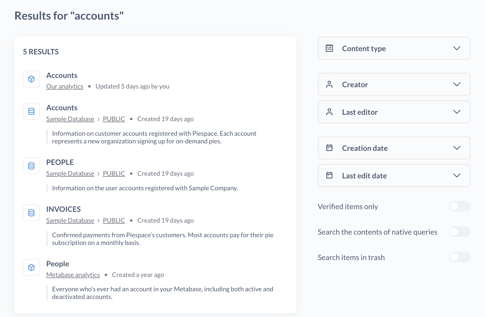
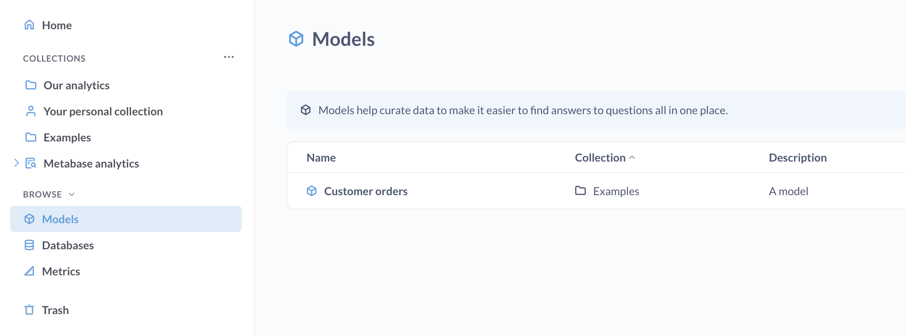
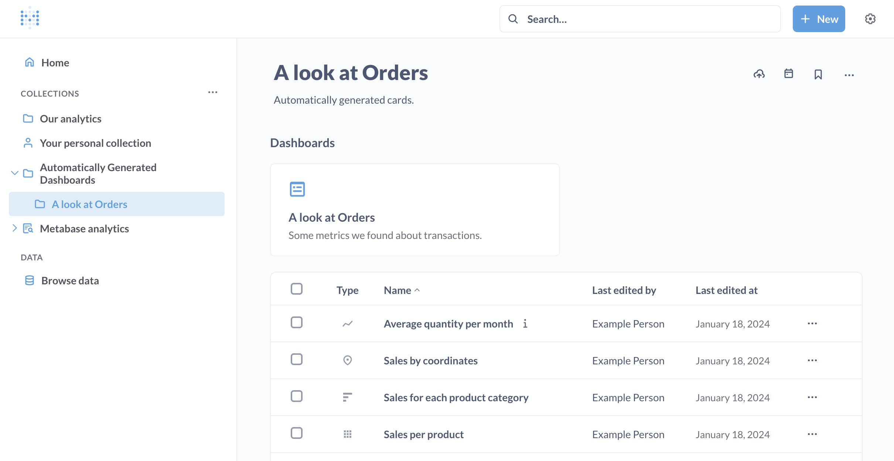
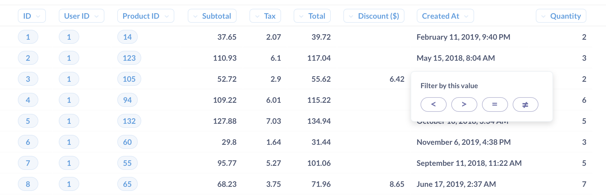
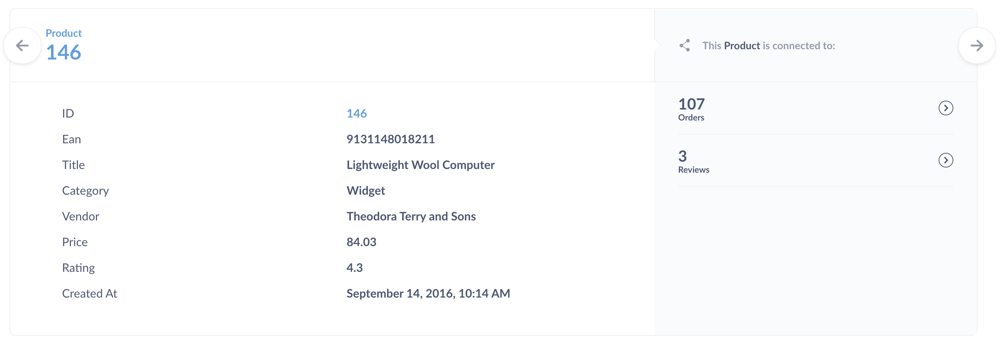

# Basic exploration

## See what your teammates have made

As long as you're not the very first user in your team's Metabase, the easiest way to start exploring your data is by looking at dashboards, charts, and lists that your teammates have already created. The best place to start is by checking out any dashboards that might be pinned on your home page, or in [collections][collections] you have access to.

## Command palette

The command palette lets you create new things, search your content, or jump to anywhere in your Metabase.

To bring up the command palette, hit cmd/ctrl + k. That's `cmd + k` for Macs, or `ctrl + k` for Windows PCs.

You can use the command palette to:

- Create new things (like new questions and dashboards)
- Find things (saved questions, dashboards, models, etc.)
- Find and jump to Admin and account settings.

So anytime you want to do or find anything in Metabase, just hit `cmd/ctrl + k` and start typing what you want to do.

> The command palette is currently unavailable in [interactive embedding](../embedding/interactive-embedding.md) contexts.

## Advanced search

To filter your search results, hit `cmd/ctrl + k` to bring up the command palette and enter your search term. The first result is a link to "Search and filter all X results".

Searches take into account items’ titles, descriptions, and other metadata — you can even search the contents of your SQL queries. For example, you can search for things like `SELECT escape_pod FROM mothership` and find that one question you worked on six months ago. The results will display which collection each item is saved in, what kind of object it is, and whether it’s pinned. Note that you'll only ever see items in that are in collections you have permission to view.

You can search by:

- **Content type**: dashboard, question, model, collection, database, table.
- **Creator**: who made the thing.
- **Last editor**: who made the last saved change on the thing.
- **Creation date**: when the thing entered our universe.
- **Last edit date**: when someone last cared enough to update the thing.
- **Verified items only**. Only show items that [have been verified](./content-verification.md).
- **Search the contents of native queries**: search through the SQL/native code in questions.
- **Search items in trash**: include the depths of oblivion in your search.

## Browse your databases

> Whether a group has access to the database browser depends on the group's [Create queries permission](../permissions/data.md#create-queries-permissions).

The left sidebar lists your databases, [models](../data-modeling/models.md), and [metrics](../data-modeling/metrics.md).

[Pro](https://www.metabase.com/product/pro) and [Enterprise](https://www.metabase.com/product/enterprise) plans include the ability to filter for [verified models and metrics](./content-verification.md).

The database browser will list all the databases connected to your Metabase. Hover over a table and click on the **bolt** icon to [X-ray](x-rays.md) the table, or click on the **book** icon to view more info about the table: its fields and their descriptions (if any), what questions are based on that table, and more.

To learn more, see [Exploring data with Metabase's data browser](https://www.metabase.com/learn/metabase-basics/querying-and-dashboards/data-browser).

## Exploring collections

[Collections][collections] in Metabase are a lot like folders. They're where Metabase keeps all your team's dashboards and charts.

Your teammates might have pinned some items to the top of your collection.

- [dashboards](../dashboards/introduction.md)
- [models](../data-modeling/models.md)
- [metrics](../data-modeling/metrics.md)
- [questions](../questions/start.md)

Collections have a list of any other items that are saved within them, and you can see what other collections are saved inside of the current one by checking out the navigation sidebar.

## Exploring dashboards

[Dashboards][dashboards] are a set of questions and text cards that you want to be able to refer to regularly.

If you click on a part of a chart, such as a bar in a bar chart, or a dot on a line chart, you'll see the **Action menu**, with actions you can take to dive deeper into that result, branch off from it in a different direction, or see automatic insights to [X-ray](x-rays.md) the data.

In this example of orders by product category per month, clicking on a data point on this line chart gives us the ability to:

- **See these Orders**: See a list of the orders for a particular month.
- **See this month by week**.
- **Break out by ...**: See things like the Gizmo orders in June 2023 broken out by the status of the customer (e.g., `new` or `VIP`). Different charts will have different breakout options, such as **Location** and **Time**.
- **Automatic insights**: See orders for a particular category over a shorter time range.
- **Filter by this value**: update the chart based on the value you clicked: equal to, less than, greater than, or not equal to.

> Note that while charts created with SQL currently only have [limited drill-through menu](../questions/native-editor/writing-sql.md#drill-though-in-sql-questions), you can add SQL questions to a dashboard and customize their click behavior. You can send people to a [custom destination](https://www.metabase.com/learn/metabase-basics/querying-and-dashboards/dashboards/custom-destinations) (like another dashboard or an external URL), or have the clicked value [update a dashboard filter](https://www.metabase.com/learn/metabase-basics/querying-and-dashboards/dashboards/cross-filtering).

Clicking on a table cell will often allow you to filter the results using a comparison operator, like =, >, or <. For example, you can click on a table cell, and select the less than operator `<` to filter for values that are less than the selected value.

Lastly, clicking on the ID of an item in a table gives you the option to go to a detail view for that single record. For example, you can click on a customer's ID to see the profile view for that customer.

When you add questions to a dashboard, you can have even more control over what happens when people click on your chart. In addition to the default drill-through menu, you can add a [custom destination](https://www.metabase.com/learn/metabase-basics/querying-and-dashboards/dashboards/custom-destinations) or [update a filter](https://www.metabase.com/learn/metabase-basics/querying-and-dashboards/dashboards/cross-filtering). Check out [interactive dashboards](../dashboards/interactive.md).

## Bookmarks

**Bookmarks** are a way to quickly get back to things you visit frequently (or have been working on recently). Bookmarked items show up in the main navigation sidebar above [collections][collections].

To bookmark an item, look for the **ribbon** icon in the upper right corner of the item's page. You can bookmark:

- Questions
- Models
- Dashboards
- Collections

To add or remove a bookmark from an item, click on the three-dot menu (**...**) next to the item in the collection.

Some things to remember with bookmarks:

- Bookmarks are personal; other people can't see your bookmarks. If you want to highlight something for everyone, you'll want to put it in an official collection and/or pin the item in the collection (see [collections][collections]).
- If you end up bookmarking a lot of items, you can collapse the bookmarks section in the sidebar (or remove the bookmarks that are just getting in your way).
- Items that you bookmark will get a boost in your search results (but not the search results of other people).
- To reorder bookmarks, simply drag and drop them in the sidebar.

[collections]: ./collections.md
[dashboards]: ../dashboards/start.md
[models]: ../data-modeling/models.md
