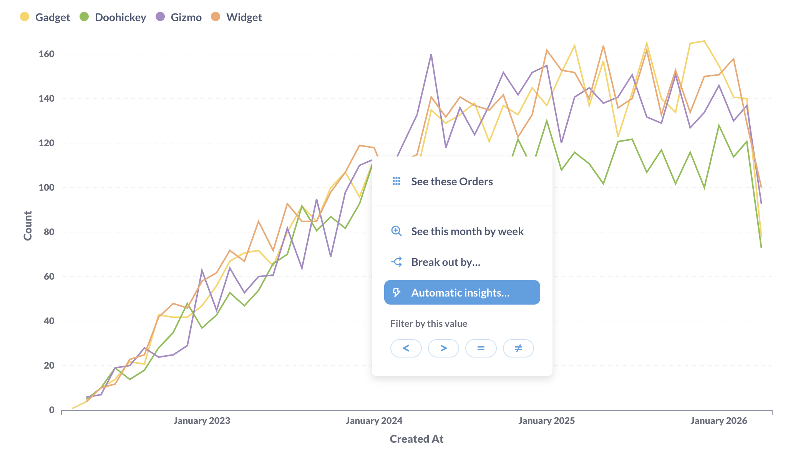

# Basic exploration

How to poke around your Metabase. Browsing models and databases, exploring collections, bookmarks, verified items, search, and more.

## Browse models and data

To view the [models](../data-modeling/models.md) and databases you have access to, click on **Browse data** in the left sidebar.

[Models][models] are tables curated by your team, so they make great starting points for asking questions.

To view the [data reference](./data-model-reference.md) section, click on the **Databases** tab, then click on **Learn about our data** in the upper right. You can also hover over individual tables and click on the book icon.

### Only show verified models



One nice-to-have pro feature is that you can filter for verified models by toggling the **Only show verified models** option.

## Exploring collections

[Collections][collections] in Metabase are a lot like folders. They're where Metabase keeps all your team's dashboards and charts.

If your teammates are cool, they'll have [pinned](./collections.md#pinned-items) some important dashboards or questions within your collections; if so, those pinned items will show up as cards at the top of the collection.

## Exploring models, questions, and dashboards

If you click on a part of a chart, such as a bar in a bar chart, or a dot on a line chart, you'll see a **drill-through menu**, with actions you can take to dive deeper into that result, branch off from it in a different direction, or see automatic insights to [X-ray](x-rays.md) the data.

If you click on a cell in a table (like in a model), Metabase will often allow you to filter the results using a comparison operator, like =, >, or <. For example, you can click on a table cell, and select the less than operator `<` to filter for values that are less than the selected value.

Lastly, clicking on the ID of an item in a table gives you the option to go to a detail view for that single record. For example, you can click on a customer's ID to see the profile view for that customer.

You can also click on the headings of tables to see more options, like summing the values of a column, or filtering based on that column.

One of our personal favorite ways to explore is with the **Distribution** option. This will show you how many rows there are in a given table, grouped by the column you clicked on. So if you have a Users table, if you click on an Age column and select Distribution, you'll see a bar chart with the count of users you have in each age bracket.

## Verified items



Verified questions and models are marked with a blue checkmark icon:

Administrators can **Verify** a question or model from the three dot menu (`...`) to signal that they've reviewed the item and deemed it to be trustworthy. That is: the question or model is filtering the right columns, summarizing the right metrics, and querying records from the right tables. Verified items are more likely to show up higher in search suggestions and search results (and you can filter for them.)

If someone modifies a verified question, the question will lose its verified status, and an administrator will need to review and verify the question again to restore its verified status.

## Bookmarks

**Bookmarks** are a way to quickly get back to things you visit frequently (or have been working on recently). Bookmarked items show up in the main navigation sidebar above [collections][collections].

To bookmark an item, look for the **ribbon** icon. If you don't immediately see the ribbon, open up the settings for that item. You can bookmark:

- Questions (ribbon's in the editing sidebar)
- Models (ribbon's in the editing sidebar)
- Dashboards (ribbon's in the dot menu: **...**)
- Collections (ribbon's in the upper right of the collection's page)

When viewing a collection, you can also click on the dot menu, **...**, next to an item to add or remove a bookmark from the item.

Some things to remember with bookmarks:

- Bookmarks are personal; other people can't see your bookmarks. If you want to highlight something for everyone, you'll want to put it in an official collection and/or pin the item in the collection (see [collections][collections]).
- If you end up bookmarking a lot of items, you can collapse the bookmarks section in the sidebar (or remove the bookmarks that are just getting in your way).
- Items that you bookmark will get a boost in your search results (but not the search results of other people).
- To reorder bookmarks, simply drag and drop them in the sidebar.

## Search

Use the search bar to find dashboards, questions, collections, subscriptions, and alerts. You can select from the typeahead's dropdown results, or hit enter to view a search results page. You can also activate the search bar from anywhere by pressing the `/` key.

Searches take into account items’ titles, descriptions, and other metadata. The results will display:

- Which collection each item is saved in
- What kind of object it is
- If it’s pinned
- If it's [official](./collections.md#official-collections) (marked in yellow)
- If it's [verified](./exploration.md#verified-items).

You'll only ever see items in collections you have [permission to view](../permissions/start.md).

### Search filters

You can filter your search by:

- Content type: Dashboard, Question, Model, Collection, Database, Table
- Creator
- Last editor
- Creation date
- Last edit date

### Search for code in your SQL queries

To search the contents of your SQL queries:

1. Type in the term or code snippet you want to search for in your native queries, and hit enter to bring up the search results page.
2. Toggle the **Search the contents of native queries** option, and Metabase will search your SQL queries.

For example, you can search for things like `SELECT escape_pod FROM mothership` and find that one question you worked on six months ago.

### Search for verified items only

On some paid plans, you can filter search results for [verified items](#verified-items). To include only verified items in your search results:

1. Search for a term and hit enter to view the search results page.
2. In the right sidebar, toggle the **Verified items only** option.

## Further reading

- [Exploring data with Metabase's data browser](https://www.metabase.com/learn/basics/questions/data-browser)

[collections]: ./collections.md
[dashboards]: ../dashboards/start.md
[models]: ../data-modeling/models.md
