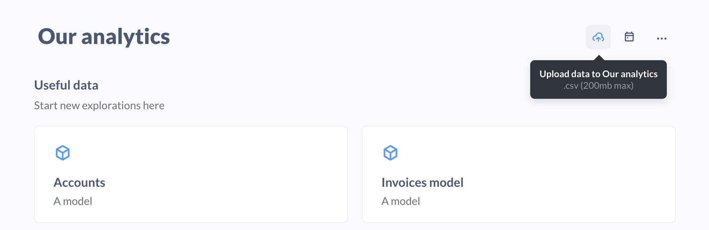
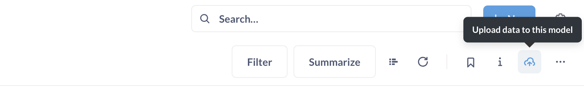

# Uploading data

If an admin has [set up uploads](../databases/uploads.md), you can upload CSV data by clicking on the **Upload** icon in the top right of the collection page.

.

## Create, append, or replace models with uploads

When you upload a CSV file, Metabase may ask to select a destination for that upload (depending on whether there are other uploads).

If your CSV has the same columns as a model from a previously uploaded file, you can append data to that model. Otherwise, you can create a new [model](../data-modeling/models.md). if you want to:

- Create a new model
- [Append to an existing model created by an upload](#appending-to-a-model-created-by-an-upload)
- [Replace the data for an existing model created by an upload](#replacing-the-data-of-an-uploaded-model)

Metabase will create a [model](../data-modeling/models.md) that contains that CSV data, as well as the model's underlying table.

Uploads will only be available if your admin has enabled uploads for your Metabase, and you're in a group with Unrestricted access to the schema used to store those uploads. See [Uploading data](../databases/uploads.md).

## Appending to a model created by an upload

You can upload additional CSV data to an existing model created by a previous CSV upload.

The uploaded CSV must have the same column name, order, and type as the columns in the model. Metabase will look for a header row to check that the column names are the same. So if you split a large CSV into multiple CSVs, make sure to include header rows for all of the files.

When appending, Metabase will simply insert the rows into the underlying table, which will update the model that sits on top of that table. If you have duplicate rows from one upload to the next, Metabase will preserve those duplicate rows.

The upload icon will only be visible on models created by uploads.

## Replacing the data of an uploaded model

Instead of deleting a model and recreating it, you can replace the underlying data with an updated spreadsheet.

Like appending to uploaded models, replacing the uploaded CSV data with a new CSV file requires the columns and headings to match.

If you [delete the uploaded table](../databases/uploads.md#deleting-tables-created-by-uploads), you won't be able to replace the model's data.

## Further reading

- [Enabling uploads](../databases/uploads.md)