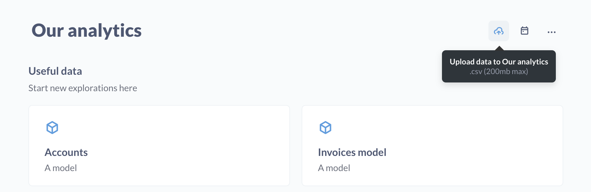
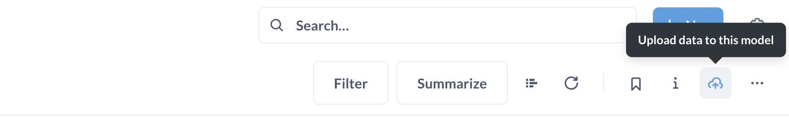

# Uploading data

You can upload CSV files to Metabase to query, visualize, and share.

## Upload requirements

To upload CSV data, you'll need:

- Uploads [enabled](../databases/uploads.md) by an admin.
- [Data permissions](../permissions/data.md): your group needs **Can view** data access and **Create queries** access (query builder or higher) for the upload schema. (Unless you're an admin, you can't see what groups you're in; just noting this here so you know groups are a thing. Ask your admin to put you in a group with these privileges).
- [Curate access](../permissions/collections.md#curate-access) to the collection you want to upload to.

The upload icon only appears in collections where you have Curate access. Everyone has Curate access to their [personal collection](../permissions/collections.md#personal-collections), so you can always upload there.

## Uploading a CSV file

**From a collection page**:

1. Go to the collection where you want to save the uploaded data.
2. Click the **Upload** icon (the cloud with an arrow) in the upper right of the collection page.
3. Select your CSV file.

**From the sidebar**:

1. Click the **Add data** button (**+**) next to **DATA** in the left sidebar.
2. Select **CSV**.
3. Drag and drop a file or click **Select a file**.
4. Choose the destination collection at the bottom of the modal.
5. Click **Upload**.

You can also add data from [Google Sheets](../cloud/google-sheets.md) (Metabase Cloud only).

## Create, append, or replace models with uploads

When you upload a CSV file, Metabase may ask to select a destination for that upload (depending on whether there are other uploads).

If your CSV has the same columns as a model from a previously uploaded file, you can append data to that model. Otherwise, you can create a new [model](../data-modeling/models.md). You can:

- Create a new model
- [Append to an existing model created by an upload](#appending-to-a-model-created-by-an-upload)
- [Replace the data for an existing model created by an upload](#replacing-the-data-of-an-uploaded-model)

Metabase will create a [model](../data-modeling/models.md) that contains that CSV data, as well as the model's underlying table.

## Appending to a model created by an upload

You can upload additional CSV data to an existing model created by a previous CSV upload.

The uploaded CSV must have the same column name, order, and type as the columns in the model. Metabase will look for a header row to check that the column names are the same. So if you split a large CSV into multiple CSVs, make sure to include header rows for all of the files.

When appending, Metabase will simply insert the rows into the underlying table, which will update the model that sits on top of that table. If you have duplicate rows from one upload to the next, Metabase will preserve those duplicate rows.

The upload icon will only be visible on models created by uploads.

## Replacing the data of an uploaded model

Instead of deleting a model and recreating it, you can replace the underlying data with an updated spreadsheet.

Like appending to uploaded models, replacing the uploaded CSV data with a new CSV file requires the columns and headings to match.

If you [delete the uploaded table](../exploration-and-organization/uploads.md#deleting-models-and-tables-created-by-uploads), you won't be able to replace the model's data.

## Primary key auto-generation

When you upload a CSV, Metabase will create a unique primary key column, called `_mb_row_id`, as the first (left-most) column of the uploaded CSV table. This `_mb_row_id` column will contain automatically generated integers. Metabase will also ignore any columns in the upload that have a name that will be in the database with the same name as the auto-generated primary key column (e.g., `_MB row-ID` in the CSV will be `_mb_row_id` or `_MB_ROW_ID` in the database).

If you don't want this autogenerated ID column, you can always remove the column from the model Metabase created. Visit the model, click on the info **i** icon, then **Model details**. From the model details page, click the **Edit definition** button. In the Data section of the query builder, click on the down arrow next to the table, deselect the added ID column, and save your changes.

## Data type errors

Metabase will try to guess what the data type is for each column, but if some entries are not like the others, Metabase may not guess the type correctly. For example, if you have a column that starts with integers like 100, 130, 140, then later on a float 105.5, Metabase may reject the upload. To fix this, you'll need to use spreadsheet software to adjust the formatting so that all the integers are formatted as floats (e.g., 100.00, 130.00, 140.00 and so on) before uploading.

## File size limit

CSV files cannot exceed 50 MB in size.

> While Metabase limits uploads to 50 MB, the server you use to run your Metabase may impose a lower limit. For example, the default client upload limit for [NGINX is 1 MB](https://nginx.org/en/docs/http/ngx_http_core_module.html#client_max_body_size). So you may need to change your server settings to allow uploads up to 50 MB. People on Metabase Cloud don't have to worry about this.

If you have a file larger than 50 MB, the workaround here is to split the data into multiple files and [append those files to an existing model](../exploration-and-organization/uploads.md#appending-to-a-model-created-by-an-upload). Each file that you upload to Metabase must have a header row (the names of the columns), so if you're splitting one file into multiple files, you'll need to add header rows to each file.

## Date formats

For now, Metabase only recognizes dates and datetimes from strings in uploaded CSVs with the following formats:

### Dates

Represents the year, month, and day without time information.

**Format**: `yyyy-MM-dd`

**Example**: `2023-01-01`

### Datetimes

Represents the year, month, day, hour. Minutes, seconds, and fractional seconds are optional.

**Format**: `yyyy-MM-ddTHH:mm:ss.SSS`. The "T" separator could also be a space (" ").

**Examples**:

- `2023-01-01 00`
- `2023-01-01 00:00:00.000`
- `2023-01-01T00:00:00.000`
- `2023-01-01 00:00:00.0000000`

### Datetimes with offsets

Represents the datetime with an offset from Coordinated Universal Time (UTC). Minutes and seconds in the offset are optional.

**Formats**:

Datetime formats:

- `yyyy-MM-ddTHH:mm`.
- `yyyy-MM-ddTHH:mm:ss`.
- `yyyy-MM-ddTHH:mm:ss.SSS` (and any number of S's).

The "T" separator could also be a space (" ").

Offsets:

- `Z` (for UTC)
- `+HH` or `-HH`
- `+HH:mm` or `-HH:mm`
- `+HH:mm:ss` or `-HH:mm:ss`

**Examples**:

- `2023-01-01 00:00:00+00:00:00`
- `2023-01-01T00:00:00+00:00:00`

## Deleting models and tables created by uploads

### Deleting models created by uploads



You can move a model to Trash by clicking on the three dots in the upper right and selecting **Move to Trash**.

For deleting models completely, see [Deleting items permanently](../exploration-and-organization/delete-and-restore.md).

### Deleting tables created by uploads



To delete tables created by uploads, go to **Admin** > **Settings** > **Uploads**.

Under **Manage uploads**, Metabase will list the tables underlying the models.

When you delete the table, Metabase will give you the option to **Also send all models and questions based on this table to the trash**.

## Further reading

- [Enabling uploads](../databases/uploads.md)
