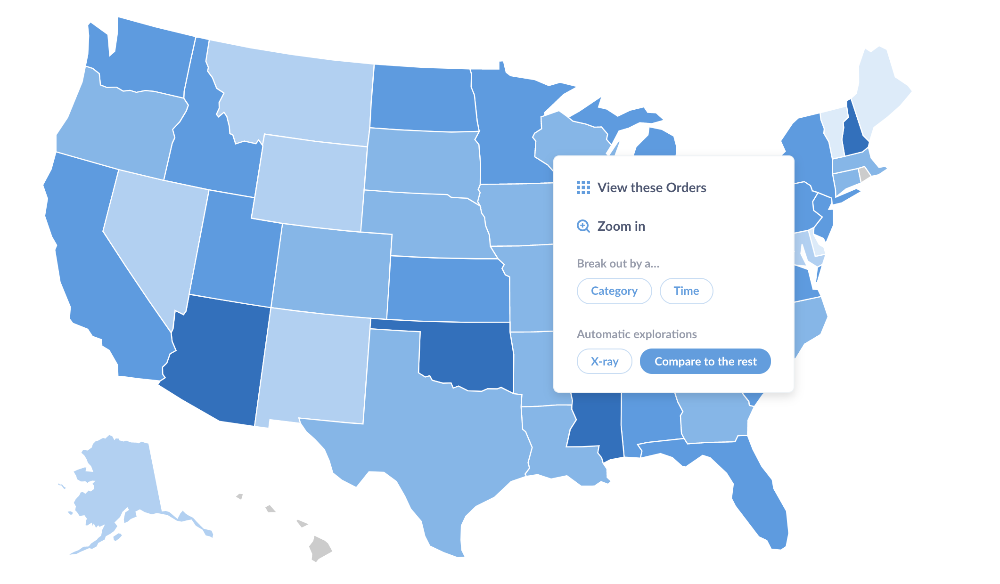

# X-rays

X-rays are a fast and easy way to get automatic insights and explorations of your data.

## Viewing X-rays by clicking on charts or tables

One great way to explore your data in general in Metabase is to click on points of interest in charts or tables, which shows you ways to further explore that point.

We've added X-rays to this drill-through menu, so if you find a point on your line chart that seems extra interesting, give it a click and X-ray it!

## Comparisons

To see how the value of a bar, point, or geographic region compares to the rest of the data, click on it to pull up the drill-through menu, then select **Compare to the rest**.

If you're already looking at an X-ray of a table, Metabase will give you the option to look at X-rays of certain fields, if there are any.

## Table X-rays

Another great way to get to know your data is by X-raying your tables. From left nav, click on **Browse Data** and click the lightning bolt icon on a table to view an X-ray of it.

## X-rays in the data browser and data reference

You can also view an X-ray by browsing to a table and clicking on the lightning bolt icon. Click on the **Browse Data** button in the top navigation, select a database, and hover over a table to see the icon.

From the Browse Data page, you can also click on `Learn about our data` to view the Data Reference section. From here you can navigate through databases, tables, columns, metrics, or segments, and you can click on the X-ray link in the left sidebar to see an X-ray of the item you're currently viewing.

## Exploring newly added data sources

If you're an administrator, when you first connect a database to Metabase, Metabot will offer to show you some automatic explorations of your newly connected data.

## Browsing through suggested X-rays

Depending on the X-ray you're currently viewing, you'll see suggestions that will let you:

- "Zoom out" and view an X-ray of the table the current X-ray is based on.
- "Zoom in" to see a more detailed X-ray about a field or dimension of the current X-ray.
- Go to an X-ray of a related item, like a metric based on the current table, or a different table that's related to the current one.

## Saving X-rays

If you come across an X-ray that's particularly interesting, you can save it as a dashboard by clicking the green Save button. Metabase will create a new dashboard and put it and all of its charts in a new collection, and will save this new collection wherever you choose.

## Disabling X-rays

If for some reason X-rays aren't a good fit for your team or your data, administrators can turn them off completely by clicking on the gear icon in the upper right and going to **Admin settings** > **Settings** > **General** and toggling the option to **Enable X-ray features**.

If you pin any dashboards in the "Our Analytics" collection, Metabase will hide the X-ray suggestions that appear on the homepage.

Admins can also manually remove these suggestions by clicking on the **Customize** button in the upper right and selecting a dashboard as your homepage. [Changing the home page](../configuring-metabase/settings.md#custom-homepage) won't disable the X-ray features in the rest of Metabase.
