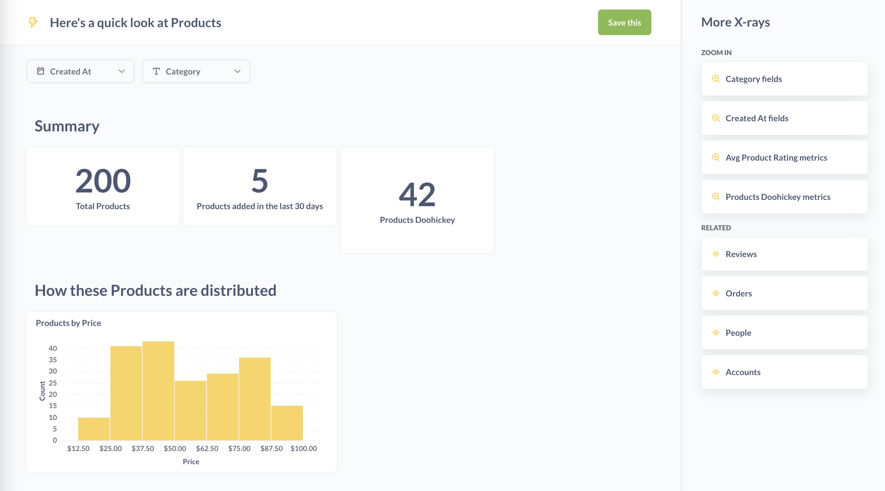
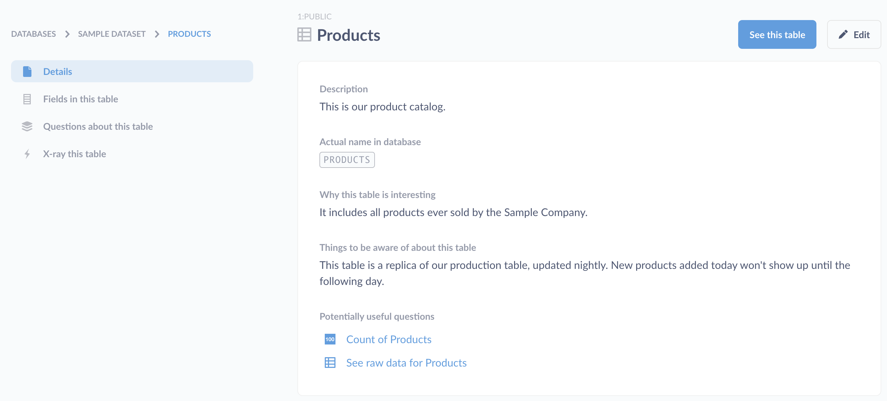

# X-rays

X-rays are a way to get automatic insights and explorations of your data.

## Get automatic insights when clicking on a chart

One great way to explore your data in general in Metabase is to click on points of interest in charts and selecting **Automatic insights**.

Metabase will give you some options:

- **X-ray**
- **Compare to the rest**

In both cases, Metabase will take a look at the fields in that table or model, and automatically generate charts that summarize the data based on the data types it finds.

Here's an example X-ray:

## X-raying models and tables

Another great way to get to know your data is by X-raying your models and tables.

- **Table X-rays**: From the left nav, click on **Browse Data**, pick a database, hover over a table card, and click the lightning bolt icon table to view an X-ray of the table.
- **Model X-rays**: Click on the ellipses for a model and select **X-ray this**.

## X-rays in the data reference

You can also view an X-ray by browsing to a table and clicking on the lightning bolt icon. Click on the **Browse Data** button in the top navigation, select a database, and hover over a table to see the icon.

From the Browse Data page, you can also click on `Learn about our data` to view the Data Reference section. From here you can navigate through databases, tables, columns, metrics, or segments, and you can click on the X-ray link in the left sidebar to see an X-ray of the item you're currently viewing.

## Exploring newly added data sources

If you're an administrator, when you first connect a database to Metabase, Metabot will offer to show you some automatic explorations of your newly connected data.

## Browsing through suggested X-rays

Depending on the X-ray you're currently viewing, you'll see suggestions that will let you:

- **Zoom out**: view an X-ray of the table the current X-ray is based on.
- **Zoom in**: see a more detailed X-ray about a field or dimension of the current X-ray.
- **Related**: X-ray some related data, like a metric based on the current table, or a different table related to the current one.

## Saving X-rays

If you come across an X-ray that's particularly interesting, you can save its cards and filters as a dashboard by clicking the green **Save this** button. Metabase will create a new dashboard and save it to the Automatically generated dashboards collection (though you can move the dashboard to any collection you have curate access to).

## Disabling X-rays

If for some reason X-rays aren't a good fit for your team or your data, administrators can turn them off completely by clicking on the gear icon in the upper right and going to **Admin settings** > **Settings** > **General** and toggling the option to **Enable X-ray features**.

If you pin any dashboards in the "Our Analytics" collection, Metabase will hide the X-ray suggestions that appear on the homepage.

Admins can also manually remove these suggestions by clicking on the **Customize** button in the upper right and selecting a dashboard as your homepage. [Changing the home page](../configuring-metabase/settings.md#custom-homepage) won't disable the X-ray features in the rest of Metabase.
