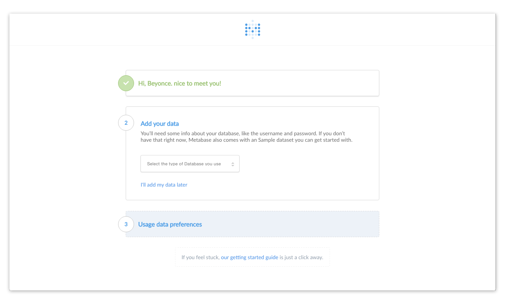
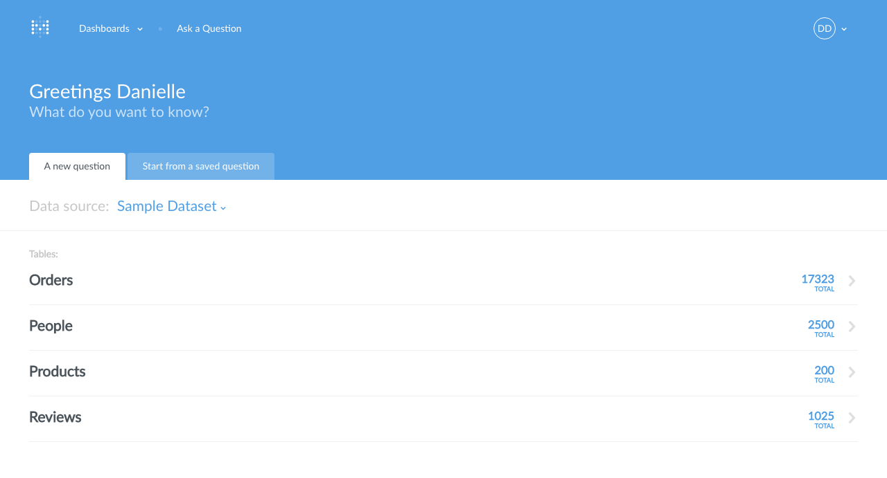
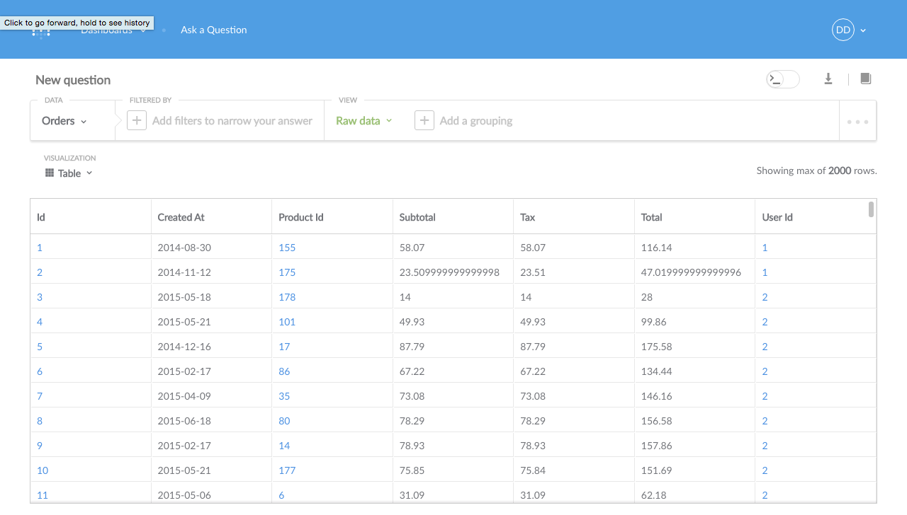
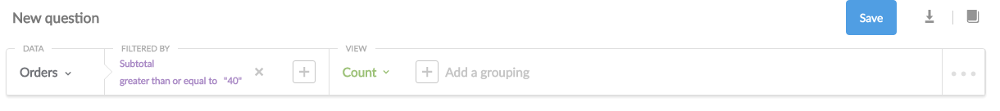
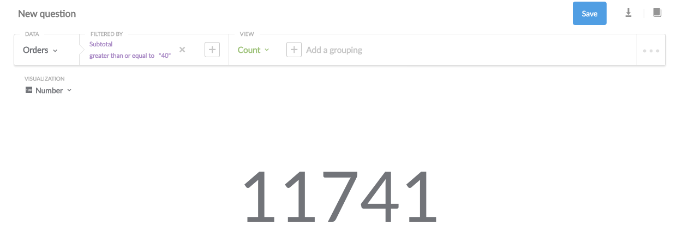

#Welcome to Metabase
Metabase lets you ask questions about your data, drill into specific records, and dashboards to help keep you organized.  

> **This guide will teach you:**
>
> How to install Metabase on your laptop or server
> How to connect Metabase to a database
> How to ask your first questions

##Step 1: Installing Metabase
Metabase uses Java to operate, so you'll need at least version 1.6 or later.  Not sure what version of Java you're using?  No problem.  Here's how to check: 

**Mac Users:**

In Terminal, insert the command prompt: "java -version".  You will receive a message similar to:

    java version "1.60_65"
    Java (TM) SE Runtime Environment (build 1.6.0_65-b14-466.1-11M4716)
    Java HotSpot (TM) 64-Bit Server VM (build 20.65-b04-466.1, mixed mode)
    
As long as the version is at least 1.6, you're all set to go! 

**Windows Users:**

Under Programs, click on the "Java" icon.  Click on "About" and then find the version number listed.  If you're using version 1.6 or greater, then you're good to go! 

---

If you don't have the latest version of Java, download it at: [https://java.com/en/download/](https://java.com/en/download/)

Once you take care of checking the version of java on your computer, **Download the Metabase file from [www.metabase.com/download](www.metabase.com/download).**  

Place the Metabase JAR in the directory.  

Run the command `java -jar metabase.jar` to create a file called "metabase.db.h2.db".  **This file contains important application data, so don't delete it!**

Now that you have Metabase installed, you can sync it to your database.  Go to [http://localhost:3000](http://localhost:3000) to connect your database.  

##Step 2: Configuring your Instance
Create a Metabase account by entering your name and email.  Create a super-secretive password!

Once you have an account, you can now connect Metabase with your data.  Where does your data live?  Depending on where you keep your database, the steps to connect with Metabase vary.  Not to worry, though, we outlined the configuration steps for each platform Metabase supports.  

###If you use Heroku: 

1. Go to [https://postgres.heroku.com/databases](https://postgres.heroku.com/databases).  
2. Click on the database you want to connect to Metabase. 
3. Write down the following information based on your database:
    * Hostname
    * Port
    * Username
    * Database Name
    * Password

You'll need to input this information into the remainder of the Metabase form.  

###If you use AMAZON RDS:

1. Go to your AWS Management Console. 
    * Need help finding that?  Visit [https://**My_AWS_Account_ID**.signin.aws.amazon.com/console](https://**My_AWS_Account_ID**.signin.aws.amazon.com/console).  Be sure to insert your own AWS Account ID, though! 
2.  Under "Database" services, click "RDS". 
3.  Then click "Instances".
4.  Select the database you want to connect to Metabase.  
5.  Write down the following information based on your database:
    * Hostname - This is listed as the "Endpoint" parameter
    * Port - Find the port parameter under "Security and Network"
    * Username - Find this under "Configuration Details"
    * Database Name - Find this under "Configuration Details"
    * Password - Ask your database administrator for the password. 

You'll need this information to finish syncing Metabase with your database.  

###If you use another REMOTE MySQL or POSTGRES: 

1. Ask your database administrator (or check your own records) for the following information
    * Hostname
    * Port
    * Username
    * Database Name
    * Password

You'll need to input this information into the Metabase form.  

###If you use MONGODB:

1.  Collect the following information about the database you'd like to connect to Metabase. 
    * Hostname
    * Port
    * Username
    * Database Name
    * Password

Metabase needs this information to finish connecting to your database.  

###If you use H2:

1.  You'll need the file path for your database. 

**Now that you have your database information,** use the information to fill out the remainder of the form.  

After you enter your database's information, Metabase will try to connect to your database and validate the credentials.  If you get a validation error, no need to panic.  Validation errors occur when the wrong credentials are entered.  Simply double check the spelling and punctuation of the information you entered and try to connect to the database once more. 

Once Metabase successfully connects to your database, it'll run a few queries against your database to build a model of your data.  Click the prompt "continue" to see what data Metabase found in your database!

##Step 3: Discovering your Data

If you look at your homepage, you'll see the different tables that Metabase was able to find in your data source set and pulled for you.  Click a table you want to learn more about.  Note the number of rows.

For example, in the sample data set above, the database (data source) is "Sample Dataset".  There are four tables—"Orders," "People," "Products," and "Reviews." They have 17,323; 2500; 200; and 1025 rows each respectively.  

##Step 4: Asking your Question 

By clicking on an individual table, you enter the interface (pictured below) that allows you to ask Metabase questions based on your data.  

Your screen will reflect the data source you connected to Metabase and the table you selected.  In our example, the data source is "Sample Dataset" and the table is "Orders". 

For now, let's start with a basic question using our data set.  How many orders placed had a subtotal (before tax) of greater than or equal to $40.00?  More precisely, this question translates to "How many records are in the table 'Orders' that meet the stated conditions.

To find the number, we want to _filter_ the data by **the field we are interested in** (which is "Subtotal" for our example).  Our operator is **"Greater than or equal to"** because we want to know the value (not whether it is greater or less than a number, etc.).  The value is 40 because we are interested in orders with a subtotal greater than or equal to 40.  We want to view the **Count** because we want to know the number (not a listing of every incident). 

After you select the different components of your question, click **Run query**.

There were 11,741 orders with a subtotal greater than or equal to $40.00.  Stated in database parlance, there are 11,741 records in the table that meet theh paramters we set.  

**The total number listed next to each table is the number of records.  Each record is an iteration of the event your database records.**

Metabase can present the answers to your questions in a variety of formats.  To change the format, select one of the options from the dropdown menu in the top left hand corner of the screen next to **Visualization**.  

Not every format is the best way to show an answer to a question.  If Metabase think that's the case with a specific question and display format, the format choice will appear faded.  For example, it wouldn't make sense to show the number of collisions between aircraft and birds as a singular bar graph.

You can "group" your data into categories.  Click **Add a grouping** to select the category to filter your answer by.  Metabase will analyze your database to discover valid categories for adding filters to your questions.  

Above, Metabase filtered the Product table to show the number of products priced more than $20 grouped by rating.  

**When you make any changes to the question (called the "query"), the blue "Run query" button reappears.** Click it to refresh the answer and to find the answer to your new query. 

 
   

