# Getting Started with Metabase

Metabase is a simple and powerful analytics tool which lets anyone learn and make decisions from their company's data. No technical knowledge required! We hope you love it.

## Logging in
The way you log in to Metabase will depend on how you or your admin set it up, so if you don’t know where to go, just ask the person who sent you your Metabase invite.

## The homepage
Go ahead and log in to Metabase and the first thing you'll see is the activity feed. Right now there’s not much there, but it’ll soon get full as you and your teammates do things in Metabase.

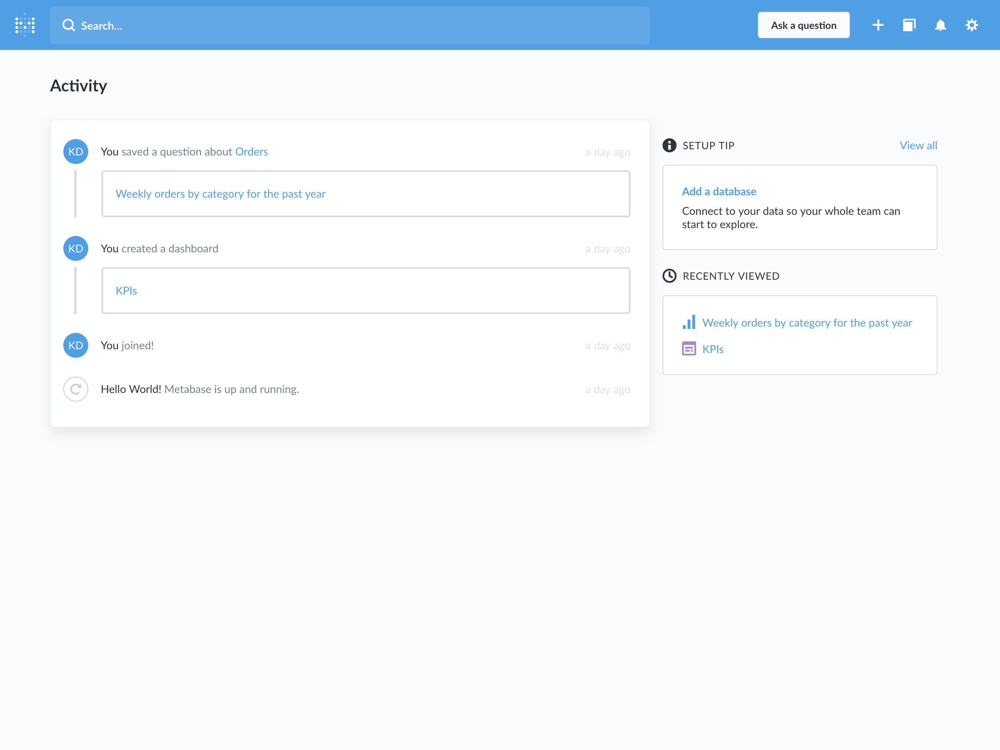

## Asking a new question

But, enough about that — let’s get to asking questions. For the next few examples, we'll be using the **Sample Dataset** that comes with Metabase.

Go ahead and click **New Question** at the top of the screen. Now we’re on the new question page. The bar that you see going across the page is what you’ll use to ask your questions. The “Select a table” dropdown should already be open, showing you a list of your database(s) and the tables within them.

## Our first question

We’re going to ask a question about the Orders table in the Sample Dataset database, so we’ll click on **Orders** in the dropdown. The Orders table has a bunch of fake data in it about product orders for a made up company. If you just want to see everything that’s in this table, you can click **Run query** and see all the raw data.

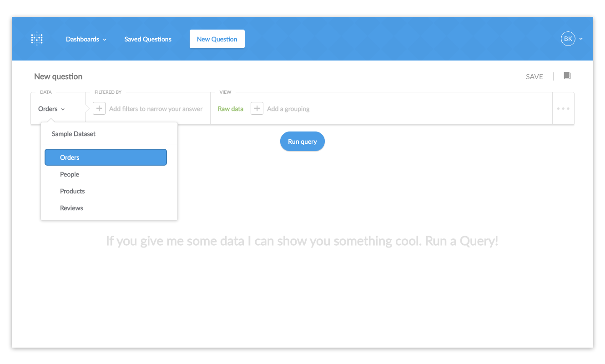

Let's start with a simple question: how many orders have been placed with a subtotal (before tax) greater than $40?  More precisely, this question translates to, "How many records (or rows) are in the table 'Orders' with a value greater than 40 in the Subtotal column?”

To find out, we want to *filter* the data by **the field we’re interested in**, which is **Subtotal**. Since each row in this table represents one order, counting how many rows there are after we’ve filtered them will give us the answer we want.

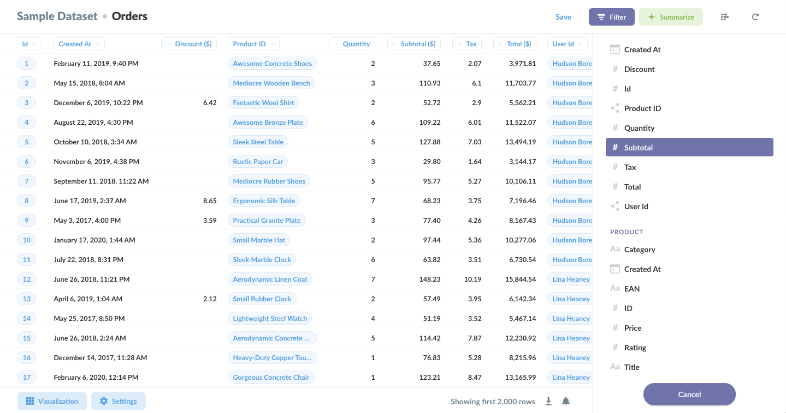

So, after we select Subtotal from the Filter dropdown we’ll get some options for the filter, and we’ll choose **Greater than**, type the number 40 in the box, and click Add Filter.

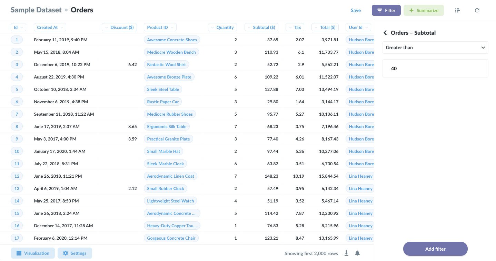

Next we need to tell Metabase what we want to see. Under the View dropdown, we’ll select **Count**, because, like we said, we want to count the total number of rows that match our filter. If we left the View set to Raw Data, that would just show us a list of all the rows, which doesn’t answer our question.

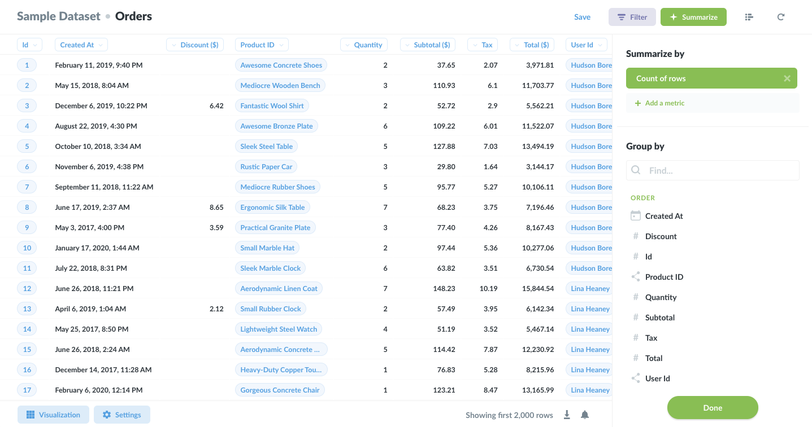

### And our first answer!

Okay, cool — we’re ready to ask our question, so let’s click the **Run query** button!

So it looks like there were 12,284 orders, each with a subtotal greater than $40. Ka-ching! Another way of saying this is that there were 12,284 *records* in the table that met the parameters we set.
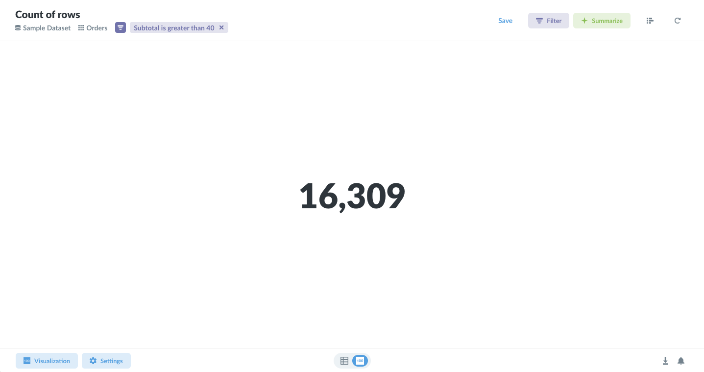

### Tweaking our question

Okay, so that’s pretty useful, but it would be even *more* useful if we could know on *which days* our customers placed these big orders. That’s not hard to do at all.

Back in the question builder box, next to **Count** in the View area, we’ll click on **Add a grouping.** This shows us a dropdown of columns that we can use to group our results by. the one we want is **Created At**, because this will now give us a separate total count of orders over $40 by the days the orders were placed (or “created”). So we’ll select **Created At** and click **Run query** again.

This time our result looks different: instead of one big number, now we’re looking at a table that shows us how many orders over $40 there were each day. Neat, but this isn’t really a great way of visualizing this information.

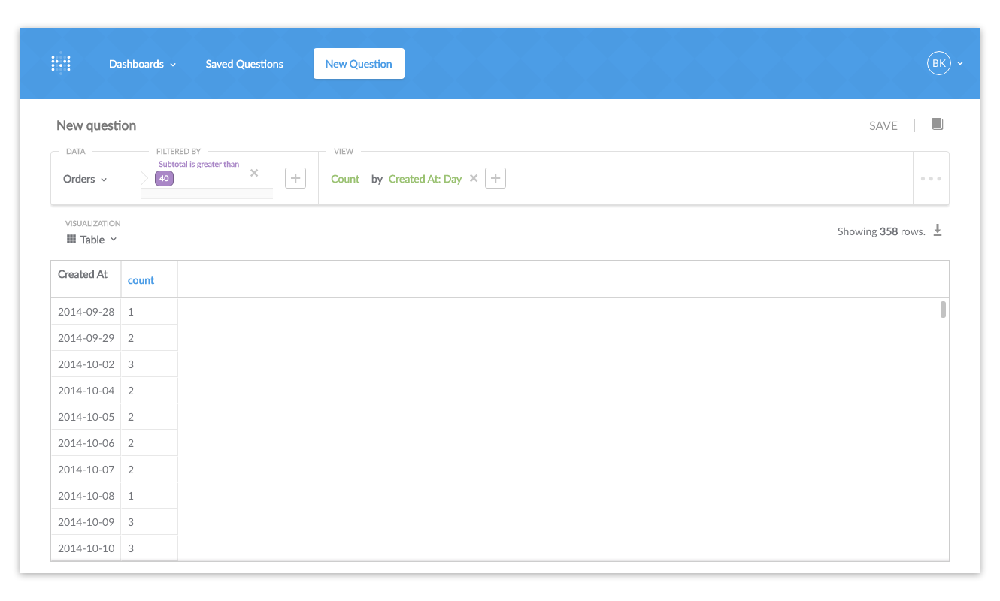

### Changing the visualization

Luckily enough, Metabase can present the answers to your questions in a variety of ways. To change the visualization, just select one of the options from the **Visualization** dropdown menu, which is in the top-left of the screen, above the table. Let’s choose **Area**.

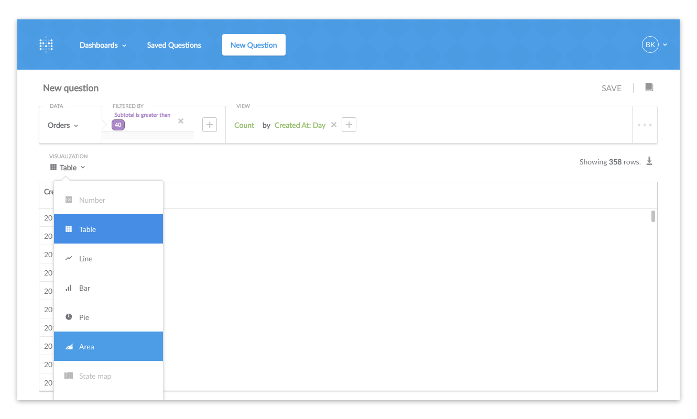

Sweet! Looks like business is booming — up and to the right is always good. If you want, try playing around with other visualization options in from the dropdown.

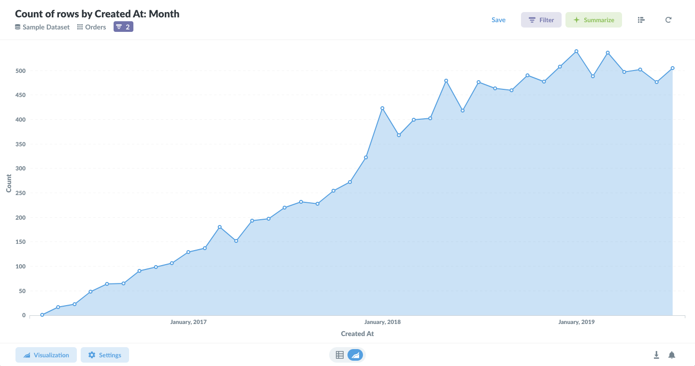

You’ll notice that some formats aren’t the best way to show an answer to a question. If Metabase think that's the case with a specific answer and visualization, the choice will appear faded in the visualization dropdown menu. For example, it wouldn't make sense to show the total number of orders over $40 as a single bar graph, or as a map.

If you want, you can try playing around with your question, like changing the number 40 to a different number. Whenever you make any changes to the question, the blue "Run query" button will reappear. Click it to ask your new question and get your new answer.

## Sharing answers with others
You can use Metabase all on your own, but it becomes even more useful when you start sharing your answers with other people on your team or in your organization. The first step is saving some of your questions.

### Saving questions

Sometimes you’ll find yourself asking certain questions again and again, whether it’s running regular reports, looking up something about an important segment of users, or just answering the same question for other people in your company. To keep from repeating the same set of steps each time you want to ask the same question, you can save your questions to  use later.

To do this, click on the **SAVE** button in the top-right of the question builder screen.

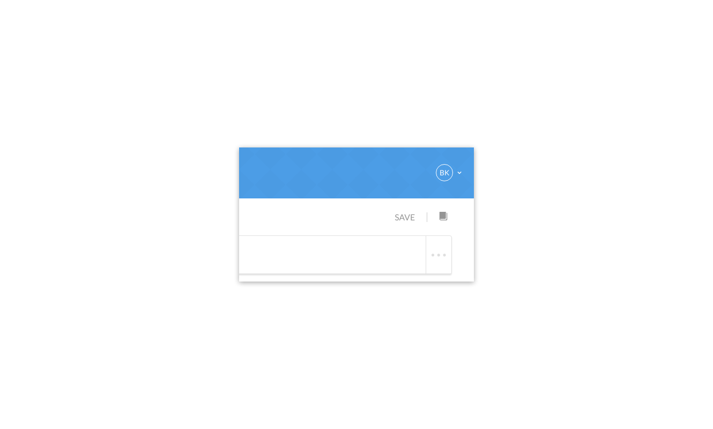

Metabase will take a stab at giving your question a meaningful name, but you can (and should) use your own naming convention that’ll help you and others find your questions later on, after amnesia has sunk in.

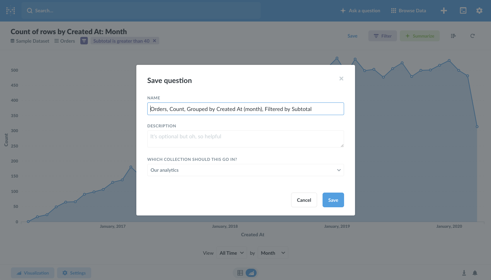

Once you’ve saved your question, you can either go back to the home page, add your saved question to a dashboard, or keep asking questions. Let’s click **Add to a dashboard** and give that a try.

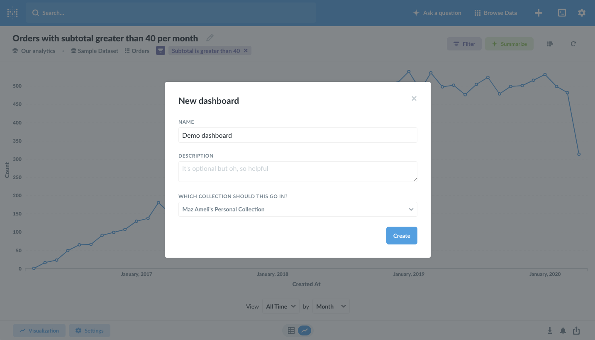

### Creating a dashboard

Unless you went off and did your own thing, you shouldn’t have any dashboards yet, so you’ll see a dialog that prompts you to create a new one and give it a name and description. Name it anything you’d like. We’ll call ours “My First Dashboard.”

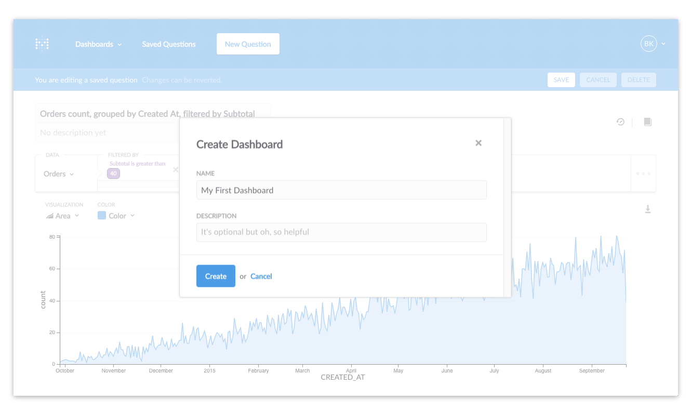

Dashboards are great when you have a set of questions and answers that you want to view together. Your saved questions will be displayed as cards on the dashboard, which you can resize and move around to your heart’s content.

So, after you click the button to create your dashboard, you should see your fancy saved question as a little card. Ain’t he cute?

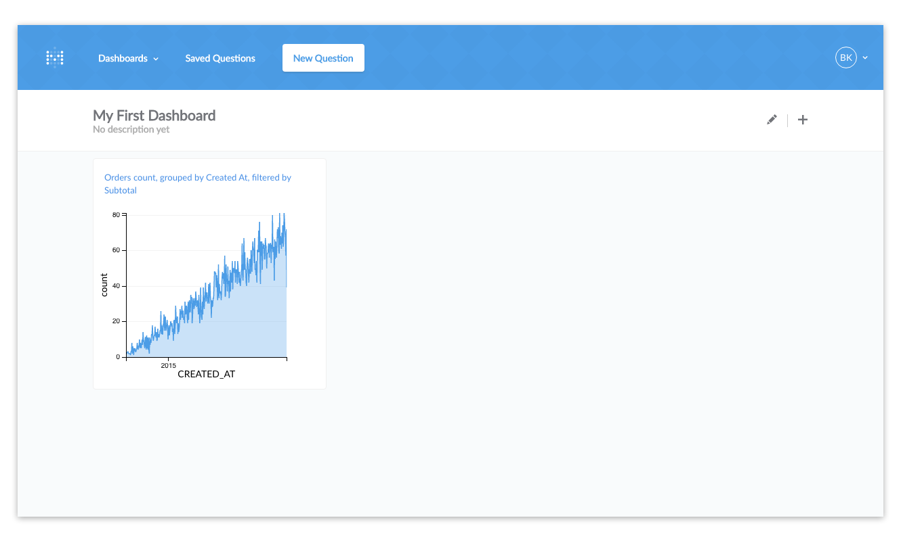

If you’re feeling up to it, you can click the edit button in the top-right of the screen (the one that looks like a pencil), and that’ll let you move and resize your saved question so you can get it looking just how you want it. Just click **Save** in the top-right when you’re done. We’ll make ours a bit wider to let those data points breathe.

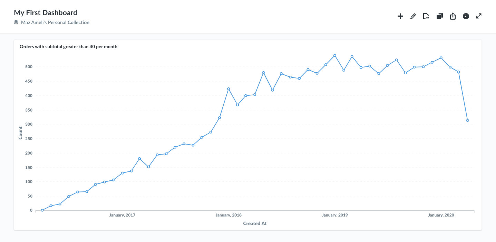

### Sharing answers directly

One other thing: once you’ve asked a question or saved a dashboard, the URL in your browser will link directly to that question or dashboard. That means you can copy and paste that URL into an email or chat and let other people see what you’ve found. This will only work if Metabase is installed on a shared server, and will require creating Metabase accounts for the people you want to share with.

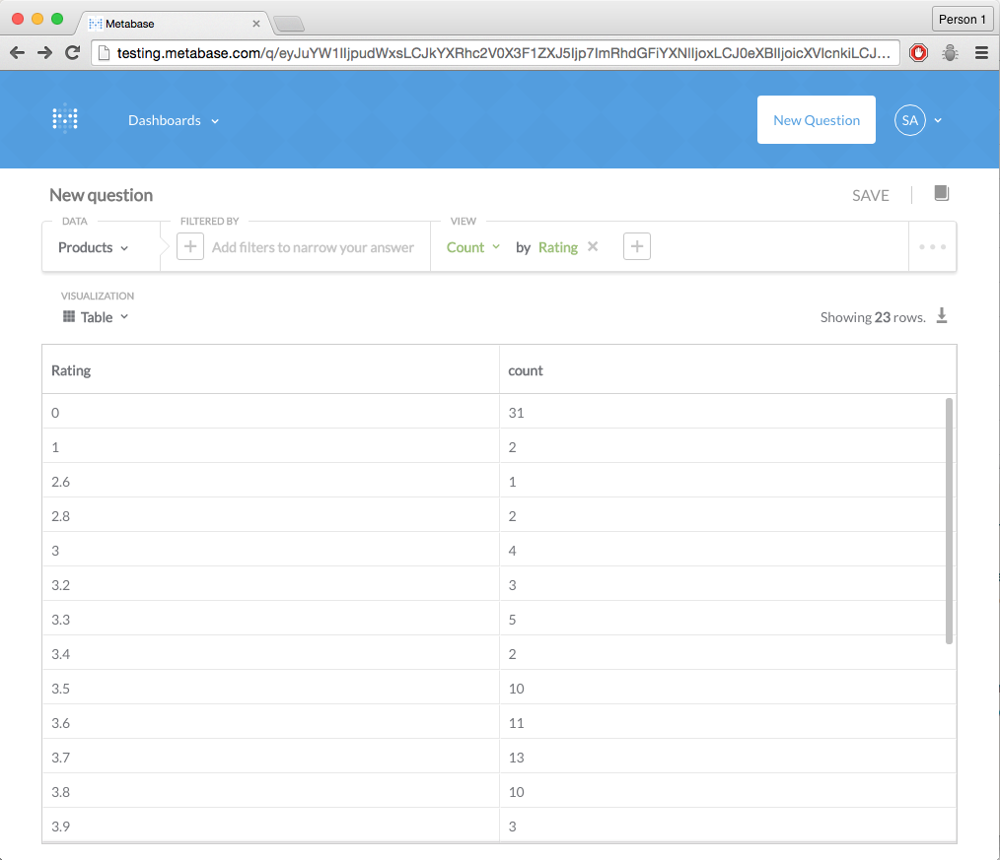

---

## That’s it!
You’ve done really well. You now have a dashboard with your question that you can share! At this point you know enough to be dangerous.

Want to learn more? Is your thirst for knowledge insatiable? Check out our [Users Guide](users-guide/start.md) for more in-depth explanations of the ins and outs of Metabase.
