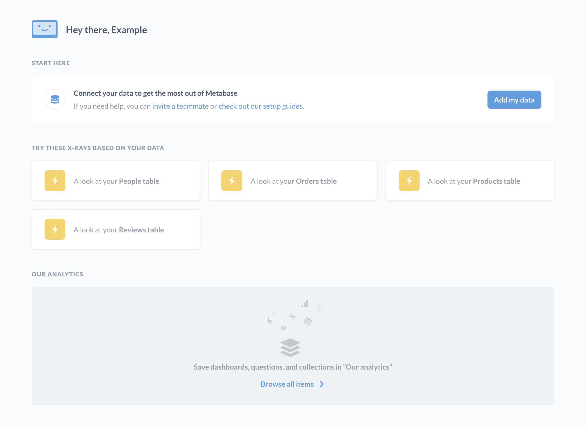
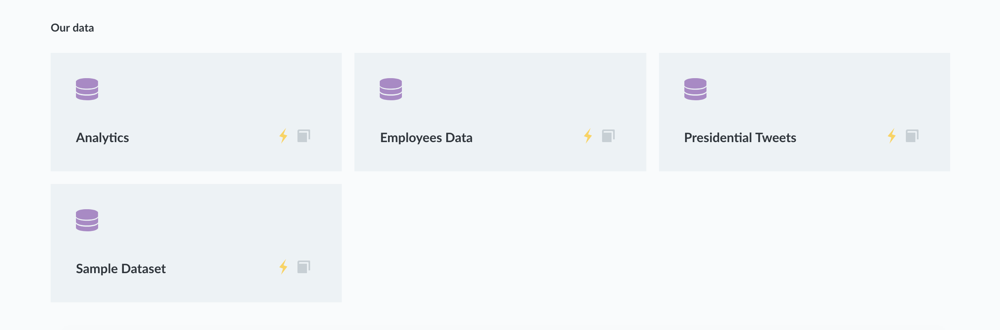
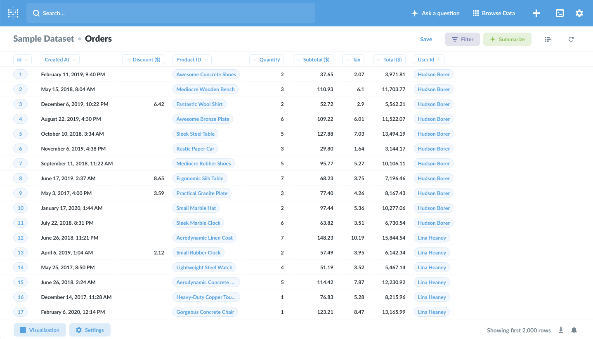
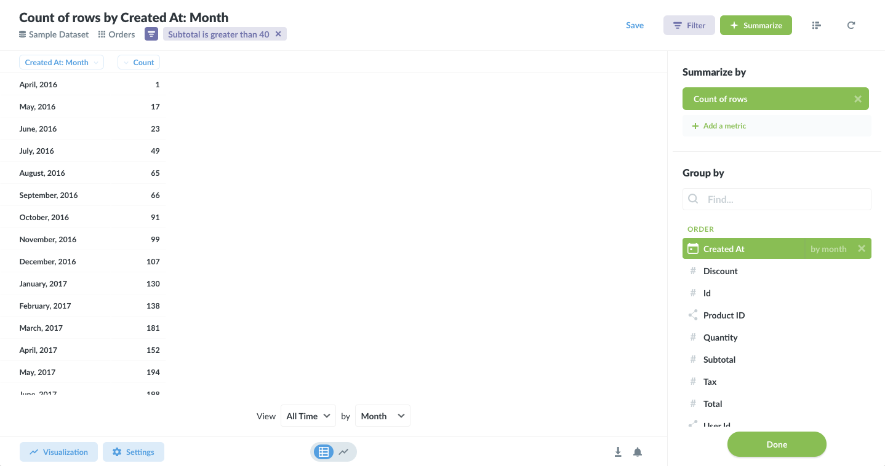
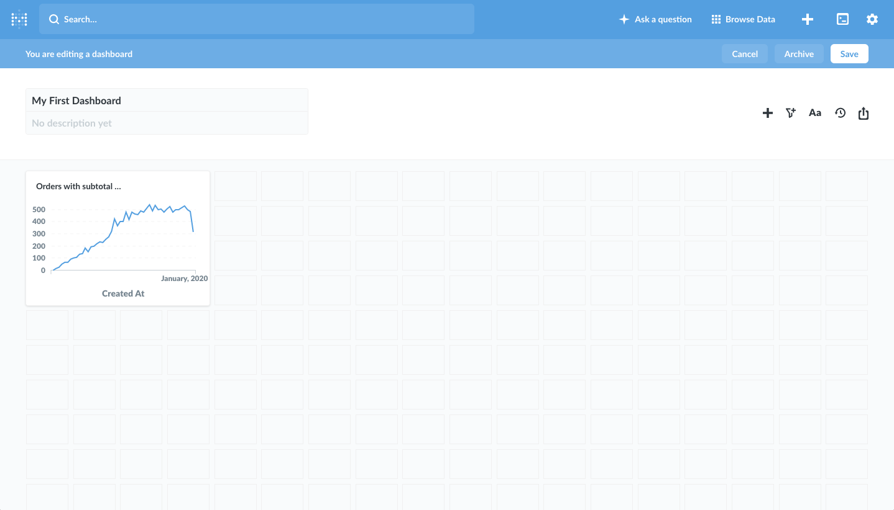

# Getting Started with Metabase

Metabase is a simple and powerful analytics tool which lets anyone learn and make decisions from their company's data. No technical knowledge required! We hope you love it.

## Logging in

The way you log in to Metabase will depend on how you or your admin set it up, so if you don’t know where to go, just ask the person who sent you your Metabase invite.

## The homepage

Fresh out of the box, Metabase will show you a few things on the home page:

- Some [automatic explorations](./users-guide/14-x-rays.md) of your tables that you can look at and save as a dashboard if you like any of them.
- An area where things you or your teammates create will show up, along with a link to see all the dashboards, questions, and pulses you have.
- A list of the databases you've connected to Metabase.

## Asking a new question

But, enough about that — let’s get to asking questions. For the next few examples, we'll be using the **Sample Dataset** that comes with Metabase.

Go ahead and click **Ask a question** at the top of the screen. There are several ways you can ask a question in Metabase, but we'll click on the Simple Question option for now. You'll then need to pick the table that you have a question about. Click the database that the table is in, then pick the table from the list. Once you do, you'll see the table's contents.

## Our first question

The Orders table has a bunch of fake data in it about product orders for a made up company. Let's start with a simple question about these orders: how many orders have been placed with a subtotal (before tax) greater than \$40? More precisely, this question translates to: "How many records (or rows) are in the table 'Orders' with a value greater than 40 in the Subtotal column?”

To find out, we want to _filter_ the data by **the field we’re interested in**, which is **Subtotal**. Since each row in this table represents one order, counting how many rows there are after we’ve filtered them will give us the answer we want.

So, we click the Filter button to open up the filtering sidebar, then select Subtotal as the column to filter on, and we’ll get some options for the filter. We’ll choose **Greater than**, type the number 40 in the box, and click Add Filter.

Next we need to tell Metabase what number we want to see. When we ask things like "how many," "what's the total," "what's the average," etc., we need to **summarize** our data. So we'll click the Summarize button to open the sidebar where we can pick how we want to summarize this data. The "Count of rows" metric is selected by default which is great since we want to count the total number of rows that match our filter.

### And our first answer!

Okay, cool — we’re ready to ask our question, so let’s click **Done**!

So it looks like there were 16,309 orders, each with a subtotal greater than \$40. Nice. Another way of saying this is that there were 16,309 _records_ in the table that met the parameters we set.

### Tweaking our question

Okay, so that’s pretty useful, but it would be even _more_ useful if we could know in _which months_ our customers placed these big orders. That’s not hard to do at all.

If we open up the Summarize sidebar again, below where we picked our metric, there's a list of all the columns that we can use as **groupings**. The one we want is **Created At**, because this will now give us a separate total count of orders over \$40 for each month the orders were placed in (or “created at”). So we’ll select **Created At**, and Metabase immediately shows us a line chart of the orders over time.

If we want to quickly check the results in tabular fashion, we can click the little toggle at the bottom center of the page to toggle from our chart to the data and back again.

### Changing the visualization

Metabase can present the answers to your questions in a variety of ways. To change the visualization, just select one of the options from the **Visualization** sidebar. Click the Visualization button in the bottom-left to open it. Let’s choose the **Area** chart option.

Sweet! Looks like business is booming — up and to the right is always good.

You’ll notice that some visualizations aren’t the best way to show an answer to a question. If Metabase think that's the case with a specific answer and visualization combination, that visualization choice will appear faded in the sidebar. For example, it wouldn't make sense to show the total number of orders over \$40 as a single bar graph, or as a map.

If you want, you can try playing around with your question, like changing the number 40 to a different number. To do that, just click on the filter badge below the page title.

## Sharing answers with others

You can use Metabase all on your own, but it becomes even more useful when you start sharing your answers with other people on your team or in your organization. The first step is saving some of your questions.

### Saving questions

Sometimes you’ll find yourself asking certain questions again and again, whether it’s running regular reports, looking up something about an important segment of users, or just answering the same question for other people in your company. To keep from repeating the same set of steps each time you want to ask the same question, you can save your questions to use later.

To do this, click on the **SAVE** button in the top-right of the question builder screen.

Metabase will take a stab at giving your question a meaningful name, but you can (and should) use your own naming convention that’ll help you and others find your questions later on, after amnesia has sunk in. You can also pick which folder, or "Collection," to save your question in.

Once you’ve saved your question, Metabase will ask if you want to add it to a new or existing dashboard. Let’s click **Create new dashboard** and give that a try. You’ll see a dialog that prompts you to create a new one and give it a name and description. Name it anything you’d like. We’ll call ours “My First Dashboard.”

### Creating a dashboard

Dashboards are great when you have a set of answers that you want to view together. Your saved questions will be displayed as cards on the dashboard, which you can resize and move around to your heart’s content.

So, after you click the button to create your dashboard, you should see your chart as a little card.

You can move and resize your chart so you can get it looking just how you want it. Just click **Save** in the top-right when you’re done. We’ll make ours a bit wider to let those data points breathe.

### Sharing answers directly

One other thing: once you’ve asked a question or saved a dashboard, the URL in your browser will link directly to that question or dashboard. That means you can copy and paste that URL into an email or chat and let other people see what you’ve found. This will only work if Metabase is installed on a shared server, and will require creating Metabase accounts for the people you want to share with.

---

## That’s it!

We hope this was helpful. Want to learn more? Is your thirst for knowledge insatiable? Check out our [Users Guide](users-guide/start.md) for more in-depth explanations of the ins and outs of Metabase.
