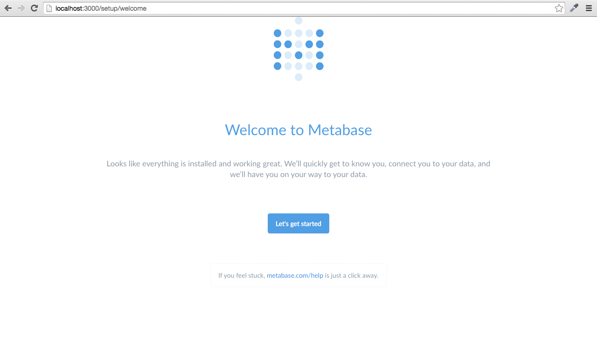

## Step 1: Installing Metabase

### Getting Metabase 

Metabase is a program that runs on the Java virtual machine (or JVM). There are two ways to run it, depending on which platform you use. 

### Trying Metabase out with the Mac OS X App

If you're using OS X, we have a Mac app that you can find in the Mac App Store or [download directly](www.metabase.com/download/osx/latest). It comes bundled with everything you need to get started, so it’s a great way to just try Metabase out. Once you've downloaded the app, move it to your Applications folder and open it up. Once you see the loading screen, you can move on to the next step: [connecting Metabase to your database](02-connecting-metabase.md).

### Running the JAR directly 

If you're fairly technical or planning on immediately setting up Metabase on a shared server, you can [download the latest JAR distribution](www.metabase.com/download/jar/latest). To run this JAR, you'll need to have Java installed on your machine.

**On Linux:**

Your Linux distribution might ship with Java pre-installed — you lucky dog, you. Try `java -version` to see if Java is set up. If not, you can install Java in a number of ways depending on your distribution.

On Ubuntu, or any other distribution with the Debian package manager, 
	
	apt-get install -Y openjdk-7-jre-headless

will install Java. For other distributions, check your distribution’s documentation.

**On Windows or Mac:**

Go to the [Java JDK downloads page](http://www.oracle.com/technetwork/java/javase/downloads/index.html) and download the latest JDK for your platform.

Once you've gotten Java installed on your machine, go to the command line and try typing `java` to make sure it's installed correctly. 

The Metabase server creates temporary files when it runs, and so you'll probably want to place the metabase.jar file in its own directory. To get things started, run the command,

    java -jar metabase.jar

After taking a few seconds to start up, you should have the Metabase server running on port 3000 of your computer. Go to [http://localhost:3000](http://localhost:3000) in a browser and you should see the screen below. 

Now that you've installed Metabase, let's [connect it to your database](02-connecting-metabase.md).