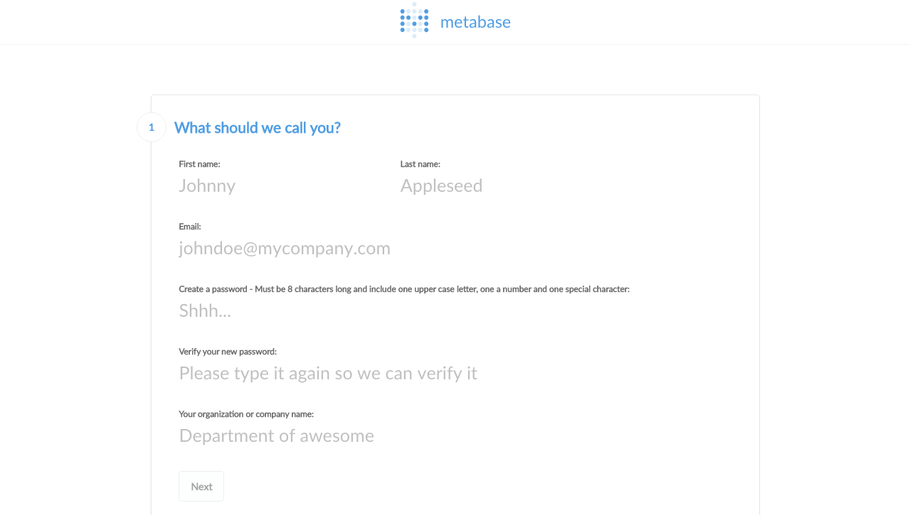
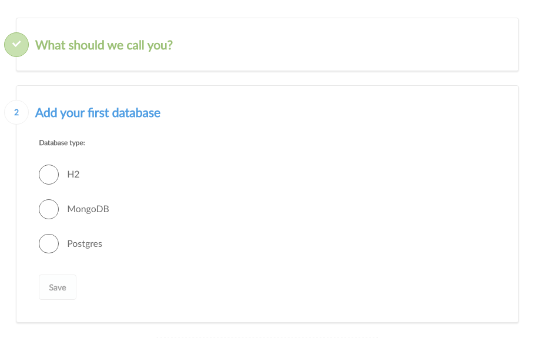

##Step 2: Connecting to a database

### Setting up the admin account
The first account created when you install Metabase is an administrator account. If you were installing Metabase in production, you should be very careful with the password to this account as it will be used, among other things, to add other users, connect to databases and set up email. 

For now, let's just create an account for ourselves to explore Metabsae. 

At this point, you will need to get together some information about which database you want to use with Metabase. We'll need:

    * The **hostname** of the server where your database lives
    * The **port** the database server uses
    * The **database name** where the data of interest lives
    * The **username** you should use for the database
    * The **password** you should use

If you use Heroku, you can find instructions on how to get this information [here](../frequently-asked-questions/questions#how-do-i-look-up-connection-information-for-databases-on-heroku). Likewise, if you are using Amazon RDS, you can follow the instructions [here](../frequently-asked-questions/questions#how-do-i-look-up-connection-information-for-databases-on-amazons-rds-service). 

If you don't have this information handy, ask the person responsonsible for administering the database for the above information.

Metabase needs this information to finish connecting to your database.  

**Now that you have your database information,** use the information to fill out the next step of the installation process. 

After you enter your database's information, Metabase will try to connect to your database and validate the credentials.  If you Metabase is unable to connect, please verify the connection credentials and try again. 

Once Metabase successfully connects to your database, it'll run a few queries against your database to build a model of your data.  Click the prompt "continue" to see what data Metabase found in your database!

Now that you've connected Metabase to a database, let's [learn how to ask questions](03-asking-questions.md)