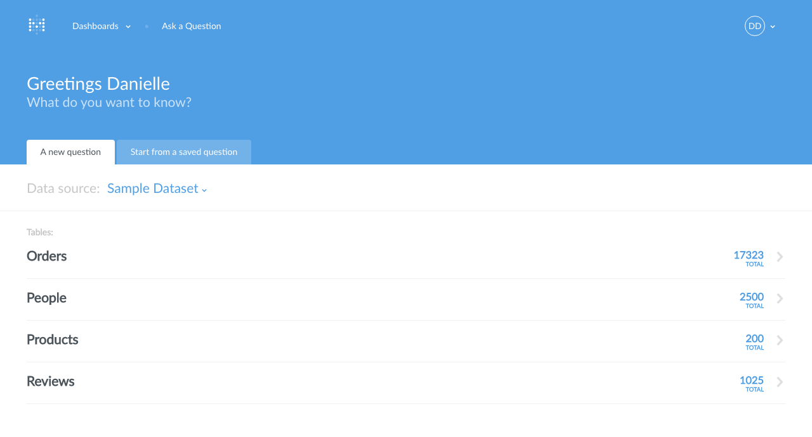
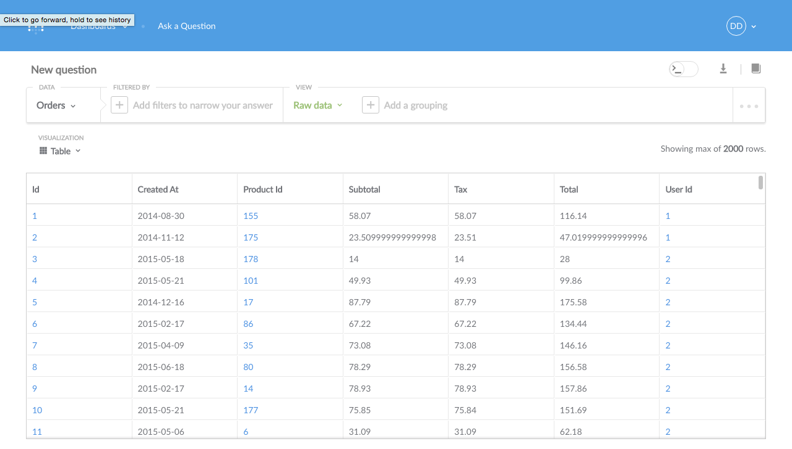
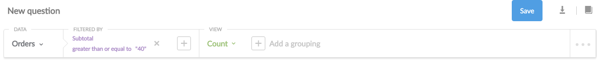
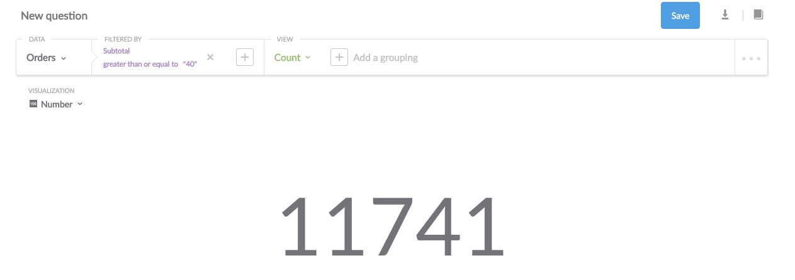
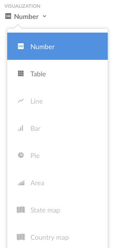

## Step 3: Asking Questions 

For the next few examples, we'll be using the sample dataset that comes with Metabase. If you want to follow along using your own database that you connected in Step 2, all of the steps should work similarly, though obviously with different results.

If you look at the homepage, you'll see the activity feed. Right now there’s not much there, but it’ll soon get full as you or your teammates do things in Metabase.

But enough about that — let’s get to asking questions. Go ahead and click New Question at the top of the screen.

Now we’re on the new question page. The bar that you see going across the page is what you’ll use to ask your questions. You’ll notice that the “Select a table” dropdown is already open, showing you a list of your databases and the tables within them. In our example, we’re going to ask a question about the Orders table in the Sample Dataset database. The Orders table has a bunch of fake data in it about product orders for a made up company.

For now, let's start with a simple question: how many orders have been placed with a subtotal (before tax) greater than $40?  More precisely, this question translates to, "How many records (or rows) are in the table 'Orders' with a value greater than 40 in the Subtotal column?”

To find out, we want to *filter* the data by **the field we’re interested in**, which is Subtotal. Since each row in this table represents one order, counting how many rows there are after we’ve filtered them will give us the answer we want. 

So, after we select Subtotal from the Filter dropdown we’ll get some options for the filter, and we’ll choose **Greater than**, type the number 40 in the box, and click Add Filter. 

Next we need to tell Metabase what we want to see. Under the View dropdown, we’ll select **Count**, because, like we said, we want to count the total number of rows that match our filter. If we left the View set to Raw Data, that would just show us a list of all the rows, which doesn’t answer our question.

Okay, cool — we’re ready to ask our question, so let’s click the **Run query** button!

So it looks like there were 13,535 orders, each with a subtotal greater than $40. Ka-ching! Another way of saying this is that there were 13,535 *records* in the table that met the parameters we set. This is how nerds would say it.

### Tweaking our question

Okay, so that’s pretty useful, but it would be even *more* useful if we could know on which days our customers placed the most of these big orders. That’s not hard to do at all.

Next to Count in the View area, we’ll click on “Add a grouping.” This shows us a dropdown of columns that we can use to group our results by. the one we want is “Created at,” because this will now give us a separate total count of orders over $40 by the days the orders were placed (or “created”). Let’s click “run query” again.

This time our result looks different: instead of one big number, now we’re looking at a table that shows us how many orders over $40 there were each day. But this isn’t really a great way of visualizing this information.

### Changing the visualization

Luckily enough, Metabase can present the answers to your questions in a variety of ways. To change the visualization, just select one of the options from the **Visualization** dropdown menu, which is in the top-left of the screen, above the table. Let’s choose **Area**.  

Sweet! Looks like business is booming — up and to the right is always good. If you want, try playing around with other visualization options in from the dropdown.

You’ll notice that some formats aren’t the best way to show an answer to a question. If Metabase think that's the case with a specific answer and visualization, the choice will appear faded in the visualization dropdown menu. For example, it wouldn't make sense to show the total number of orders over $40 as a single bar graph, or as a map.

If you want, you can try playing around with your question, like changing the number 40 to a different number. **Whenever you make any changes to the question, the blue "Run query" button will reappear.** Click it to ask your new question and get your new answer.

### Next: share your answers
While Metabase can be used on your own, it also allows you to share answers with others in your company. Let's learn [how to share your answers](04-sharing-answers.md).