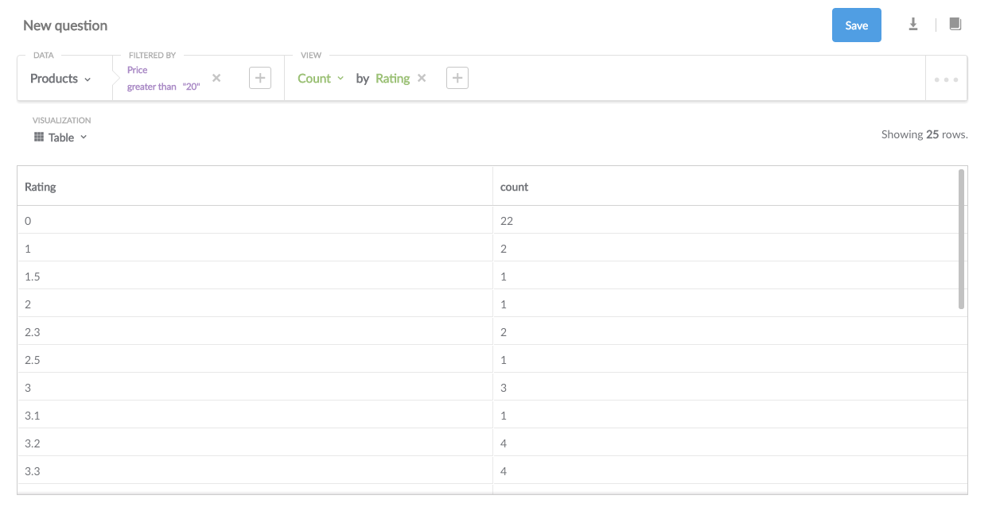

##Step 3: Asking Questions 

For the next few examples, we'll be using the Sample Dataset we ship with the server. If you want to follow along using your own database that you connected in Step 2, all of the steps should work in a similar manner, though obviously with different results.

If you look at your homepage, you'll see the different tables that Metabase was able to find in your data source set and pulled for you.  Click a table you want to learn more about.  Note the number of rows.

For example, in the sample data set above, the database (data source) is "Sample Dataset".  There are four tables—"Orders," "People," "Products," and "Reviews." They have 17,323; 2500; 200; and 1025 rows each respectively.  

By clicking on an individual table, you enter the interface (pictured below) that allows you to ask Metabase questions based on your data.  

Your screen will reflect the data source you connected to Metabase and the table you selected.  In our example, the data source is "Sample Dataset" and the table is "Orders". 

For now, let's start with a basic question using our data set.  How many orders placed had a subtotal (before tax) of greater than or equal to $40.00?  More precisely, this question translates to "How many records are in the table 'Orders' that meet the stated conditions.

To find the number, we want to _filter_ the data by **the field we are interested in** (which is "Subtotal" for our example).  Our operator is **"Greater than or equal to"** because we want to know the value (not whether it is greater or less than a number, etc.).  The value is 40 because we are interested in orders with a subtotal greater than or equal to 40.  We want to view the **Count** because we want to know the number (not a listing of every incident). 

After you select the different components of your question, click **Run query**.

There were 11,741 orders with a subtotal greater than or equal to $40.00.  Stated in database parlance, there are 11,741 records in the table that meet theh paramters we set.  

**The total number listed next to each table is the number of records.  Each record is an iteration of the event your database records.**

Metabase can present the answers to your questions in a variety of formats.  To change the format, select one of the options from the dropdown menu in the top left hand corner of the screen next to **Visualization**.  

Not every format is the best way to show an answer to a question.  If Metabase think that's the case with a specific question and display format, the format choice will appear faded.  For example, it wouldn't make sense to show the number of collisions between aircraft and birds as a singular bar graph.

You can "group" your data into categories.  Click **Add a grouping** to select the category to filter your answer by.  Metabase will analyze your database to discover valid categories for adding filters to your questions.  

Above, Metabase filtered the Product table to show the number of products priced more than $20 grouped by rating.  

**When you make any changes to the question (called the "query"), the blue "Run query" button reappears.** Click it to refresh the answer and to find the answer to your new query. 

While Metabase can be used on your own, it also allows you to share answers with others in your company. Let's learn how[ to share your answers](04-sharing-answers.md)