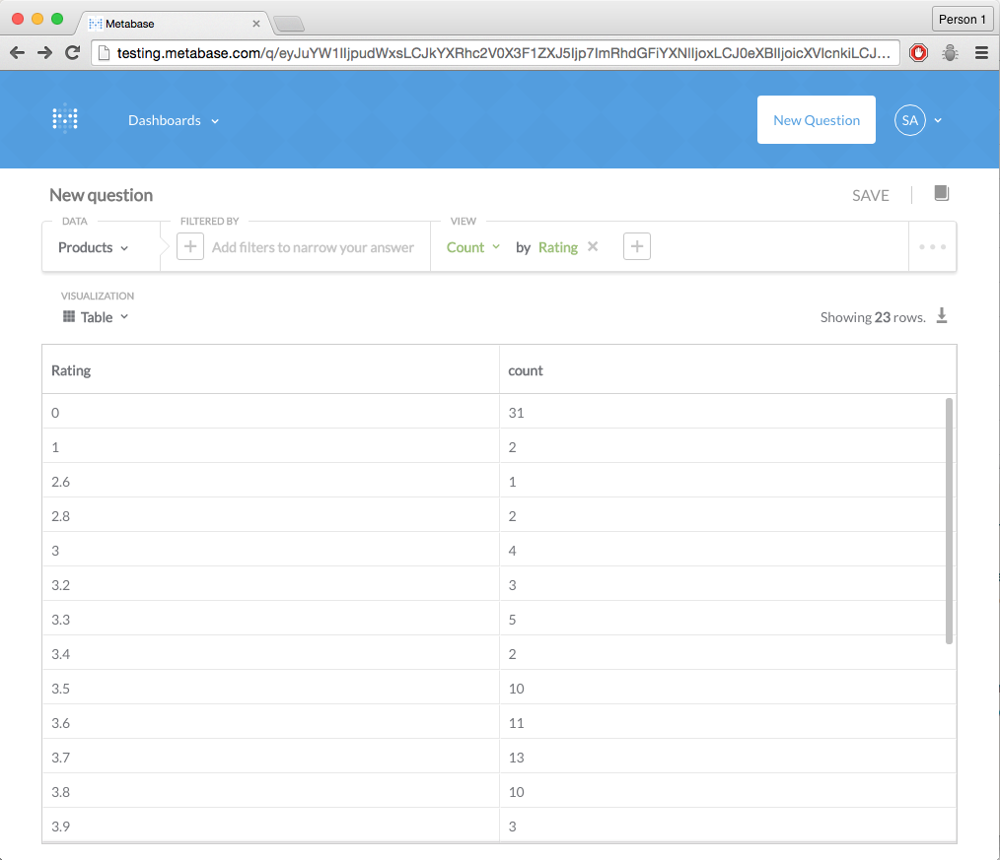
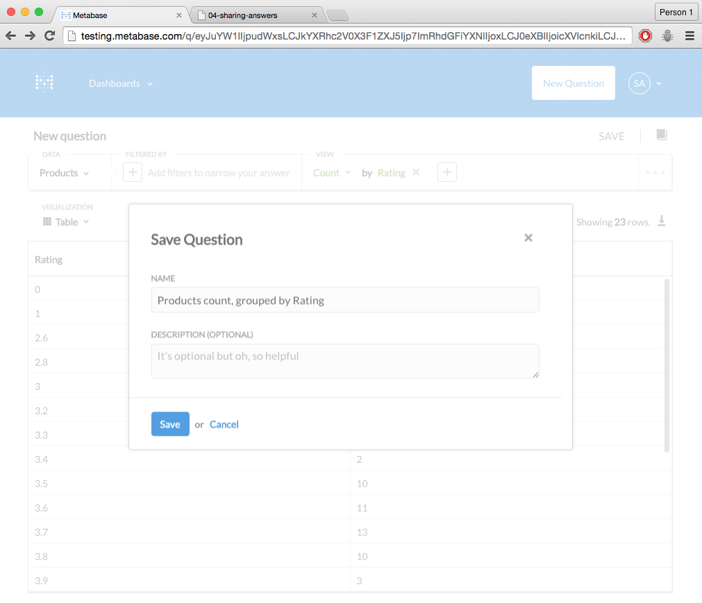
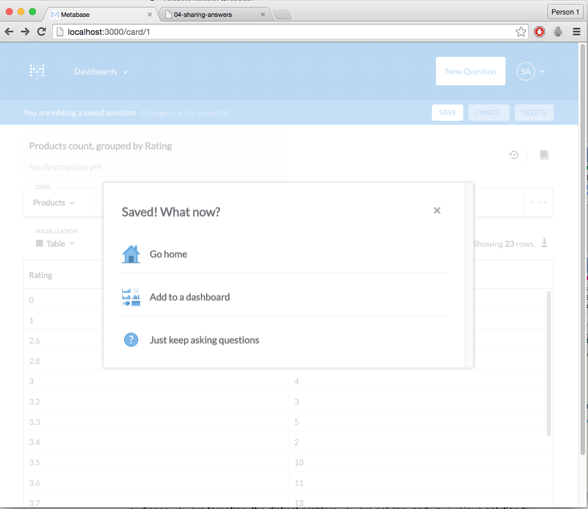
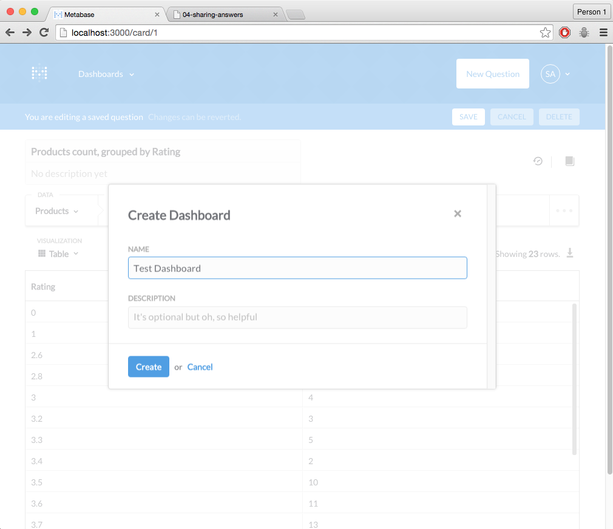
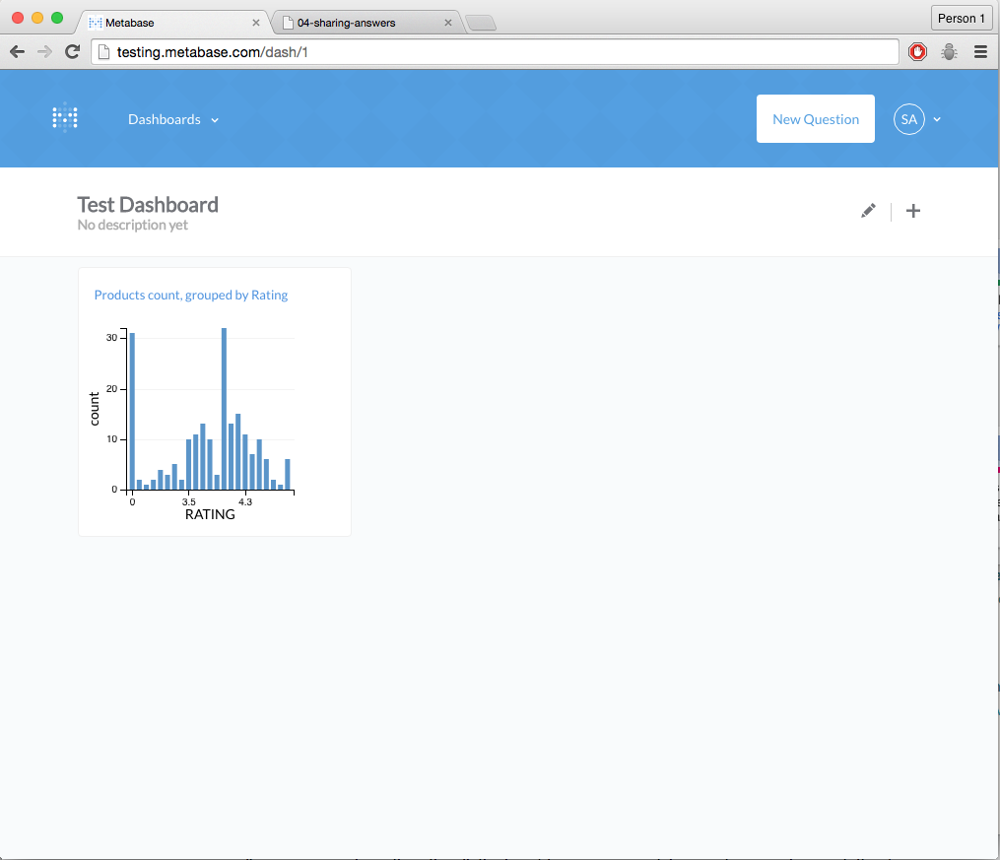

##Step 4: Sharing answers with others

### Sharing answers directly

Once you have asked a question, the URL links directly to your answer. If you copy this URL, you can share it directly with anyone via email, IM or any other means.

### Saving questions

Some questions you'll find occur over and over again, whether it's a regular report you run, a common segment of users or products you look up or just a question others in your company keep asking you. To keep from repeating the same set of steps each time you want to re-ask the question, you can save the question for later use.

To do this, click on the "Save button"

Metabase will guess a meaningful name for the question, but you can (and should) use a naming scheme that helps you and others find it 6 months down the line. 

Once you have saved the card, you'll have a few options depending on whether you are creating a batch of related cards, or if you want to ask a new question. 

### Creating a dashboard

Sometimes there are a group of questions (and their associated answers) that are meant to be viewed together. Dashboards are made up of a number of saved questions which are displayed as Cards within a dashboard. To create your first dashboard, click on "Add to Dashboard" in the post question save confirmation message. 

If you don't have any dashboards already created, you should see a dialog that prompts you for a name.

Once you've added a card to a dashboard, you can go to the dashboard and see something similar to the below.

You now have a dashboard with your question that you can share! At this point you know enough to be dangerous and can switch to asking simple questions with your own database. 

If you want to learn more, check out our [User Guide](../users-guide/start.md)