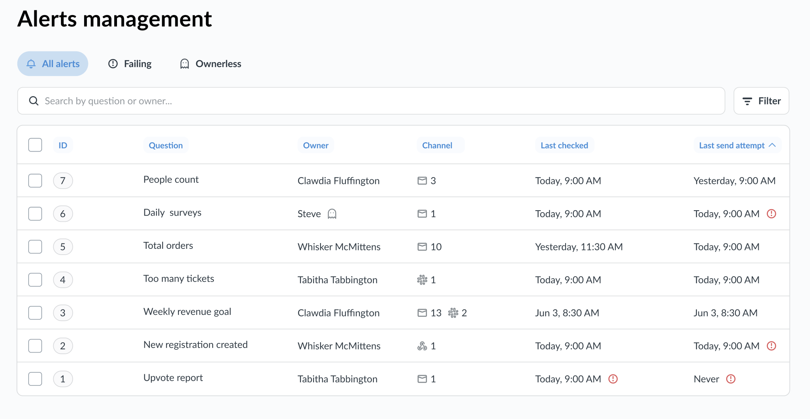
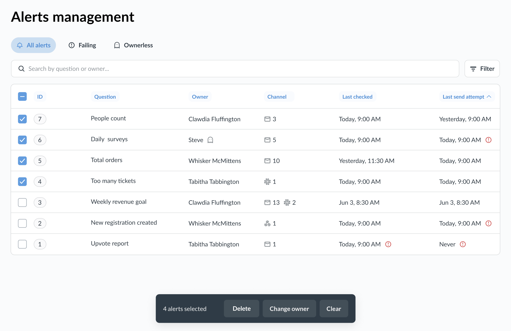

# Alerts management

_Admin > Tools > Alerts management_

In the Alert management section, Admins can:

- View and search all [question alerts](../questions/alerts.md) in their Metabase
- Identify failed or orphaned alerts
- Edit alerts, including changing the alert's owner
- Delete alerts in bulk

Currently, [dashboard subscriptions](../dashboards/subscriptions.md) are not included.

## See all alerts

To see all alerts active in your Metabase instance, go to **Admin > Tools > Alerts management**.

You can:

- Filter alerts by channel ([email](../configuring-metabase/email.md), [Slack](../configuring-metabase/slack.md), or [webhook](../configuring-metabase/webhooks.md)) or recipient.

- See alerts that **failed** the last time they were ran.

  Failed alerts view include both alerts that were attempted but failed (for example, because of a query error) and alerts that were abandoned and never attempted (for example, because the instance was restarting at the moment when the alert was scheduled).

  To see the entire history of alert runs (not just the last attempt), go to **Admin > Tools > Tasks** instead.

- See **ownerless** alerts - alerts whose owner has been deactivated

  This is helpful when you want to [mass-delete](#delete-alerts) alerts that are no longer relevant, or [change the owner](#change-alert-owners) to an active user.

- See individual alert's properties and history.

- [Delete alerts in bulk](#delete-alerts).

- [Change alert owners in bulk](#change-alert-owners).

If you want to get some analytics about your alerts (rather than manage them) - for example, you want to see how many alerts have failed per week, or which questions have the most number of alerts - use [Usage Analytics](../usage-and-performance-tools/usage-analytics.md) instead.

## Change alert owners

The owner of an alert has the power to edit or delete the alert. Usually, the person who created the alert is also the alert's owner.

Admins can change owners of alerts. This is useful, for example, if the original alert owner left the company, and you need to give some else the power to manage the alert.

To change the owner for one or more alerts:

1. Go to **Admin > Tools > Alerts management**.
2. Select the alerts whose owners you'd like to change.
3. Click **Change owner** at the bottom of the screen.
4. Assign a new owner.

## Delete alerts

You can delete multiple alerts at once.

1. Go to **Admin > Tools > Alerts management**.
2. Select the alerts whose owners you'd like to delete.
3. Click **Delete** at the bottom of the screen.

## Further reading

- [Alerts](../questions/alerts.md)
- [Usage analytics](../usage-and-performance-tools/usage-analytics.md)
- [Setting up email](../configuring-metabase/email.md)
- [Setting up Slack](../configuring-metabase/slack.md)
- [Setting up webhooks](../configuring-metabase/webhooks.md)
- [Managing people](../people-and-groups/managing.md)
