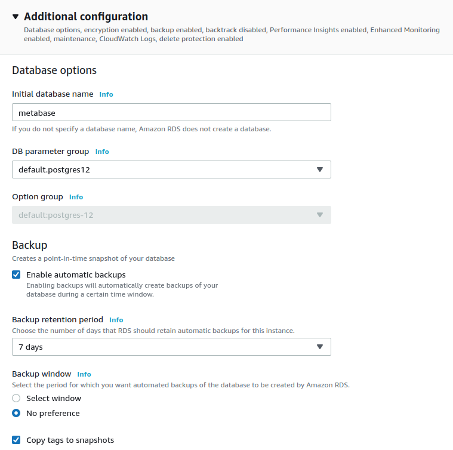

# Creating an RDS database on AWS

If you want to move from using Metabase just for testing to something that is ready for the big time, you should use PostgreSQL for your application database. Here's a high-level view of Metabase deployed with a dedicated application database.

## Create a database

In AWS, enter RDS in the search box or select RDS from the dropdown button on the top left of the page. Once inside RDS, click on the **Create database** button.

Select PostgreSQL as the engine type. We'll choose the latest version available in AWS at the time of writing (12.4-R1).

Templates: you can leave "Production" selected, or choose any other option that better suits your needs.

Settings: type a unique **DB instance identifier** for your database. You'll need the username and master password to configure the environment variables in Metabase.

  

Instance size: the sizing of the RDS instance depends on the number of Metabase instances that will be connected to this database, the number of simultaneous users who are using Metabase, and the number of questions, dashboards, and configurations that are saved. To start, a `t3.small` is a good choice.

  

Availability & Durability: on production deployments, you **should** be using a Multi-AZ (Availability Zone) cluster, as this will ensure that the database does not goes down in case there is an issue on a single availability zone.

  

Connectivity:

- Ensure that you are deploying the database in the same VPC as the one you deployed the Metabase instance/s, otherwise they won't be able to see each other.
- Create a **VPC security group**, as you will need to grant access from the Metabase instance/s to the database on the port that listens for connections.
    

Additional configuration:

- Enter `metabase` as the **Initial database name**. Metabase will use this database for all of its configurations.
- You can also configure the backup window in case you need to restore the backups at some point in time.

When you've completed all these configurations, click on the **Create database** button on the lower right part of the page and wait for the database to be created (which can take several minutes).

## Set up security

Once the database status is `Available`, you need to click on the DB identifier:

On the page that appears after you click on the database identifer, you will see on the center of the page the **Connectivity & Security** section. This section will provide you with the **Endpoint** that Metabase needs to connect to the application database we just created.

In the **Security group rules** section, you'll see the Security Group that was created, but the group will have a rule that allows only one IP address to access the database.

To configure the rule for the database, select the **CIDR/IP - Inbound** rule, then click on the **Inbound rules** tab on the lower part of the page.

When you click on Inbound Rules, you need to click on **Edit Inbound Rules** button that appears on the right side of the section.

On the edit page, you need to delete the IP address that appears as default, then add the security group for the server you're running Metabase on (the Security group name will have the keyword AWSEBSecurityGroup in its name). Once you add this security group, click the **Save rules** button.

## Add the RDS instance as the application database with environment variables

After having finished all the previous steps, go to the your Metabase deployment and add the RDS instance as the Application Database with [Environment variables](../configuring-metabase/environment-variables.md).