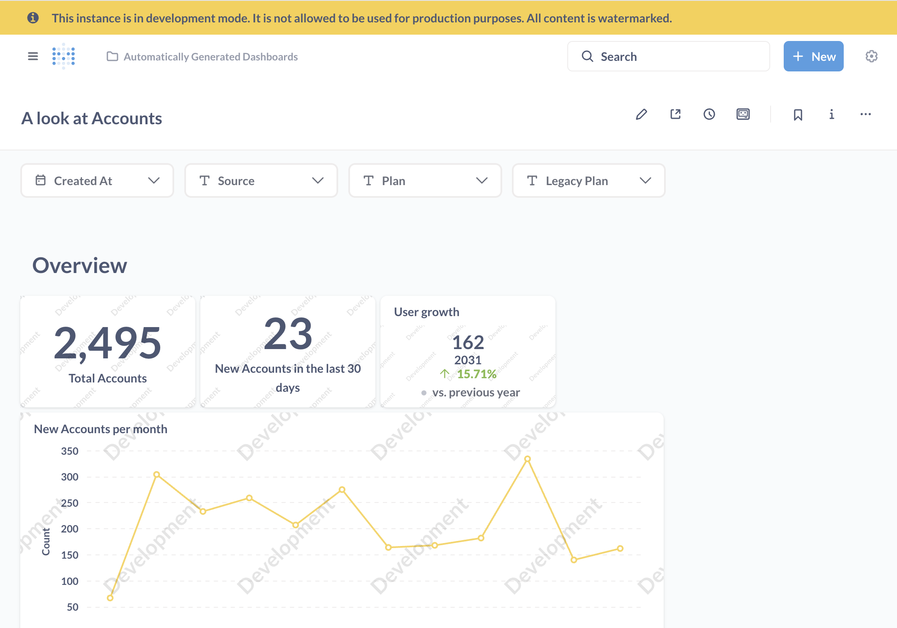
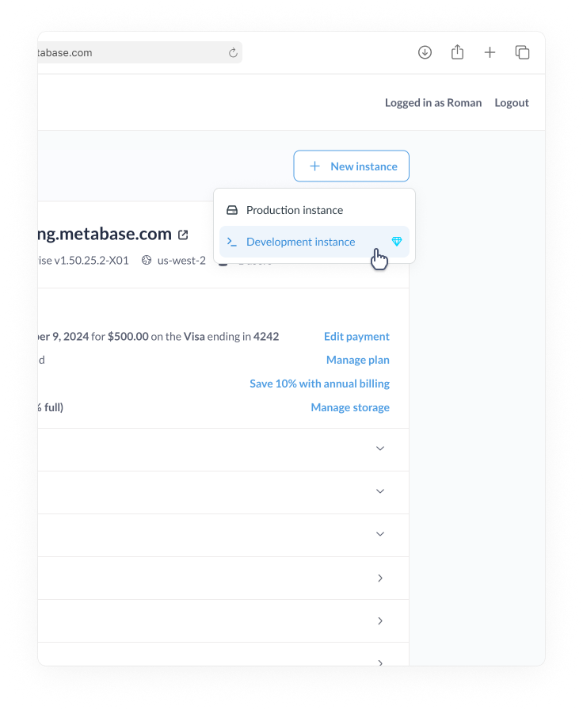

# Development instances



> A development instance **can't be used in production** and must be on **Metabase version 55 or above**.

On Pro and Enterprise plans, you can purchase a development instance or development token as an add-on to your plan.

- **Self-hosted**: you can purchase a dev token that you can use for one or more self-hosted development instances (meaning: you can reuse the same token for multiple dev instances at no additional cost). The development token will have access to the same set of paid features as your production token.
- **Cloud**: you can purchase a development instance hosted on [Metabase Cloud](https://www.metabase.com/cloud/). The development instance will have access to the same set of paid features as your production token.

Dev instances are only available to Pro and Enterprise plans; they're not included in the base plans. Dev instances must be purchased as an add-on to your plan, after you've completed your trial and made your first payment.

## Pay a flat fee, not per test user

That's the basic value proposition. Unlike production instances where you pay per user account, you can just pay a flat fee for a dev instance. That way you can mess around with dashboards, permissions, and so on, without paying for user accounts that you only use for testing.

Once you're happy with the changes in your dev instance, you can [export your changes and import them](./serialization.md) into your production Metabase.

## You can't use development instances in production

The UI for development instances, including the UI for all its exports and notifications, is watermarked.

## Creating a development instance

If you're on a Pro or Enterprise plan, you can purchase a development instance of Metabase in the Metabase Store.

1. Log in to your [store account](https://store.metabase.com).
2. Go to the Instances tab.
3. Click **+ New instance**.
4. Select **Development instance**.

You can choose a Cloud instance or get a token for a self-hosted development instance.

## Downgrading with development instances

If you're on a Pro Cloud plan and downgrade to a Starter plan, we'll delete any development instances you've created. All of your production instances will remain intact (minus the Pro features).

If you downgrade and you're on a self-hosted plan, the token will no longer be valid, and you'll lose access to the paid features.

## Getting data from development to production

You can export changes made in your development instance and import them into your production instance. Check out [serialization](../installation-and-operation/serialization.md).