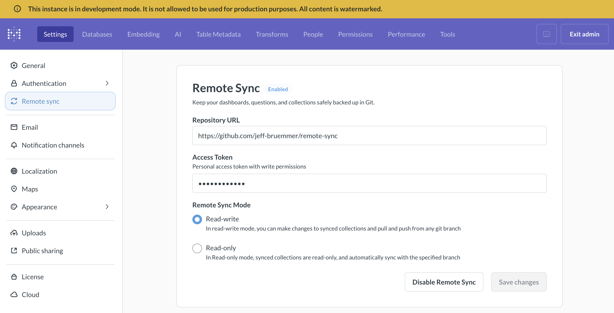
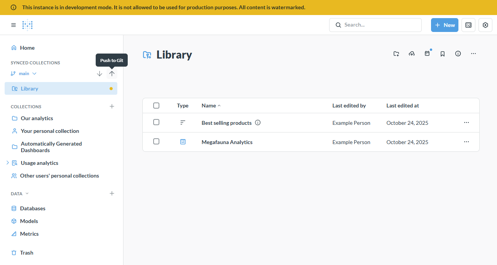
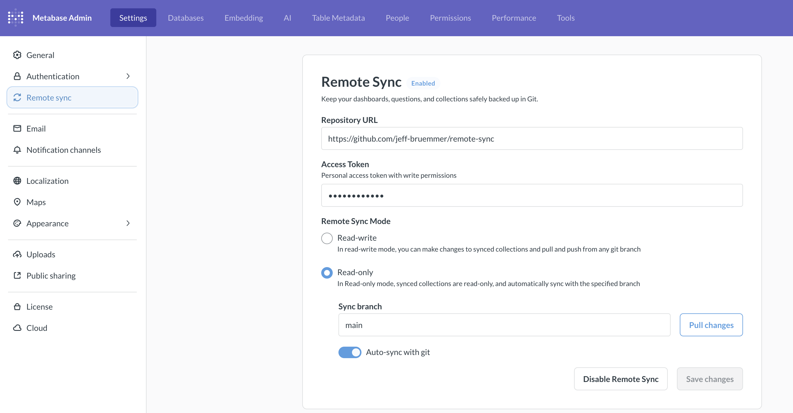
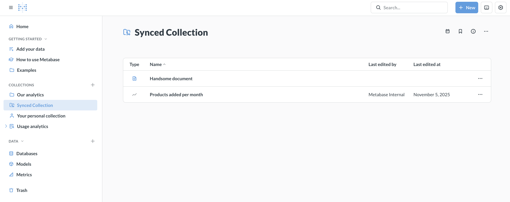
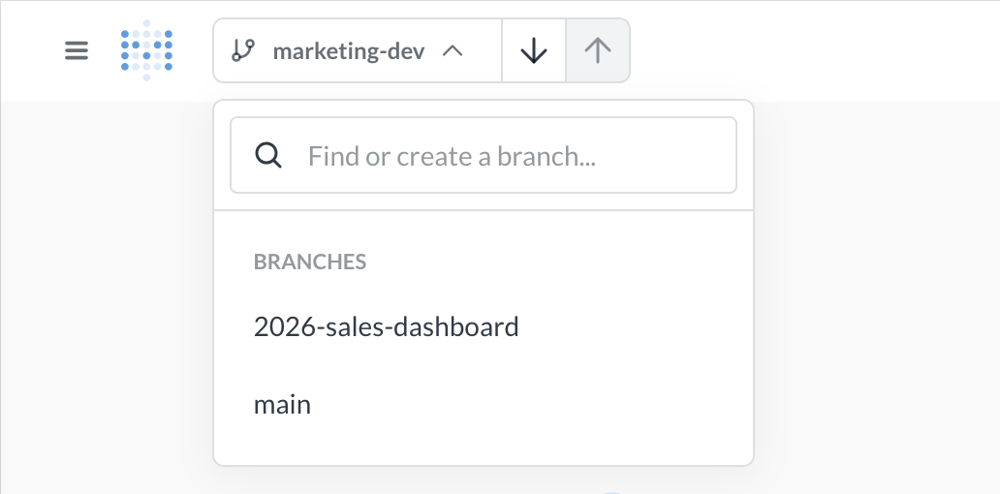

# Remote sync



## Overview

Remote Sync lets you develop analytics content in your Metabase and automatically deploy it to a read-only production Metabase through Git. Remote Sync can sync:

- Top-level collections (dashboards, questions, models, metrics)
- Library content (published tables and their segments and measures)
- Snippets
- Transforms

Metabase doesn't sync any of your data. What it stores in Git are [YAML files](./serialization.md#example-of-a-serialized-question) describing your analytics content. Your actual data stays in your databases and never goes to GitHub.

### How Remote Sync works

Here's a basic remote-sync workflow:

1. Create a dashboard in a **Metabase configured in Read-write mode**.
2. Push it to a Git branch.
3. Open a pull request for review.
4. Merge the PR to production.
5. Your **Metabase configured in Read-only mode** automatically pulls in the changes.

We'll cover [setting up Remote Sync](#setting-up-remote-sync), an [example dev-to-production workflow](#an-example-dev-to-production-workflow), [branch management](#branch-management), and some other odds and ends.

### Key concepts

**Remote Sync has two modes for different roles**:

- **Read-write mode**: Create and edit content. You can [push](#pushing-changes-to-git) and [pull](#pulling-changes-from-git) changes to and from your repository. Multiple Metabase instances can connect in Read-write mode, each working on [different branches](#branch-management).
- **Read-only mode**: Read-only instances only [pull](#pulling-changes-from-git) changes (typically from your main branch) and don't allow direct editing of synced content. In Read-only mode, you also can't edit transforms (even if transforms syncing wasn't enabled in read-write mode), can't edit Library content, and can't create segments or measures on published tables. You can set up [auto-sync](#pulling-changes-automatically) to automatically pull approved changes every five minutes.

**You choose what to sync**: You can sync the Library, any top-level collections, and transforms. Everything inside selected collections (including sub-collections) is versioned and synchronized with your repository. If you use [Tenants](../embedding/tenants.md), you can also sync shared collections.

**Items in synced collections must be self-contained**: Everything a dashboard or question needs must be [inside a synced collection](#items-in-synced-collections-cant-depend-on-items-outside-of-synced-collections).

**Content is stored as [YAML files](./serialization.md#example-of-a-serialized-question)**: Remote Sync stores your content as YAML files in your Git repository. Each dashboard, question, model, and document becomes a YAML file that can be reviewed in pull requests and versioned like code.

**Remote Sync excludes table metadata**: Column types, descriptions, and visibility settings don't sync. If you need to version table metadata, use [serialization](./serialization.md) instead.

## Setting up Remote Sync

You'll need to be an admin to set up Remote Sync.

1. [Set up a repository to store your content](#1-set-up-a-repository-to-store-your-content)
2. [Create a personal access token for development](#2-create-a-personal-access-token-for-development)
3. [Connect your development Metabase to your repository](#3-connect-your-development-metabase-to-your-repository)
4. [Select collections to sync](#4-select-collections-to-sync)
5. [Push your changes to your repository](#5-push-your-changes-to-your-repository)
6. [Create a personal access token for production](#6-create-a-personal-access-token-for-production)
7. [Connect your production Metabase to your repository](#7-connect-your-production-metabase-to-your-repository)
8. [Configure transforms syncing (optional)](#8-configure-transforms-syncing-optional)

### 1. Set up a repository to store your content

Before you connect Metabase to your Git repository, create a [new GitHub repository](https://docs.github.com/en/repositories/creating-and-managing-repositories/creating-a-new-repository). Initialize the repo with a README.md.

### 2. Create a personal access token for development

Create a [GitHub fine-grained personal access token](https://docs.github.com/en/authentication/keeping-your-account-and-data-secure/managing-your-personal-access-tokens) for your repository with these permissions:

- **Contents:** Read and write
- **Metadata:** Read-only (required)

Copy the token immediately after generating it.

### 3. Connect your development Metabase to your repository



You can put any Metabase into Read-write mode. We also offer [Development instances](./development-instance.md) that you can use for Remote Sync or any other kind of development.

In the Metabase instance that you use for development:

1. Go to **Admin settings** > **Settings** > **Remote sync**.

2. Enter your repository URL:

   - For example, `https://github.com/your-org/your-repo`. The repository must already exist and be initialized with at least one commit.

3. Select **Read-write mode**.

4. Add your access token:

   - Paste the personal access token (PAT) you created earlier. Make sure the token has [read and write permissions](#2-create-a-personal-access-token-for-development). Metabase encrypts your token before storing it.

5. Save and test the connection:

   - Click "Save changes". Metabase will check whether it can reach your repository. If the connection fails, make sure your token has the appropriate permissions and hasn't expired. If you copied the token incorrectly, generate a new one.

6. (Optional) If you have [multi-tenant user strategy enabled](../embedding/tenants.md#enable-multi-tenant-strategy), you can also choose which [shared collection](../embedding/tenants.md#changing-tenant-strategy) to sync.

### 4. Select collections to sync

You can select any top-level collection under Our Analytics to sync with Git. In the Remote Sync settings, choose which collections you want to track.

Collections you select for syncing must pass referential integrity checks—they need to be self-contained, meaning all dependencies (like models referenced by questions) must also be in synced collections.

If you use [tenants](../embedding/tenants.md), you can also choose to sync [shared collections](../embedding/tenants.md#collection-types).

### 5. Push your changes to your repository



Once you've added content, you'll see a yellow dot on the synced collections indicating uncommitted changes.

1. At the top of the screen, choose which branch to push to and click the up arrow (push) icon.

2. Enter a commit message describing your changes (e.g., "Added dashboard on mammoth populations").

3. Click "Push changes" to commit and push your changes to your repository.

Check your repository; you should see the collection.

By default, you're pushing to your repository's main branch. However, you can choose (or create) a different branch so you can open pull requests for review. See [Branch management](#branch-management) for details on creating and switching branches.

### 6. Create a personal access token for production

Create a [GitHub fine-grained personal access token](https://docs.github.com/en/authentication/keeping-your-account-and-data-secure/managing-your-personal-access-tokens) for your repository with these permissions:

- **Contents:** Read-only
- **Metadata:** Read-only (required)

Copy the token immediately after generating it — you'll need to paste it into your production Metabase.

### 7. Connect your production Metabase to your repository



In your production Metabase instance:

1. Go to **Admin settings** > **Settings** > **Remote sync**.

2. Enter your repository URL:

   - Use the same repository as your development Metabase, for example, `https://github.com/your-org/your-repo`.

3. Select **Read-only mode**.

4. Add your access token:

   - Paste the read-only personal access token you created for this production Metabase.

5. Save and test the connection:

   - Click "Save changes". Metabase will verify it can reach your repository. If the connection fails, verify your token has the appropriate permissions and hasn't expired.

6. Sync your content:
   - Click "Pull changes" to immediately sync content from your repository.
   - To keep your production instance automatically updated, toggle on "Auto-sync with Git". Metabase will pull changes from your main branch every five minutes.

In Read-only mode, synced collections appear in the regular collections list with a special icon to indicate that they're versioned and read-only.



At this point, you should be all set up. Exit Admin settings, then reload your browser. You should see your synced collections in your production Metabase.

### 8. Configure transforms syncing (optional)

To version control your data transformation logic, you can sync your [Transforms](../data-studio/transforms/transforms-overview.md) including all your tags and jobs. Transform syncing is all or nothing: Metabase will sync your entire transforms namespace. You can't selectively sync specific transform folders.

## An example dev-to-production workflow

Let's say your team wants to build a new analytics dashboard. Here's a workflow that ensures all production content goes through a review process.

### Step 1: Create a new branch

In your development Metabase, click the branch dropdown at the top of the screen to [create a new branch](#branch-management) for your work, like `feature/megafauna-dashboard`.

### Step 2: Create content in your development Metabase

Create a dashboard called "Megafauna Analytics" and add some questions. Save the questions either to the dashboard itself or to a synced collection. Save the dashboard to a synced collection.

### Step 3: Push to your development branch

1. You should see a yellow dot on your synced collection (indicating local changes).
2. Click the up arrow (push) icon at the top of the screen.
3. Enter a commit message: "Add Megafauna Analytics dashboard".
4. Metabase commits your changes to the branch you're working on and pushes them to your repo.

### Step 4: Create a pull request

In your Git repository:

1. Create a pull request from your branch, `feature/megafauna-dashboard`, to the main branch `main`.
2. Review the changes to the YAML files representing your dashboards and questions.
3. Someone who knows what they're doing approves and merges the PR.

### Step 5: Production automatically updates

On your production Metabase instance:

1. Within five minutes, Auto-sync detects the new commits on `main` (you can also manually import the changes).
2. The "Megafauna Analytics" dashboard appears in production with all its questions.
3. The content is read-only (people can view and use it, but can't edit it).

## How synced collections work in Read-write mode

- [Synced collections in the UI](#synced-collections-in-the-ui)
- [Moving and deleting content in synced collections](#moving-and-deleting-content-in-synced-collections)
- [Items in synced collections can't depend on items outside of synced collections](#items-in-synced-collections-cant-depend-on-items-outside-of-synced-collections)

### Synced collections in the UI

You can select any top-level collection under Our Analytics to sync with Git. Synced collections show their current state with visual indicators: a yellow dot indicates unsynced local changes that need to be committed. At the top of the screen, you'll see up/down arrows that provide sync controls for pulling and pushing changes.

If you are using [tenants](../embedding/tenants.md), you can also sync shared collections. You'll see the same yellow dot indicator for shared collections.

In Read-only mode, synced collections appear in the regular collections list (not in a separate "Synced Collections" section) with a special icon to indicate they're versioned and read-only.

When transforms syncing is enabled, you'll find your transforms in the Transforms section of the Admin settings. Synced transforms are also read-only in Read-only mode.

### Moving and deleting content in synced collections

When you remove content from a synced collection in Read-write mode and push that change, the content will also be removed from your production instance when it syncs. This applies to moving content out of a synced collection or deleting it entirely.

Content in other Metabases that depended on this item may break since the dependency will no longer be in a synced collection.

### Items in synced collections can't depend on items outside of synced collections

For Remote Sync to work properly, synced collections must be self-contained. Everything a dashboard or question needs must be inside one of the synced collections. This includes:

- Questions that reference models
- Dashboards with questions
- Click behaviors linking to other items
- Filters that pick values from other questions
- @ mentions in documents

### Making sub-collections appear at the top level

Sometimes you might want synced content to appear at the top level of your navigation rather than nested under a synced collection. If you use [Tenants](../embedding/tenants.md), you can accomplish that with synced shared collections.

If you aren't using tenants, you can use permissions to control how the collection hierarchy appears to different groups.

1. **Organize content in sub-collections of your synced collection**. For example, you might have `Analytics/Mammoth Statistics` and `Analytics/Giant Sloth Statistics`.

2. In your production Metabase, **set up permissions for embedded groups:** Groups should have:
   - **No view access** to the top-level synced collection itself
   - **View access** to specific sub-collections within the synced collection

For groups with these permissions, the sub-collections they can access will appear at the top level of navigation, as if they were root-level collections. They won't see the top-level synced collection that you have in your development Metabase.

What you see in Read-write mode:

```
Collections
└── Analytics
    ├── Mammoth Statistics
    ├── Giant Sloth Statistics
```

What embedding groups see in Read-only mode (with no access to Analytics, but access to Mammoth Statistics and Giant Sloth Statistics):

```
Collections
├── Mammoth Statistics
└── Giant Sloth Statistics
```

## Remote Sync uses serialization

Remote Sync serializes your Metabase content as YAML files in your repo. YAML files use Metabase [serialization format](./serialization.md). See [Serialization docs](./serialization.md) for more information on the format.

## What Metabase syncs

Remote Sync uses the same serialization format as the [Metabase CLI serialization feature](./serialization.md), storing your content as YAML files in your Git repository.

**What syncs:**

- Dashboards and their cards
- Questions (saved queries and models)
- Model metadata (column descriptions, display settings, etc.)
- Documents
- Timelines and events
- Collection structure and metadata
- Library content (published tables, metrics, snippets, segments, measures)
- Transforms (including jobs and folders)

**What doesn't sync:**

- Users, groups, and permissions
- Alerts and subscriptions
- Database connections
- Personal collections
- Table metadata (column types, descriptions, visibility settings, etc.)

## Branch management

Branching is only available in Read-write mode.

### Creating a branch

You can create branches in Metabase or directly in your Git repository. Branches created in Git will appear in the Metabase branch dropdown once Metabase syncs with your repository.

Before creating branches, push an initial commit to your main branch.

To create a new branch in Metabase:

1. Click the branch dropdown at the top of the screen.
2. Type a name for the new branch in the search box.
3. Press Enter to create the branch.

The new branch is created from your current commit (not the latest commit from the remote).

### Switching branches

At the top of the screen, you'll see a branch dropdown:



1. Click the branch dropdown to see available branches.
2. Select a different branch to switch to it.

If the branch doesn't appear, ensure it exists in your Git repository and that the name matches exactly (branch names are case-sensitive).

If you have unsynced changes, Metabase will show a dialog asking what you want to do:

- **Push changes to the current branch:** Commits your changes to the current branch before switching.
- **Create a new branch and push changes there:** Saves your work to a new branch, keeping the original branch clean.
- **Discard these changes:** Throws away your uncommitted changes (can't be undone).

The dialog shows you exactly which items have changed, so you can make an informed decision.

If you switch modes (from Read-write to Read-only or vice versa) with unpushed changes, you'll be prompted to save or discard them. You cannot switch to Read-only mode with uncommitted changes.

If changes don't appear after switching modes: Hard refresh your browser (Cmd/Ctrl + Shift + R).

## Pushing changes to Git

You can only push changes in a Metabase with Remote Sync set to Read-write mode.

### Committing and pushing your changes

When you make changes to items in a synced collection, a yellow dot appears on your synced collection (indicating uncommitted changes). To commit and push your changes:

1. Click the up arrow (push) icon at the top of the screen (make sure you're pushing to the right branch).
2. Enter a descriptive commit message explaining your changes.
3. Click "Continue" to push your changes to Git.

If you see a message that "Remote is ahead of local", that means someone else pushed to the branch from another Metabase in Read-write mode. Pull the latest changes before pushing again.

## Pulling changes from Git

You can pull changes when in Read-write or Read-only mode.

In Read-write mode, you can get the latest changes from your Git repository:

1. Click the down arrow (pull) icon at the top of the screen.
2. Review any summary of incoming changes if shown.
3. Confirm the import.
4. Metabase updates your collections with the latest content from Git.

If changes don't appear after pulling:

- Verify you're on the correct branch.
- Hard refresh your browser (Cmd/Ctrl + Shift + R).
- If you encounter sync errors, review error messages in the sync dialog, manually resolve conflicts in your Git repository, then pull again.

In Read-only mode, go to **Admin settings** > **Settings** > **Remote sync** and click **Pull changes**.

### Handling unsynced changes

If you have local uncommitted changes when trying to pull or switch branches, Metabase will prompt you with options:

- **Push changes to the current branch:** Commit your changes first, then proceed.
- **Create a new branch and push changes there:** Preserve your work on a new branch.
- **Discard these changes:** Throw away your uncommitted changes to accept what's in Git.

When in doubt, create a new branch and push changes to that branch. That way you won't lose any work.

### Pulling changes automatically

In Read-only mode, you can set Metabase to auto-sync changes from your main branch.

1. Navigate to **Admin settings** > **Settings** > **Remote sync**.
2. Enable Auto-sync with Git.

By default, Metabase will check for and pull changes from the branch you specify every five minutes. You can also manually sync as needed.

## Disabling Remote Sync

To disable Remote Sync, go to the Remote Sync settings page in Admin settings.

To disable Remote Sync:

1. Go to **Admin settings** > **Settings** > **Remote sync**.
2. Click **Disable Remote Sync**.
3. In the confirmation dialog, click **Disable**.

- All remote sync settings are cleared, including the repository URL, access token, and branch information.
- Your synced collections and their content remain in your Metabase (they're not deleted).
- Synced collections become regular collections that you can edit like any other collection.
- You can re-enable Remote Sync later by reconnecting to a repository, but any changes you made to the collection after disabling can be overwritten if you enable sync again.

## Migrating existing content to Remote Sync

If you already have content in your Metabase, you can gradually adopt Remote Sync. Content that lives outside synced collections remains unaffected—you can continue working with it normally while you migrate content into a synced collection over time.

Make sure you move any dependencies (like models referenced by questions) into synced collections, since [synced content must be self-contained](#key-concepts).

### If you already have a repo with serialized Metabase data

Keep doing what you're doing.

If you want to switch fully to Remote Sync, we recommend starting with a new repo:

1. Check out a new branch in your Metabase instance in Read-write mode.
2. Import your data to your Metabase instance with the serialization command as you normally would.
3. Move the content you want to sync into a synced collection.
4. Push up your changes to the new repo.

Remote Sync does NOT sync table metadata, so if you're importing and exporting your [table metadata](../data-modeling/metadata-editing.md), you should stick with serialization.

## Further reading

- [Library](../data-studio/library.md)
- [Serialization](./serialization.md)
