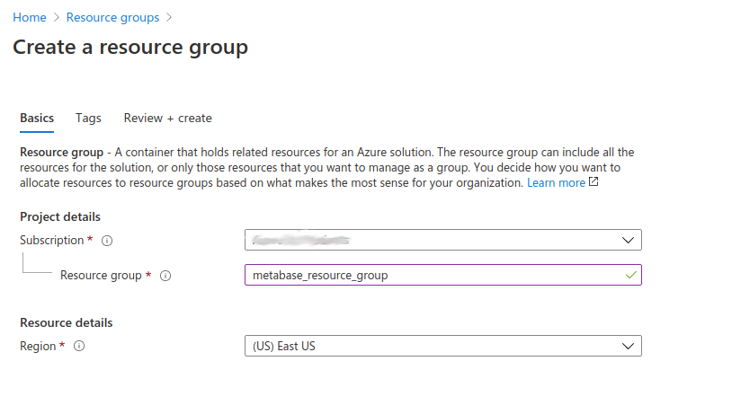
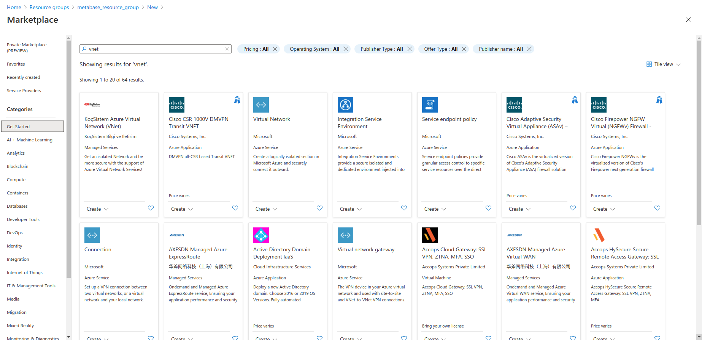
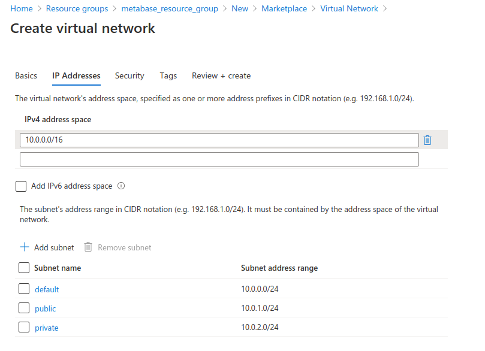
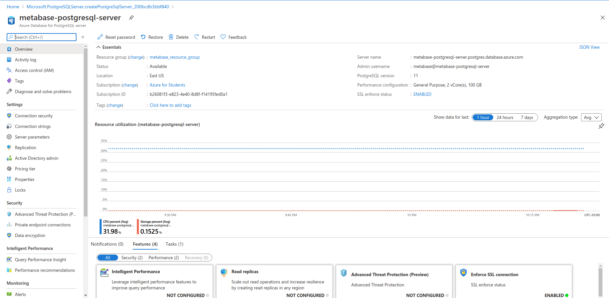
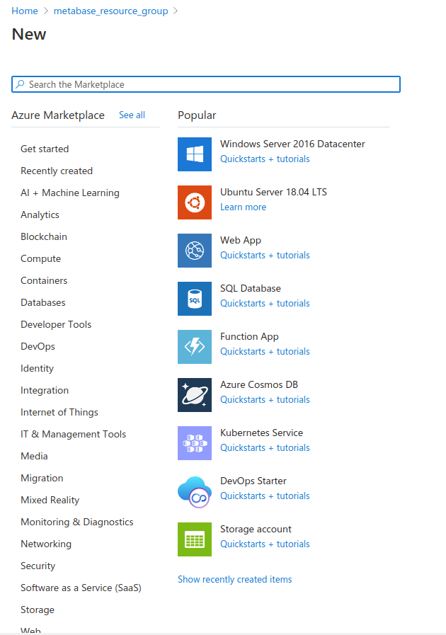
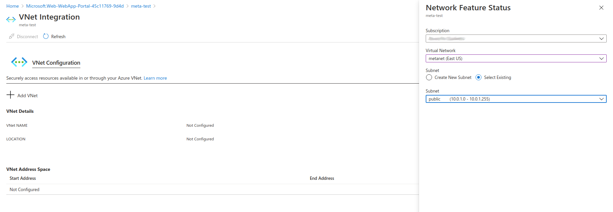

# Running Metabase on Microsoft Azure

This guide covers the basics for running your Metabase instance in Microsoft Azure using Docker.

## Step 1: Create the resource group (resource grouping)

On the Azure management console, click on the **Resource Groups** icon at the top of the page (or just search for Resource Groups). If you already have a resource group, you can go straight to [Step 2](#step-2-create-the-vnet-virtual-network).

On the resource group page, click on the **+ Add** button in the top bar to create a new resource group. On the **Create a resource group** page, select your valid Azure Subscription, enter the name of your resource group, and select a region.



Click **Next**  until you see the **Create** button, then click it.

When selecting the region for your Metabase, you should consider the location of your users and your data warehouse, as well as the infrastructure costs and privacy laws that might restrict cross-border data transfers.

## Step 2: Create the VNET (virtual network)

At the center of the page, click on the **Create resources** button. Search for **VNET**:



Select the VNET product from Microsoft, and click **Create**:


Enter a name for the virtual network and select the same region you used for the resource group. Click on **Next: IP Addresses** button at the bottom.

Here we'll create a secure network composed of a public subnet (a network that is exposed to the internet), and a private network that will contain your application database.

In the IPv4 address, you should have a default value of 10.0.0.0/16 (otherwise add that network space to the box). Next, add two subnets:

- one subnet named public, with the subnet address range of 10.0.1.0/24, and
- one subnet named private with the subnet range of 10.0.2.0/24.



Click **Next** until you get to the **Review and create** page, then click on the **Create** button at the bottom to create your network.

## Step 3: Create the Application Database (PostgreSQL)

From the Azure Management console homepage, create a new resource. This time search for **Azure Database for PostgreSQL**. You can also find this database in the Marketplace menu under **Databases**.


In the next page you will have to select the way you will use the service. Choose **Single server** for now, which is a good starting point, but take into account that this will create just one instance of PostgreSQL that will be your single point of failure.

On the next screen, select or enter the following:

- **Resource group**: the one you are including all your components.
- **Server name**: a unique name for your database.
- **Data Source**: can be left as `None`.
- **Location**: the same one you used for your Resource Group and VNET.
- **Version**: use the latest one you can.
- **Compute + Storage**: you can re-dimension your database,  but you must select the `General Purpose` tier, as it's the only tier that provides a Private Link.

Then choose an admin username and password of your choice.

Click **Next** until you get to the final page, then click **Create**. It'll take some time for Azure to create the database. Once the creation is complete, click on the **Go to resource** button.

## Step 4: Create the private endpoint connection

On the properties page for the Azure for PostgreSQL database, you can manage parameters for your database. You'll create the **Private Endpoint** to the database, so all traffic from the web application is routed internally through Azure's network.

On the left menu, click on **Private endpoint connection** which is situated under **Security**



Now click on the button of the top bar with a plus sign that says **Private endpoint**. In the page that opens:
1) Provide a name for this link (any name that describes what you are trying to do is fine, like `metabase_link`). Select the region where the database lives, click **Next**.
2) On the **Resource** section of the configuration, ensure that **Resource type** is set to `Microsoft.DBforPostgreSQL/servers` which will enable you to select in the dropdown below the server created in the previous step, and leave **Target sub-resource** with the default value
3) On the **Configuration** section, the only value that needs to be changed is the **Subnet** one, where you need to select the **private** subnet that you created on the first step of this guide, and leave everything else as it is.


Now go to the last step and click **Create**. Once the endpoint is created, you will need do two things before proceeding:

1) In the page of database server you just created go to the database **Connection Security** item and **deny all public network access**.
2) In the page of the VNET you created in the previous step, go to **Connected devices** setting and you should see a device connected to the network. Take note of the IP address, as you'll need it in Step 5 (this is the IP address that the network has given to the database server).

## Step 5: Create web application (deploy Metabase)

At last, the step where all the magic comes together: go to your resource group and add a new resource, or search for **Web App** in the Marketplace (blue globe icon).


Now set up the following values on the page (resource group should be the same as in the first step):
- **Name**: The name must be unique, as the subdomain is shared across all Azure deployments.
- **Publish**: Docker Container.
- **Operating System**: Linux.
- **Region**: Use the same region as the previous steps.
- **App Service Plan**: If you don't have one a service plan, Azure will create a new one automatically.
- **SKU and Size**: Set a Production level plan with **AT LEAST** 200 total ACU and 3.5GB of memory, and click **Apply**.

Now go to the next step where you will select:

- **Options**: Single container.
- **Image source**: DockerHub.
- **Access Type**: Public.
- **Image and tag**: metabase/metabase:latest (or choose any other docker image tag of your preference, like our Enterprise Edition). To find the latest version, check our [Community Edition Dockerhub repository](https://hub.docker.com/r/metabase/metabase/tags?page=1&ordering=last_updated) and also our [Enterprise Edition Dockerhub Repository](https://hub.docker.com/r/metabase/metabase-enterprise/tags?page=1&ordering=last_updated).
- **Startup command**:  Leave this field empty.

Click **Next** until you get to the last section, then click **Create**, and wait while your application initializes.

Now go to the application configuration page and click on **Settings** -> **Networking** on the left side of the page. On the next page, click on **Click here to configure** under **VNET integration**.


Now click on the huge plus sign next to **Add VNET** and select the VNET that you created, and the public subnet. Click **OK**.



Return to the application configuration page and click on **Settings** -> **Configuration** on the left side of the page. You should see a few Application Settings already configured.

You'll need to add the [Environment Variables]() for connecting Metabase to its [PostgreSQL Application Database](https://www.metabase.com/docs/latest/operations-guide/configuring-application-database.html#postgres). Make sure that you use the full **MB_DB_CONNECTION_URI**.

Also, take into account that the username in Azure PostgreSQL is `user@name_of_your_database_engine` so in this case the entire connection uri would be as follows: 

```
postgresql://databasePrivateIPAddress:port/postgres?user=user@name_of_your_database_engine&password=configuredpassword&ssl=true&sslmode=required
```

For example, if your values are:

1) **database private IP address**: 10.0.2.4
2) **database port**: 5432 (in the case of Postgres, MySQL/MariaDB default port is 3306)
3) **name of the database server**: metabase-app-database
4) **username of the database**: metabase
5) **password**: Password1!

then your connection string would be: 

```
postgresql://10.0.2.4:5432/postgres?user=metabase@metabase-app-database&password=Password1!&ssl=true&sslmode=require
```

Click **Save** and the instance will restart. 

Once it finishes, you should be able to visit your Metabase at the URL shown in the "Overview" tab in the web app (under the URL section). 

## Additional configurations

### How to enable Health checks

Enabling health checking in Metabase is a good practice.  Go to your **web app** -> **Monitoring** -> **Health Check** -> **Enable health check**, and include in the path `/api/health`.

### How to upgrade

Go to the Metabase web app you created and click in **Settings** -> **Container Settings**.

In the textbox of your Metabase Docker container, change the version of the container to the new version. See available versions in [Dockerhub](https://hub.docker.com/r/metabase/metabase/tags?page=1&ordering=last_updated).

**Important**: always ensure you have a backup of your Database before doing a version upgrade, *especially* when upgrading between major versions. Also remember that Metabase doesn't officially support downgrading versions.

### How to see the logs

Visit your web app in Azure, and navigate to **Monitoring -> Log stream**.

You should be able to see the logs as well inside Metabase by going to Settings -> Admin -> Troubleshooting -> Logs.

### Performance tuning

- Disable FTP State
- Change HTTP version to 2.0
- Enable WebSockets
- ARR Affinity enabled

### Custom domains

In your Azure web app, visit **Settings** -> **Custom domains** to use a custom domain with your own certificates.

### Scale-up vs Scale-out

Azure provides an easy way to increase the server's capacity by doing a Scale-up. Simply choose a pricing tier with more RAM and CPU count and restart the instance. This approach is easier than scaling out and you should choose this option first before scaling out.

For a highly-available Metabase deployment, you can tell your web app to scale-out (more servers serving the application in parallel). Simply go to Scale-out and use the slider to ask for more instances, or use a custom autoscaling policy (like using more servers during your work hours and fewer during off hours).

### CORS

In case you're embedding Metabase, you might need to enable CORS in **Settings** -> **CORS** in the web application. You'll need to fill the origin domains for the app with the embedded Metabase, so Azure knows to enable cross requests from those domains.

### Database name

Azure does not let users create a database upon service creation, that's the reason why we used `postgres` as the database to install Metabase. Althought this shouldn't be a problem, a good practice would be to install the database in a separate database named `metabase`. If you are not in a hurry to try the product, you should create a database named `metabase` as soon as you create the database and then use the appropiate connection string when deploying the docker container.
In the example above the connection string would be 

```
postgresql://10.0.2.4:5432/metabase?user=metabase@metabase-app-database&password=Password1!&ssl=true&sslmode=require
```
