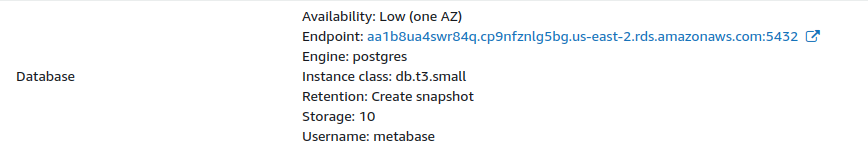
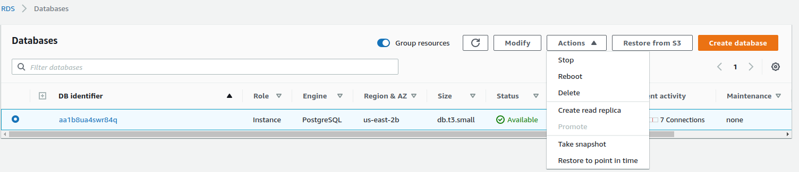
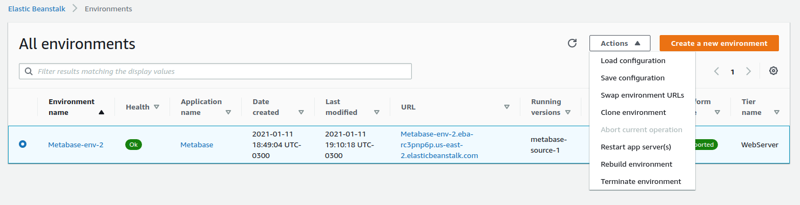
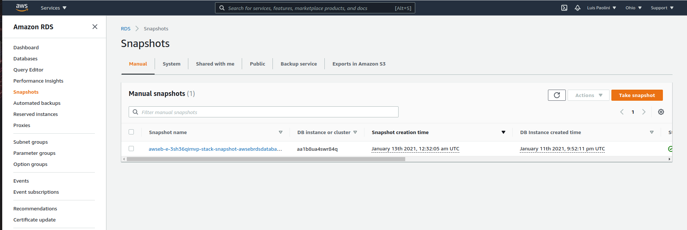

# Running Metabase on AWS Elastic Beanstalk

> Due to problems with the platform, we no longer recommend using Elastic Beanstalk to run Metabase in production.

If you're running Metabase on Elastic Beanstalk, we recommend you switch to a different setup.

## Alternatives to Elastic Beanstalk

### Metabase Cloud

We recommend [Metabase Cloud](https://www.metabase.com/pricing) (obviously).

### Self-hosted setups

You can set up Metabase with either PostgreSQL or MySQL as its application database, and run Metabase on a server you can monitor, either on your hardware or with a cloud provider.

At a minimum, make sure you back up your application database regularly (and always before upgrading). Follow your organization's requirements for security, monitoring, and availability.

### Professional services

If you'd like help with setting up Metabase (or building out your data stack in general), check out the [professional services we offer](https://www.metabase.com/product/professional-services).

## Decouple your RDS database from the Elastic Beanstalk deployment

If you're using AWS's Relational Database Service to store your Metabase application data, you can continue to do so (though you should still move your Metabase installation away from Elastic Beanstalk). You can use [environment variables](../configuring-metabase/environment-variables.md) to connect to your RDS host from wherever you move your Metabase installation to.

### Notify people that your Metabase will be down for a bit

This procedure will generate downtime, so make sure to communicate to your users that Metabase will be down while you recreate the environment with the new database.

### Get a snapshot of your application database

> You'll need the master username and password for the database you used when you created the Elastic Beanstalk instance.

Identify the RDS endpoint that your Elastic Beanstalk is using by going to the configuration of the Environment and finding the endpoint value on the Database section.

- If Retention is "Create snapshot", you're good to go. You can delete the whole Elastic Beanstalk environment, because AWS will take a snapshot (backup) of the database before deleting the environment.
- If Retention has a different value, visit your RDS instance and take a snapshot of the database used by the Elastic Beanstalk application.

  

### Terminate your Elastic Beanstalk environment with snapshot

Go to the Elastic Beanstalk Metabase application, select the running environment, and terminate it. Confirm that the database will be terminated **with snapshot**.

Terminating the environment can take around 20 minutes. If the deletion fails, you'll have to identify through CloudFormation which resources failed to be deleted and delete them yourself.

### Restore your snapshot

Return to RDS and select the **Snapshots** option on the left of the page. You should see a Manual Snapshot listed.

Select that snapshot and click on **Actions** > **Restore Snapshot**.

From this step on, you can follow the same steps as the [Configuring RDS for Metabase](./creating-RDS-database-on-AWS.md). 

## Upgrade your Elastic Beanstalk deployment

If you want to stay in Elastic Beanstalk, you can keep upgrading it by following these steps:

1. Download the [last published Beanstalk artifact file](https://downloads.metabase.com/v0.47.2/metabase-aws-eb.zip).
2. Unzip the file.
3. Edit the Dockerrun.aws.json file and change the image tag to the latest available version. Always Avoid using `:latest`, instead, use the latest version number.
4. Compress the file.
5. Upload the file to AWS as a new Beanstalk version.
6. Upgrade your environment.

Remember that if you're using a Pro or Enterprise version of Metabase, you need to use the metabase/metabase-enterprise repository instead of the metabase/metabase one.
