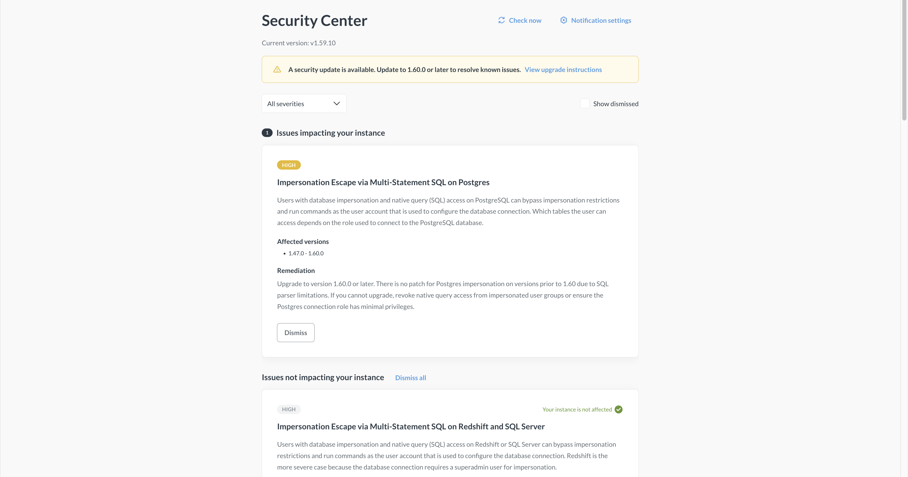
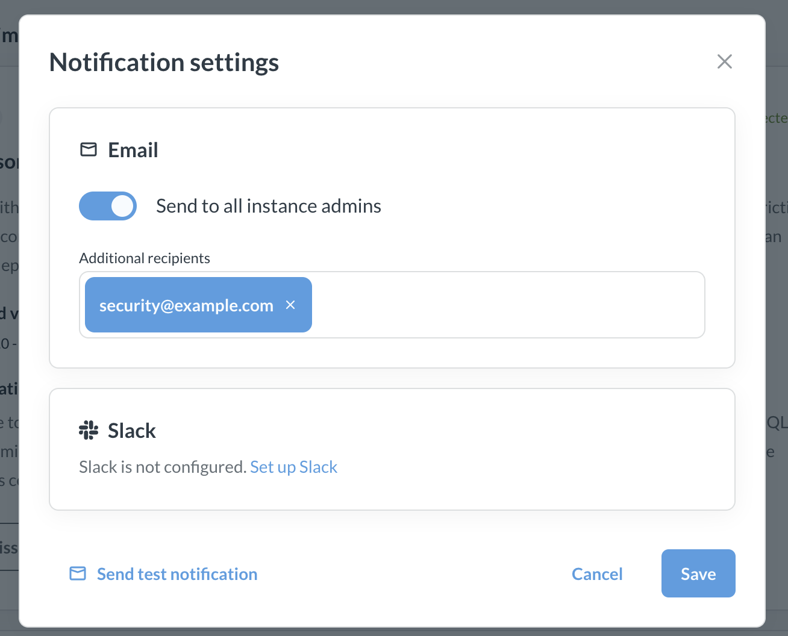

# Security center



_Admin > Security_

The Security Center is the main way we (Metabase the company) let people who are self-hosting Metabase know about important security patches. You can configure Metabase to send notifications to specific email addresses or a Slack channel whenever a new security advisory is published.

Security center is available for (and relevant to) self-hosted Metabases on Pro/Enterprise plans. Metabase Cloud instances are automatically patched as soon as issues are discovered and resolved. Air-gapped Metabases will not get the security center (regardless of the plan) because security center needs to check Metabases's security registry for updates, which would violate air-gapping.

## See security issues affecting your instance

Security center in **Admin > Security** will display _all_ security advisories published by Metabase, regardless of whether they're affecting your instance.

You can opt in to get email or Slack notifications when new issues affect your instance.

To check whether your instance is affected by a security issue, Metabase analyzes the instance's configuration: version, settings, databases connected, features used, etc. For example, if an advisory involving impersonation on PostgreSQL is posted, Metabase will check whether your instance has a PostgreSQL database connected, and whether it has impersonation enabled. If Metabase finds an issue that impacts your Metabase, it will highlight the issue in the security center and send you a notification (if you've set up notifications, which you should do).

Metabase checks for new security advisories periodically, but you can also force the check by clicking **Check now** in the security center.

You can dismiss security issues by clicking **Dismiss** on an issue. Keep in mind that you can't un-dismiss the issue, so only dismiss an issue once you've gone through remediation steps.

## Remedy security issues

Every security issue posted in **Admin > Security** will come with remediation steps. These steps will usually just involve upgrading your Metabase.

See [Upgrading a self-hosted Metabase](upgrading-metabase.md#upgrading-a-self-hosted-metabase).

If you have questions or need help, you can always [reach out to us](https://www.metabase.com/help-premium) and we'll get you sorted.

## Get notified about security issues

_Admin > Security_

To get notified about security issues affecting your instance, you must set up at least one notification channel for your Metabase. See [Set up email](../configuring-metabase/email.md) or [Set up Slack](../configuring-metabase/slack.md).

Once you set up a notification channel for your Metabase:

1. Go to **Admin > Security**.
2. At the top of security center, click **Notification settings**.
3. Select Email and/or Slack:

   - **Email**: you can choose whether to send emails to all admins of your Metabase, and add any additional emails, including non-Metabase users. For example, you can add people from the security team at your org.
   - **Slack**: pick a channel or a user to send notifications to.

   

4. (Optional, but you should do this) Click **Send the test notification** to make sure the messages actually arrive.
5. Save.

You'll only get notifications about new issues _affecting your instance_. New issues that don't affect your instance will be visible in the security center, but you won't get notified about them.

## Further reading

- [Security](https://www.metabase.com/security)
- [Upgrading Metabase](upgrading-metabase.md)
