- [Configuring RDS for Metabase (the recommended guide)](#configuring-rds-for-metabase-the-recommended-guide)
  - [Step 1](#step-1)
  - [Step 2](#step-2)
  - [Step 3](#step-3)
  - [Step 4](#step-4)
- [Decouple your RDS database from the Elastic Beanstalk deployment](#decouple-your-rds-database-from-the-elastic-beanstalk-deployment)
  - [Step 1](#step-1-1)
  - [Step 2](#step-2-1)
  - [Step 3](#step-3-1)

# Configuring RDS for Metabase (the recommended guide)

If you want to move from using Metabase just for testing to something that is ready for the big time, you need to use a production-grade database like PostgreSQL or MySQL/MariaDB. Here's a [high level architecture diagram](images/Metabase-AWS-SI.png) of Metabase deployed with a dedicated application database.

## Step 1
In AWS, enter RDS in the search box or select RDS from the dropdown button on the top left of the page. Once inside RDS, click on the **Create database** button.

## Step 2
- Create Database: select MySQL or PostgreSQL as engine types, as these two are the ones that Metabase support as the Application Database (where Metabase will save all of its configurations). For this example we will choose PostgreSQL on its latest version available in AWS at the time of writing (12.4-R1).

- Templates: you can leave "Production" selected, or choose any other option that better suits your needs.

- Settings: type a unique **DB instance identifier** for your database. You'll need the username and master password to configure the environment variables in Metabase.
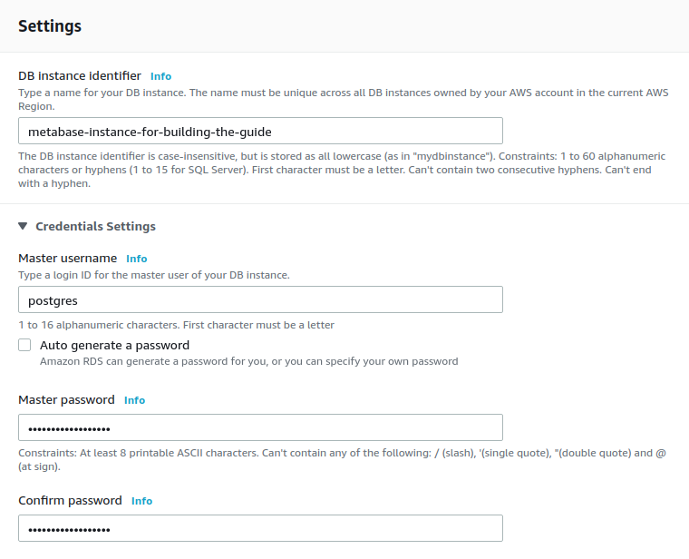

- Instance size: the sizing of the RDS instance depends on the number of Metabase instances that will be connected to this database, the number of simultaneous users who are using Metabase, and the number of questions, dashboards, and configurations that are saved. To start, a `t3.small` is a good choice.
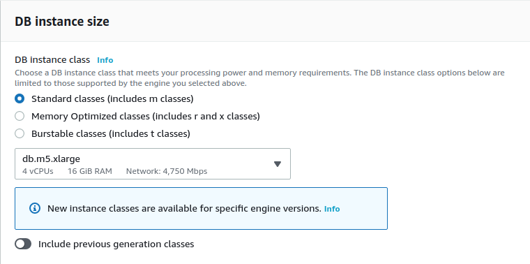

- Availability & Durability: on production deployments, you __should__ be using a Multi-AZ (Availability Zone) cluster, as this will ensure that the database does not goes down in case there is an issue on a single availability zone.
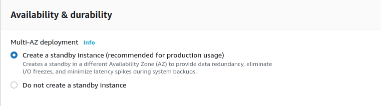

- Connectivity: 
  - Ensure that you are deploying the database in the same VPC as the one you deployed the Metabase instance/s, otherwise they won't be able to see each other. 
  - Create a **VPC security group**, as you will need to grant access from the Metabase instance/s to the database on the port that listens for connections.
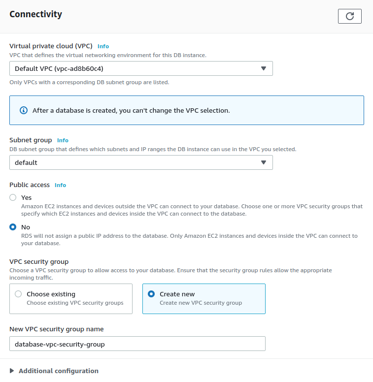

- Additional configuration
  - Enter `metabase` as the **Initial database name**. Metabase will use this database for all of its configurations. 
  - You can also configure the backup window in case you need to restore the backups at some point in time.

When you've completed all these configurations, click on the **Create database** button on the lower right part of the page and wait for the database to be created (which can take several minutes).

## Step 3
Once the database status is `Available`, you need to click on the DB identifier:
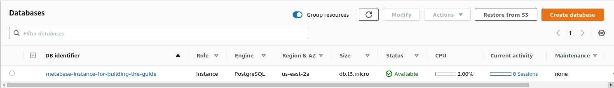

On the page that appears after you click on the database identifer, you will see on the center of the page the **Connectivity & Security** section. This section will provide you with the **Endpoint** that Metabase needs to connect to the application database we just created.

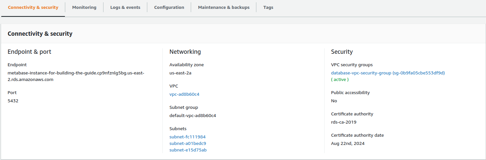

In the **Security group rules** section, you'll see the Security Group that was created, but the group will have a rule that allows only one IP address to access the database. You need to change this rule to allow access to the Elastic Beanstalk environment.

To configure the rule for the database, select the **CIDR/IP - Inbound** rule, then click on the **Inbound rules** tab on the lower part of the page.

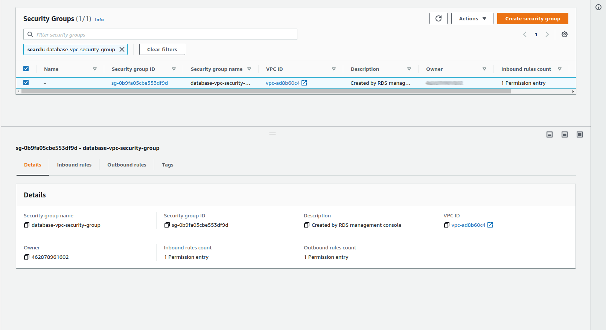

When you click on Inbound Rules, you need to click on **Edit Inbound Rules** button that appears on the right side of the section.

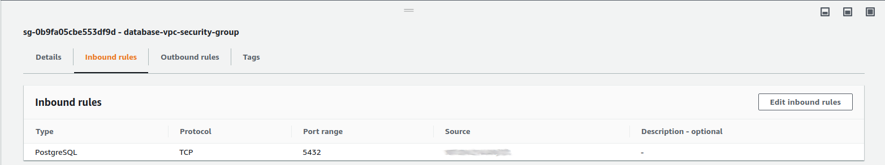

On the edit page, you need to delete the IP address that appears as default, then add the security group that the Elastic Beanstalk has (the Security group name will have the keyword AWSEBSecurityGroup  in its name). Once you add this security group, click the **Save rules** button.

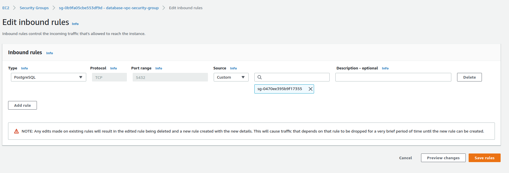

# Step 4 

After having finished all the previous steps, go to the your Elastic Beanstalk deployment and add the RDS instance as the Application Database with [Environment variables](environment-variables.html) under the [Software configuration](running-metabase-on-elastic-beanstalk.html#set-or-change-environment-variables).

---
# Decouple your RDS database from the Elastic Beanstalk deployment

In the previous versions of this guide, we recommended the creation of an Elastic Beanstalk deployment (AWS's service for deploying applications easily) that had a RDS (AWS's Relational Database Service) database included in the creation by default thanks to the magic of CloudFormation (AWS's Infrastructure as a Code service). While this was an easier approach to simplify the deployments, we found out that this approach was not the optimal for building a future-proof architecture, since leaving the creation of the database to Elastic Beanstalk lead to limitations in the configuration of the database that would limit the choice for users. That's the reason why we now recommend creating the database separately from the Metabase deployment and glue them together manually, or even separate both components with this guide:

- This procedure will generate downtime, so make sure to communicate to your users that Metabase will be down while you recreate the environment with the new database.
- You'll need the master username and password for the database you used when you created the Elastic Beanstalk instance.

## Step 1
Identify the RDS endpoint that your Elastic Beanstalk is using by going to the configuration of the Environment and finding the endpoint value on the Database section.
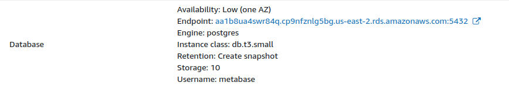
- If the Retention option is "Create snapshot", you're good to go. You can delete the whole Elastic Beanstalk environment, because AWS will take a snapshot (backup) of the database before deleting the environment.
- In case the Retention option has a different value, visit your RDS instance and take a snapshot of the database used by the Elastic Beanstalk application.
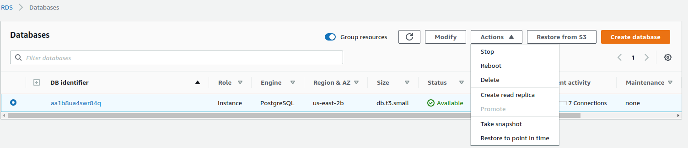

## Step 2
Go to the Elastic Beanstalk Metabase Application, select the running environment, and terminate it. Confirm that the database will be terminated __with snapshot__)
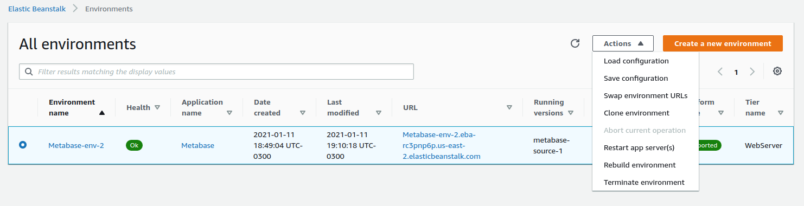

This step can take around 20 minutes. If the deletion fails, you'll have to identify through CloudFormation which resources failed to be deleted and delete them yourself.

## Step 3
Return to RDS and select the **Snapshots** option on the left of the page. You should see a Manual Snapshot listed.
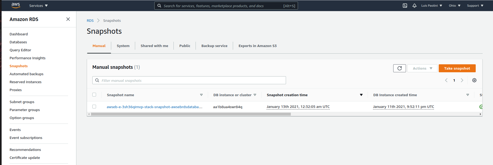

Select that snapshot and click on **Actions** → Restore Snapshot.

From this step on, you can follow the same steps as the [Configuring RDS for Metabase (the recommended guide)](#configuring-rds-for-metabase-the-recommended-guide) from [step 2](#step-2).
