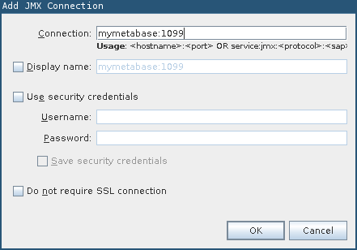

## Monitoring Your Metabase Instance

This guide assumes that you have the VisualVM tool installed
locally. VisualVM is included with OpenJDK and the Oracle JDK and is
found in the `bin` directory of the JDK install. Some Linux
distributions separate VisualVM from the JDK, in which case it's a
separate `visualvm` package.

### Connecting to a Local Metabase Instance

If you have VisualVM installed on your Metabase server and are able to
run VisualVM there, this is the easiest path as there is no need to
setup remote communication with your metabase instance. In this
scenario, start Metabase like you would normally and separately start
VisualVM. Metabase will be listed under are running your Metabase
instance


### Connecting to a Remote Metabase Instance

Monitoring a remote Metabase instance (or a local instance running in
a docker container) is probably more common, but requires a more
setup. First we need to specify some system properties that lets the
JVM know that we want to allow remote monitoring. Assuming we are
running Metabase using `java -jar metabase.jar`, we'd need change the
invocation to the below command, which includes the properties:

```
java --add-to-start=jmx,jmx-remote \
     -Dcom.sun.management.jmxremote \
     -Dcom.sun.management.jmxremote.port=1099 \
     -Dcom.sun.management.jmxremote.rmi.port=1099 \
     -Dcom.sun.management.jmxremote.authenticate=false \
     -Dcom.sun.management.jmxremote.ssl=false \
     -Dcom.sun.management.jmxremote.local.only=false \
     -Djava.rmi.server.hostname=<Metabase Hostname> \
     -jar metabase.jar
```

Port `1099` is a typical RMI/JMX port, but it can be any accessible port.

*Note:* The above command opens up your application to monitoring by
anyone and should only be used when on a trusted network for a short
period of time. Securing this connection is possible, see [the Oracle
docs](https://docs.oracle.com/javase/8/docs/technotes/guides/management/agent.html)
for more information.

Users running Metabase in a `docker` container will need to specify
the system properties detailed above and will also need to ensure the
port is open. Docker allows specifying environment variables via a
separate file that can be passed into the `docker run` invocation. You
can create a file called `metabase-vars.env` with `JAVA_OPTS`
specified:

```
JAVA_OPTS=-Dcom.sun.management.jmxremote.port=1099 -Dcom.sun.management.jmxremote.rmi.port=1099 -Dcom.sun.management.jmxremote.authenticate=false -Dcom.sun.management.jmxremote.ssl=false -Dcom.sun.management.jmxremote.local.only=false -Djava.rmi.server.hostname=<Metabase Hostname>
```

*Note:* This file expects to have each environment variable on it's own line with no line breaks

```
docker run --env-file=metabase-vars.env -d -p 3000:3000 -p 1099:1099 -h <Metabase Hostname> --name metabase metabase/metabase
```

The addition `-p 1099:1099` opens the JMX port for monitoring and the
`--env-file=metabase-vars.env` passes in the extra JMX related
environment variables. With the instance started, VisualVM needs to
know how to connect to the running instance. First add a new remote
instance:


Then use the hostname you specified above:


*Note:* Your local machine needs to be able to refer to the hostname
you specified which might require a hosts entry


The port specified for the JMX host needs to match the system property
and the exposed port (if using Docker):



Next open the new remote JMX process:


### Runtime Information

Connecting to a running Metabase instance with VisualVM will make lots
of runtime information available. This guide won't go over all of
possibilities of the tool, but will highlight a few important pieces.

When running into memory related issues, typically the first question
we want to know is what is consuming extra memory? A heap dump will
take a snapshot of everything in memory at that specific point of
time. That memory snapshot can be analyzed later by tools like the
[Eclipse Memory Analyzer Tool](https://www.eclipse.org/mat/). Create a
heap dump from the "Monitor" tab:


Another useful picture of a running Metabase system is a Thread
Dump. In cases when Metabase appears hung or extremely slow, a thread
dump will indicate what each thread is executing (or blocked on) for
that specific point in time. Collect a thread dump via the "Threads"
tab:


