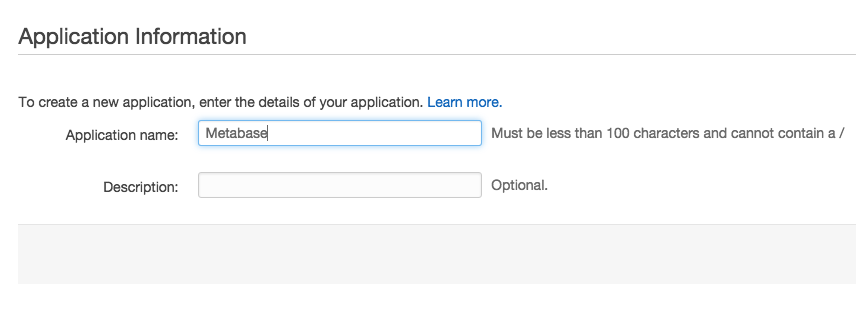
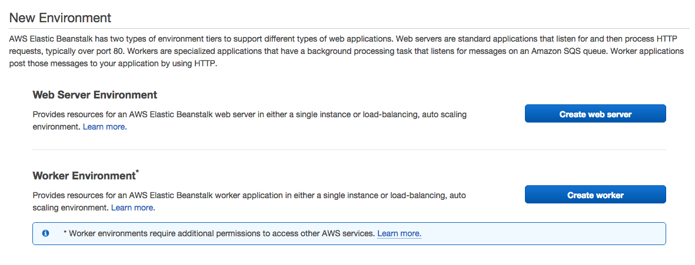
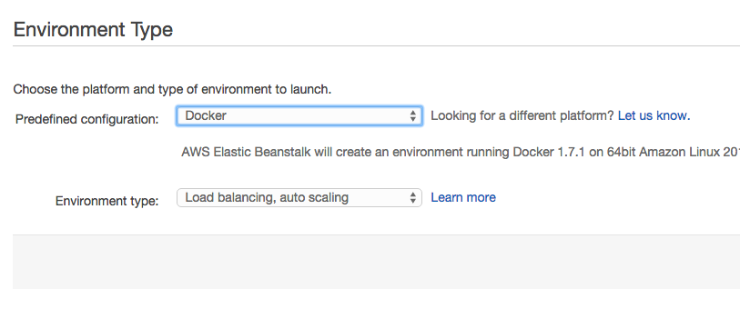
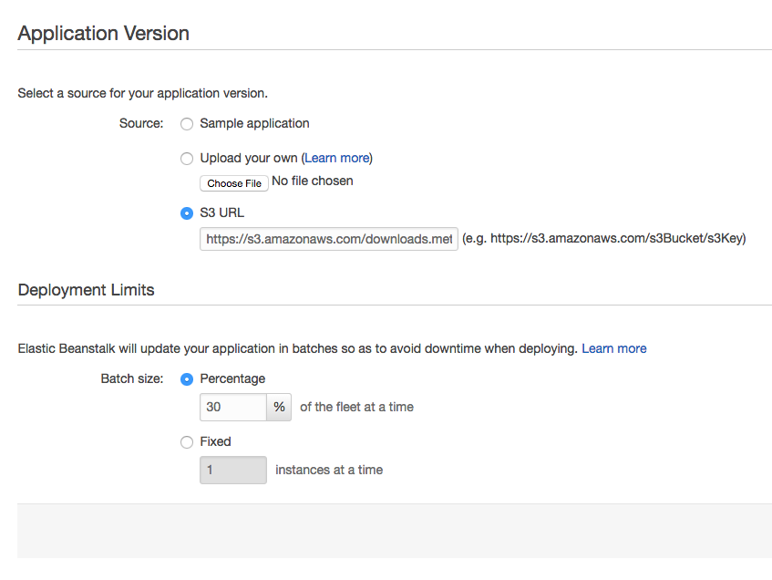
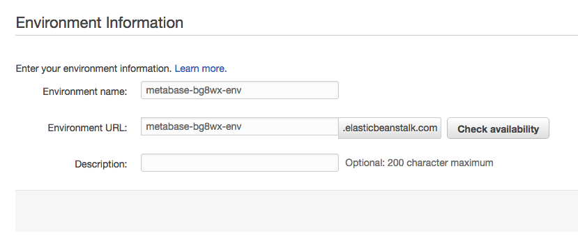
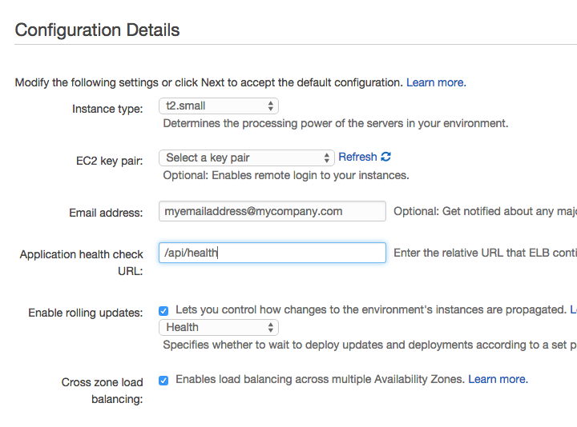
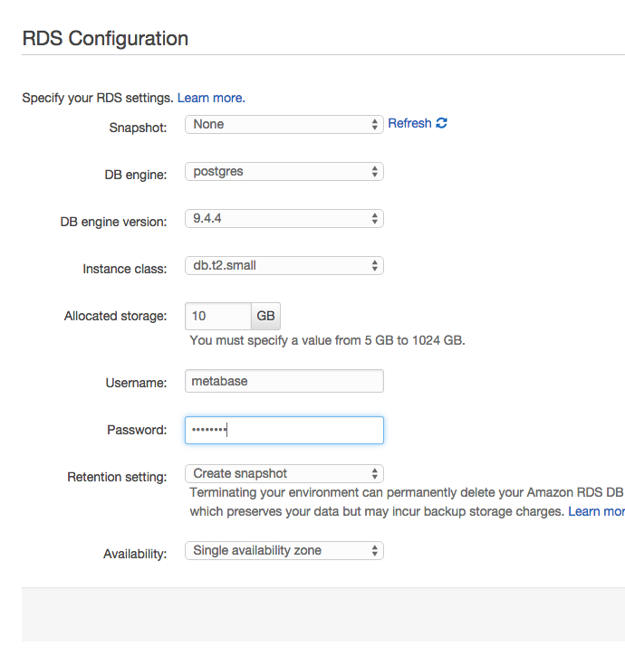
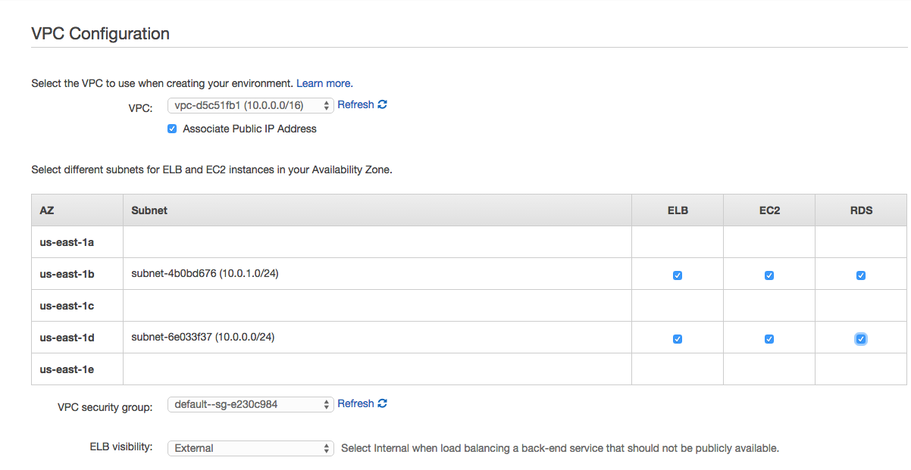
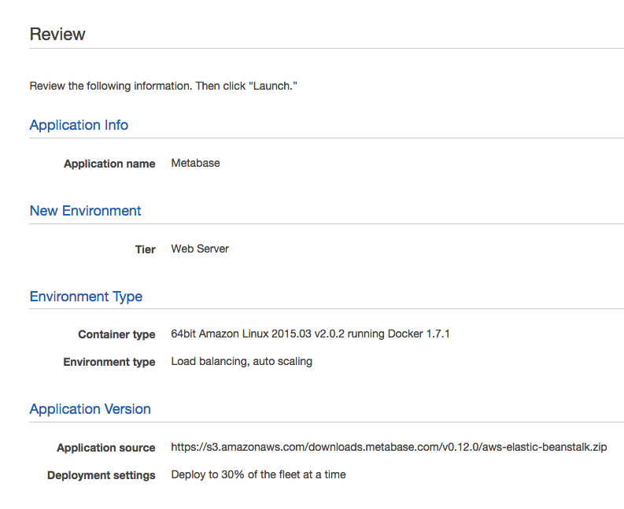

**Covered in this guide:**

*   [Installing Metabase on AWS Elastic Beanstalk](#running-metabase-on-aws-elastic-beanstalk)
*   [Upgrading to new versions of Metabase](#deploying-new-versions-of-metabase)
*   [Retaining Metabase logs on S3](#retaining-metabase-logs)
*   [Running Metabase over HTTPS](#running-metabase-over-https)
*   [Setting the Java timezone](#setting-the-jvm-timezone)
*   [Using Papertrail for logging](#using-papertrail-for-logging-on-aws)
*   [Protecting invalid hostname access](#protecting-against-invalid-hostname-access)

# Running Metabase on AWS Elastic Beanstalk

The Metabase team runs a number of production installations on AWS using Elastic Beanstalk and currently recommend it as the preferred choice for production deployments.  Below is a detailed guide to installing Metabase on Elastic Beanstalk.

### Quick Launch

Metabase provides an Elastic Beanstalk pre-configured launch url to help new installations getting started.  If you are starting fresh we recommend you follow this link to begin creating the Elastic Beanstalk deployment with a few choices pre-filled.

[Launch Metabase on Elastic Beanstalk](http://downloads.metabase.com/{{site.latest_version}}/launch-aws-eb.html)

The rest of this guide will follow each phase of the Elastic Beanstalk setup step-by-step.

### New Application

Elastic Beanstalk is organized into Applications and Environments, so to get started we must create a new Application.  Enter the application name `Metabase` and continue by clicking `Next`.

### New Environment

Elastic Beanstalk provides 2 choices for environments within an Application, we want to pick `Create web server` by clicking the button on the right.

### Environment Type

For the environment settings we want to make the following selections:

 * Predefined configuration: `Generic > Docker`
 * Environment type: `Load balancing, auto scaling`

This will run our Metabase application using  [Docker](https://www.docker.com) under the hood.
This will use the official Metabase Docker image which is [published on Dockerhub](https://hub.docker.com/r/metabase/metabase/).

When your environment type settings look like the above then go ahead and click `Next`.

### Application Version

The application version describes the exact binary you wish to deploy to your Elastic Beanstalk application.
Metabase provides a pre-built AWS Elastic Beanstalk application version which can be linked to directly.
Simply enter the following url in the `S3 URL` textbox:

https://s3.amazonaws.com/downloads.metabase.com/{{ site.latest_version }}/metabase-aws-eb.zip

Leave all the settings under Deployment Limits on their defaults.  These settings won't impact Metabase.

### Environment Information

Here you are given a chance to pick a name and url that you want to use for running Metabase instance.
Feel free to get creative, just remember that the URL for your Metabase instance must be unique across all AWS Elastic Beanstalk deployments,
so you'll have to pick something nobody else is already using.

We often recommend something like `mycompanyname-metabase`

And of course if you don't care about the URL you can simply leave it to whatever Amazon inputs by default.

Click `Next` to continue.

### Additional Resources

##### Using RDS with metabase

To run Metabase in a cloud environment of any kind we highly recommend using an independent database server with high availability such as Amazon RDS.  So for standard deployments we will choose to create an RDS instance with our Elastic Beanstalk application.

NOTE: it's possible to skip this step if you wish, however this will force Metabase to use a local H2 database file on your application server and there will be no way to backup and maintain that database, so when your instance is restarted for any reason you'll lose all your Metabase data.  If you are just doing a quick trial of Metabase that may be okay, but otherwise we recommend against this.

##### Using Metabase in a VPC

Newer AWS accounts are encouraging the use of VPC for deployments and in general we think it's simplest to follow that best practice.

If you prefer not to use a VPC that is fine, however one thing to note is that some EC2 instance types (t2.* in specific) are not available outside of a VPC, so if you choose to not use a VPC then make sure and pick appropriate instance types.

Once you've made your choices click `Next` and lets move on

### Configuration Details

There are quite a few choices available here so we'll go through each of them individually.

* `Instance type` is for picking the size of AWS instance you want to run.  Any size is fine but we recommend `t2.small` for most uses.
	* Remember that you cannot choose a t2.* instance type if you did not check the box to run in a VPC.
* `EC2 key pair` is only needed if you want to ssh into your instance directly.  We recommend leaving this out.
* Enter an `Email address` to get notifications about your deployments and changes to your application.  This is a very simple way to keep some tabs on your Metabase environment, so we recommend putting a valid email in here.
* The `Application health check URL` is how Elastic Beanstalk knows when the application is ready to run, you must set this to `/api/health`
* The remainder of the options can all be safely left to their default values

Once everything looks good then click `Next`

### Environment Tags

You can safely skip this page and simply click `Next`

### RDS Configuration

If you clicked the checkbox to create an RDS instance you will come to this section, otherwise you can move on.

Here you'll make the appropriate choices to configure your RDS database to work with Metabase.  Again, we cover each choice one-by-one:

* `Snapshot` should be left as `None`.
* `DB engine` should be set to `postgres`. Metabase also supports MySQL/Maria DB as backing databases, but this guide currently only covers running Metabase on Postgres.
* `DB engine version` can simply be left on the default, which should be the latest version.
* For `Instance class` you can choose any size, we recommend `db.t2.small` or bigger for production installs.  Metabase is pretty efficient so there is no need to make this a big instance.
* You can safely leave `Allocated storage` to the default size.
* Pick a `Username` and `Password` for your database.  This is just for reference if you need to connect to your db directly for some reason, but generally this should not be necessary.  These settings will be automatically made available to your Metabase instance, so you will not need to put them in anywhere manually.
* You can safely leave the `Retention setting` as `Create snapshot`
* Under `Availability` we recommend the default value of `Single Availability Zone` for most circumstances.

That should be it, you can click `Next` to continue.

### VPC Configuration (optional)

If you are launching your Metabase inside of a VPC you'll now need to check a few boxes to enable your application to work inside your VPC subnets.

Unless you have a custom VPC setup that you know how to configure it's easiest to just check all the boxes and allow your infrastructure to exist on all subnets.

Once you've finished your VPC config click `Next`

### Permissions

If this is your first time creating an application for Elastic Beanstalk then you will be prompted to create a new IAM role for your launched application.  We recommend simply leaving these choices to their defaults.

When you click `Next` a new tab will open in your browser and you will be prompted to create a new IAM role for use with Elastic Beanstalk.  Again, just accept the defaults and click `Allow` at the bottom of the page.

### Review Information

The final screen just gives you a full summary of the choices you made along the way so you can double check things.  Always cood to take a look at this and make sure you didn't miss anything.

When you're ready click the `Launch` button at the bottom of the page and then you're off!

### Wait for your Environment to start

This can take a little while depending on Amazon.  It’s not strange to see this take 20-30 minutes, so feel free to do something else and come back to check on it.  The time taken here is to provision each part of the environment.

When all is well you should see something like this:

To see your new Metabase instance simply click on the link in parentheses next to your environment name.  In this example it's `metabase-env-tttt.elasticbeanstalk.com`

Now that you’ve installed Metabase, it’s time to [set it up and connect it to your database](../setting-up-metabase.md).

# Deploying New Versions of Metabase

Upgrading to the next version of Metabase is a very simple process where you will grab the latest published Elastic Beanstalk deployment file from Metabase and upload it to your `Application Versions` listing.  From there it's a couple clicks and you're upgraded.

Here's each step:

1. Go to Elastic Beanstalk and select your `Metabase` application
* Click on `Application Versions` on the left nav (you can also choose `Application Versions` from the dropdown at the top of the page)
* Download the latest Metabase Elastic Beanstalk deployment file
  * http://downloads.metabase.com/{{ site.latest_version }}/metabase-aws-eb.zip
* Upload a new Application Version
	* Click the `Upload` button on the upper right side of the listing
		* Give the new version a name, ideally including the Metabase version number (e.g. {{ site.latest_version }})
		* Select `Choose File` and navigate to the file you just downloaded
		* Click the `Upload` button to upload the file
	* After the upload completes make sure you see your new version in the Application Versions listing
* Deploy the new Version
	* Click the checkbox next to the version you wish to deploy
	* Click the `Deploy` button in the upper right side of the page
		* Select the Environment you wish to deploy the version to using the dropdown list
		* Click the `Deploy` button to begin the deployment
	* Wait until all deployment activities are completed, then verify the deployment by accessing the Metabase application url

Once a new version is deployed you can safely delete the old Application Version if desired.  we recommend keeping at least one previous version available for a while in case you desire to revert for any reason.

# Retaining Metabase Logs

If you want to retain the Metabase application logs you can do so by publishing then to an S3 bucket of your choice.  Here's how:

1. On you Metabase Elastic Beanstalk environment, click on the `Configuration` link in the navigation bar on the left side.  You will be taken to a page with a number of boxes containing different configuration options for your environment.
* Click on the box labeled `Software Configuration` under the heading `Web Tier`
* Scroll down and then check the box labeled `Enable log file rotation to Amazon S3`
* Click `Save` in the bottom right corner

After you click save your Environment will begin updating with your new change.  you will have to wait a minute for this to complete and then you're good to go.  Elastic Beanstalk will now periodically publish the application log files to S3 for you and you can download them and analyze them at your leisure.

# Running Metabase over HTTPS

### Upload a Server Certificate

This is only relevant if you plan to use HTTPS (recommended) for your Metabase instance on AWS.  There is no requirement to do this, but we are sticklers for security and believe you should always be careful with your data.

Sadly there is no option to do this via the AWS Console, so this step must be performed using the [AWS CLI client](http://docs.aws.amazon.com/cli/latest/userguide/cli-chap-welcome.html)

    aws iam upload-server-certificate \
		--server-certificate-name <your-cert-name> \
		--certificate-body file:///path/to/certificate.crt \
		--private-key file:///path/to/private-key.pem

This will create a new certificate inside your AWS environment which can be reused for a variety of things.  Remember the name you chose for your certificate because we'll use that later in the setup process when we enable SSL.

### Setup DNS CNAME (using AWS)
* Open up the AWS **Route 53** console by navigating to **Services > Networking > Route 53** in the AWS Console header
* Click on **Hosted Zones** then click on the domain name you want to use for Metabase
* Click on the blue button **Create Record Set** (a new panel will open up on the right side of the page)
	* Enter in a **Name**: for your application.  this should be the exact url you plan to access Metabase with.  (e.g. metabase.mycompany.com)
	* Under the dropdown for **Type**: select *CNAME - Canonical name*
	* In the box labeled **Alias**: input the full path to your Elastic Beanstalk environment (e.g. mycompany-metabase.elasticbeanstalk.com)
	* Leave all other settings in their default values and click the **Create** button at the bottom of the page
	* NOTE: after the record is created you must wait for your change to propagate on the internet.  this can take 5-10 minutes, sometimes longer.

### Modify Metabase to enforce HTTPS

Before trying to enable Https support you must upload a server certificate to your AWS account.  Instructions above.

1. Go to Elastic Beanstalk and select your `Metabase` application
* Click on Environment that you would like to update
* Click on `Configuration` on the left hand sidebar
* Scroll down to `Load Balancing` under the _Network Tier_ section and click the gear icon to edit those settings.
* Set the value for `Secure listener port` to *443*
* Then, a little bit lower on the dropdown for `SSL certificate ID`, choose the name of the certificate that you uploaded to your account.
  * NOTE: the certificate MUST match the domain you plan to use for your Metabase install
* Scroll to the bottom of the page and click `Save` in the lower right
  * NOTE: your Environment will begin updating with your new change.  you will have to wait for this to complete before making additional updates
  * IMPORTANT: once this change is made you will no longer be able to access your Metabase instance at the \*.elasticbeanstalk.com url provided by Amazon because it will result in a certificate mismatch.  To  continue accessing your secure Metabase instance you must [Setup a DNS CNAME](#setup-dns-cname)

Once your application is working properly over HTTPS we recommend setting an additional property to force non-https clients to use the HTTPS endpoint

1. Click on `Configuration` on the left hand sidebar
* Scroll down to `Software Configuration` under the _Web Tier_ section and click the gear icon to edit those settings.
* Under `Environment Properties` add an entry for `NGINX_FORCE_SSL` with a value of `1`
* Scroll to the bottom of the page and click `Apply` in the lower right, then wait for your application to update.

# Setting the JVM Timezone

It's best to set your JVM timezone to match the timezone you'd like all your reports to come in.  You can do this by adding the `JAVA_TIMEZONE` environment variable.

1. Click on `Configuration` on the left hand sidebar
* Scroll down to `Software Configuration` under the _Web Tier_ section and click the gear icon to edit those settings.
* Under `Environment Properties` add the following
   * `JAVA_TIMEZONE` with a value such as `US/Pacific`
* Scroll to the bottom of the page and click `Apply` in the lower right, then wait for your application to update.

# Using Papertrail for logging on AWS

This provides a simple way to use the Papertrail logging service for collecting the logs for you Metabase instance in an easy to read location.

1. Click on `Configuration` on the left hand sidebar
* Scroll down to `Software Configuration` under the _Web Tier_ section and click the gear icon to edit those settings.
* Under `Environment Properties` add the following entries
   * `PAPERTRAIL_HOST` - provided by Papertrail
   * `PAPERTRAIL_PORT` - provided by Papertrail
   * `PAPERTRAIL_HOSTNAME` - the name you want to see showing up in Papertrail for this server
* Scroll to the bottom of the page and click `Apply` in the lower right, then wait for your application to update.

*NOTE:* sometimes these settings will not apply until you restart your application server, which you can do by either choosing `Restart App Server(s)` from the Actions dropdown or by deploying the same version again.

# Protecting against invalid hostname access

For the truly paranoid, we provide a setting in the AWS EB deployment which enforces an nginx check of the hostname of the incoming request and terminates the request if the client is not requesting the exact hostname that we expect.  This is nice for preventing random internet traffic from stumbling upon your Metabase instance.

1. Click on `Configuration` on the left hand sidebar
* Scroll down to `Software Configuration` under the _Web Tier_ section and click the gear icon to edit those settings.
* Under `Environment Properties` add an entry for `NGINX_SERVER_NAME` with a value corresponding to the exact domain name you are using for your Metabase instance.
* Scroll to the bottom of the page and click `Apply` in the lower right, then wait for your application to update.
