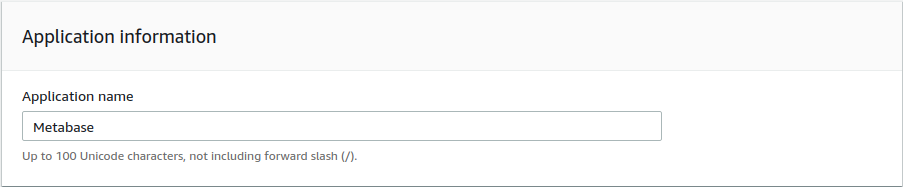
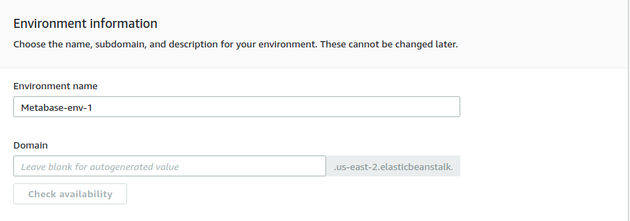
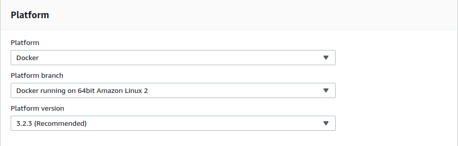
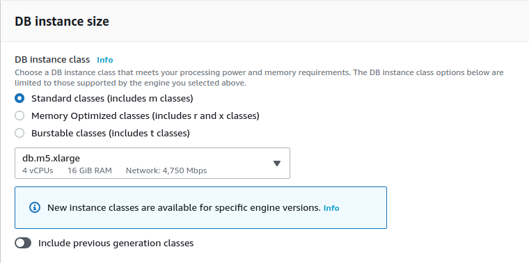
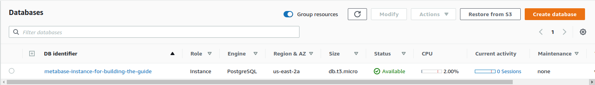

**Covered in this guide:**

- [Running Metabase on AWS Elastic Beanstalk](#running-metabase-on-aws-elastic-beanstalk)
    - [Quick Launch](#quick-launch)
    - [Application information](#application-information)
    - [Environment information](#environment-information)
    - [Platform](#platform)
      - [Enabling enhanced health checks](#enabling-enhanced-health-checks)
      - [Enabling VPC](#enabling-vpc)
      - [Final step and deploy](#final-step-and-deploy)
    - [Additional Options](#additional-options)
      - [Configuring RDS for Metabase INSIDE ElasticBeanstalk (not recommended)](#configuring-rds-for-metabase-inside-elasticbeanstalk-not-recommended)
      - [Configuring RDS for Metabase OUTSIDE ElasticBeanstalk (recommended)](#configuring-rds-for-metabase-outside-elasticbeanstalk-recommended)
    - [Configuration Details](#configuration-details)
    - [Permissions](#permissions)
    - [Wait for your environment to start](#wait-for-your-environment-to-start)
- [Deploying New Versions of Metabase](#deploying-new-versions-of-metabase)
- [Retaining Metabase Logs](#retaining-metabase-logs)
- [Running Metabase over HTTPS](#running-metabase-over-https)
    - [Upload a Server Certificate](#upload-a-server-certificate)
    - [Setup DNS CNAME (using AWS)](#setup-dns-cname-using-aws)
    - [Modify Metabase to enforce HTTPS](#modify-metabase-to-enforce-https)
- [Setting the JVM Timezone](#setting-the-jvm-timezone)
- [Using Papertrail for logging on AWS](#using-papertrail-for-logging-on-aws)

# Running Metabase on AWS Elastic Beanstalk

AWS Elastic Beanstalk has been a platform for easily deploying Metabase for a long time, however, we have changed this guide in order to provide better support and prevent users from using features from Elastic Beanstalk that might prevent them from scaling easily in the future

### Quick Launch

Metabase provides a pre-configured Elastic Beanstalk launch URL to help you get started with new installations. If you are starting fresh we recommend you follow this link in a new tab to begin creating the Elastic Beanstalk deployment with a few choices pre-filled. Then just follow the step-by-step instructions below to complete your installation.

[Launch Metabase on Elastic Beanstalk](https://downloads.metabase.com/{{ site.latest_version }}/launch-aws-eb.html)
We will need to update to this link though: https://console.aws.amazon.com/elasticbeanstalk/home?region=us-east-2#/newApplication?applicationName=Metabase&platform=Docker&environmentType=LoadBalancing&tierName=WebServer&instanceType=t3a.small&withVpc=true

After clicking the launch URL, you should see a screen that looks like this:

_NOTE: If this screenshot doesn't match what you see in the Elastic Beanstalk console, it's likely that you are on an old version of the Elastic Beanstalk UI. If you need to, you can [view our older AWS EB documentation](running-metabase-on-elastic-beanstalk-old.md)._

### Application information

Elastic Beanstalk is organized into Applications and Environments, so to get started we need to create a new application. You can customize the application name here.

### Environment information

Here's where you can pick the environment name and the domain URL that you want to use for your Metabase instance. The environment name is simply the label you're assigning to this instance of Metabase.

As for the domain URL, Feel free to get creative — just remember that the URL for your Metabase instance must be unique across all AWS Elastic Beanstalk deployments, so you'll have to pick something that nobody else is already using. We often recommend something like `mycompanyname-metabase`. If you don't care about the URL you can simply leave it to whatever Amazon inputs by default. Just be aware that this can't be changed later.

### Platform

While most of the fields here will be correctly pre-filled by following the launch URL above, you'll just need to do two things:

- First, make sure `Platform` is set to `Docker`, with the platform branch dropdown set to `Docker running on 64bit Amazon Linux 2` and Platform version to the one that has a `(Recommended)` tag.
- Next, change the `Application code` setting to `Upload your code`

- On the Source Code Origin section click the `Choose file` button with the `Local File` radio button selected and upload the file you dowloaded previously (metabase-aws-eb.zip):

These settings will run the Metabase application using [Docker](https://www.docker.com) under the hood, using the official Metabase Docker image which is [published on Dockerhub](https://hub.docker.com/r/metabase/metabase/).

You can now go ahead and click `Review and launch`.

#### Enabling enhanced health checks

You will need to enable enhanced health checks for your Beanstalk Monitoring.

Click on the `Edit` link under the Load Balancer section as seen here:

The `Health check path` is how Elastic Beanstalk knows when the application is ready to run. This path is also used by the Load Balancer to check application heath. Set this path to `/api/health` in the Processes section.

Select the default process and click on `Actions` -> Edit and change the Path from `/` to `/api/health`

After configuring this health check you can click on `Save` at the bottom of the page

#### Enabling VPC

You must enable your Application to exist in a VPC unless you will receive an error when creating it. To use a VPC, head to the Network section in the configuration and click on the `Edit` button:

Once inside the Network configuration you need to select the VPC where the Application will exist. If you haven't created one then the default one will suffice.

You need to select at least 2 zones where the Load Balancer will balance the traffic and also at least 1 zone where the instance will exist. There has to be a zone in common for the balancer to send traffic to a living instance.

After configuring the zones where the Load Balancer will exist and the ones that the application will live, click `Save` at the bottom of the page. 

#### Final step and deploy

Now go to the Capacity section and click `Edit`

The only change you need to do here is to reduce the number of Instances from 4 (the default number) to 1, as we still don't have a centralized database where Metabase will save all of its configurations and will be using only the embedded H2 database. If you want to use a database to persist all Metabase configurations you have to create one in RDS.

Now click on `Save` at the bottom of the page and you can now click on `Create App` at the end of the Configuration page to start creating the environment.

### Additional Options

#### Configuring RDS for Metabase INSIDE ElasticBeanstalk (not recommended)

This was included in the guide in the previous versions of the configuration of Metabase in ElasticBeanstalk, however, as AWS ElasticBeanstalk creates a CloudFormation template when you hit the `Create App` button, this means that the database will be created with the ElasticBeanstalk stack and removed when you remove the application. We removed this section from the guide to encourage users to create an RDS instance completely separate from ElasticBeanstalk and then connect the RDS database with the ElasticBeanstalk stack or the other way round.

_NOTE: It's possible to skip this step if you wish. However, this will force Metabase to use a local H2 database file on your application server, and there will be no way to backup and maintain that database. **When your instance is restarted for any reason you'll lose all your Metabase data**. If you are just doing a quick trial of Metabase that may be okay, but otherwise we recommend against it._

To set the database password from the Beanstalk template look for the Database configuration pane as below. It should have a red outline when you first see this page. Next, click on the `Modify` link.

The database settings screen will give you a number of options for your application database. Regarding individual settings, we recommend:

- `Snapshot` should be left as `None`.
- `Engine` should be set to `postgres`. Metabase also supports MySQL/Maria DB as backing databases, but this guide currently only covers running Metabase on Postgres.
- `Engine version` can simply be left on the default, which should be the latest version.
- For `Instance class` you can choose any size, but we recommend `db.t2.small` or larger for production installs. Metabase is pretty efficient so there is no need to make this a big instance.
- You can safely leave `Storage` to the default size.
- Pick a `Username` and `Password` for your database. We suggest you hold onto these credentials in a password manager, as it can be useful for things like backups or troubleshooting. These settings will be automatically made available to your Metabase instance, so you will not need to put them in anywhere manually.
- You can safely leave the `Retention setting` as `Create snapshot`.
- Under `Availability` we recommend the default value of `Low (one AZ)` for most circumstances.

Once you've entered a password and clicked `Save`, the red outline on the Database box should have gone away, indicating that the application is valid and ready to be launched.

#### Configuring RDS for Metabase OUTSIDE ElasticBeanstalk (recommended)

In AWS Console, enter RDS in the search box or select the service from the dropdown button on the top left of the page.

Once inside RDS, click on the `Create database` button

On the Create Database menu, you have to select MySQL or PostgreSQL as engine types, as these two are the ones that Metabase support as the Application Database (where Metabase will save all of its configurations). For this example we will choose PostgreSQL on its latest version available in AWS at this time (12.4-R1)

On the Templates section, you can leave `Production` selected or choose any other option that better suits your needs.

On the Settings section, you need to type unique identifier for your database and a master password that you will need to preserve for configuring it on the Metabase instances later on this guide.

On the instance size section, you can choose any instance size that will fit your needs. As this is the application database for Metabase, the sizing of the RDS instance depends on the number of Metabase instances that will be connected to this database, number of users that are using Metabase at once and the number of questions, dashboards and configurations that are saved.

On production deployments, you should be using a Multi-AZ(Availability Zone) cluster, as this will ensure that the database does not goes down in case there is an issue on a single availability zone 

On the Connectivity section, you have to ensure that you are deploying the database in the same VPC as the one you deployed the Metabase instance, otherwise they won't be able to see each other. You have to select to create a VPC security group on the section, as you will need to grant access from Metabase instance to the database on the port that listens for connections.

On the Additional configuration section you have to specify an `Initial database name` as this will be the database that Metabase will use for all of its configurations. From here you can also configure the backup window in case you need to restore the backups at some point in time.

Once this is done, click on the `Create database` button on the lower right part of the page and wait for the database to be created (this can take several minutes).

Once the database status is Available, you need to click on the DB identifier:

On the page that appears after you click on the database identifer you will see on the center of the page the Connectivity & Security section that will provide you with the `Endpoint` that you will need to give to Metabase to use in order to connect to this database we just created

Also, in the Security group rules section, you will see the Security Group that was created but it will have a rule that allows only one IP address to access the database. You need to change this rule to allow access to the ElasticBeanstalk environment.

You have to click on the INBOUND rule and on the page that opens click again on the Inbound rules tab on the lower part of the page to configure the rule for the database

When you click on Inbound Rules, you need to click on `Edit Inbound Rules` button that appears on the right side of the section

On edit page you need to delete the IP address that appears as default and add the security group that the ElasticBeanstalk has (you can easily idenfy it as the Security group name will have the keyword AWSEBSecurityGroup on its name). Once you add this click the `Save rules button`

Now you can go to the Metabase ElasticBeanstalk deployment and add the RDS instance as the Application Database with Environment variables under the Software configuration

Remember that when you click `Save` the Elastic Beanstalk environment will be rebooted. 

### Configuration Details

There are many ways to customize your Beanstalk deployment, but commonly modified settings include:

- `Instance type` (`Instances` block) is for picking the size of AWS instance you want to run. Any size is fine but we recommend `t3.small` for most uses.
  - Remember that you cannot choose a `t3.*` instance type if you did not check the box to run in a VPC.
- `EC2 key pair` (`Security` block) is only needed if you want to SSH into your instance directly. We recommend leaving this out.
- Enter an `Email address` (`Notifications` block) to get notifications about your deployments and changes to your application. This is a very simple way to keep tabs on your Metabase environment, so we recommend putting a valid email in here.
- The remaining options can all be safely left to their default values.

### Permissions

If this is your first time creating an application for Elastic Beanstalk then you will be prompted to create a new IAM role for your launched application. We recommend simply leaving these choices to their defaults.

When you click `Next` a new tab will open in your browser and you will be prompted to create a new IAM role for use with Elastic Beanstalk. Again, just accept the defaults and click `Allow` at the bottom of the page.

### Wait for your environment to start

This can take a little while depending on Amazon. It’s not uncommon to see this take 20 to 30 minutes, so feel free to do something else and come back to check on it. What's happening here is each part of the environment is being provisioned.

When it's all done you should see something like this:

To see your new Metabase instance, simply click on the link in parentheses next to your environment name in the top-left. In this example it's `metabase-env-tttt.elasticbeanstalk.com`

Now that you’ve installed Metabase, it’s time to [set it up and connect it to your database](../setting-up-metabase.md).

---

# Deploying New Versions of Metabase

Upgrading to the next version of Metabase is a very simple process where you will grab the latest published Elastic Beanstalk deployment file from Metabase and upload it to your `Application Versions` listing. From there it's a couple clicks and you're upgraded.

Here's each step:

- Go to Elastic Beanstalk and select your `Metabase` application.
- Click on `Application Versions` on the left nav (you can also choose `Application Versions` from the dropdown at the top of the page).
- Download the latest Metabase Elastic Beanstalk deployment file:
  - [https://downloads.metabase.com/{{ site.latest_version }}/metabase-aws-eb.zip](https://downloads.metabase.com/{{ site.latest_version }}/metabase-aws-eb.zip)
- Upload a new Application Version:
  - Click the `Upload` button on the upper right side of the listing.
  - Give the new version a name, ideally including the Metabase version number (e.g. {{ site.latest_version }}).
  - Select `Choose File` and navigate to the file you just downloaded.
  - Click the `Upload` button to upload the file.
  - After the upload completes make sure you see your new version in the Application Versions listing.
- Deploy the new Version:
  - Click the checkbox next to the version you wish to deploy.
  - Click the `Deploy` button in the upper right side of the page.
  - Select the Environment you wish to deploy the version to using the dropdown list.
  - Click the `Deploy` button to begin the deployment.
  - Wait until all deployment activities are completed, then verify the deployment by accessing the Metabase application URL.

Once a new version is deployed you can safely delete the old Application Version if desired. We recommend keeping at least one previous version available for a while in case you desire to revert for any reason.

# Retaining Metabase Logs

If you want to retain the Metabase application logs you can do so by publishing then to an S3 bucket of your choice. Here's how:

- On your Metabase Elastic Beanstalk environment, click on the `Configuration` link in the navigation bar on the left side. You will be taken to a page with a number of boxes containing different configuration options for your environment.
- Click on the edit button next to `Software`

- Scroll down and then check the box under S3 log storage

- Click `Save` in the bottom right corner.

After you click save your Environment will begin updating with your new change. You will have to wait a minute for this to complete and then you're good to go. Elastic Beanstalk will now periodically publish the application log files to S3 for you and you can download them and analyze them at your leisure.

# Running Metabase over HTTPS

### Upload a Server Certificate

This is only relevant if you plan to use HTTPS (recommended) for your Metabase instance on AWS. There is no requirement to do this, but we are sticklers for security and believe you should always be careful with your data.

Sadly there is no option to do this via the AWS Console, so this step must be performed using the [AWS CLI client](http://docs.aws.amazon.com/cli/latest/userguide/cli-chap-welcome.html)

    aws iam upload-server-certificate \
    	--server-certificate-name <your-cert-name> \
    	--certificate-body file:///path/to/certificate.crt \
    	--private-key file:///path/to/private-key.pem

This will create a new certificate inside your AWS environment which can be reused for a variety of things. Remember the name you chose for your certificate because we'll use that later in the setup process when we enable SSL.

### Setup DNS CNAME (using AWS)

- Open up the AWS **Route 53** console by navigating to **Services > Networking > Route 53** in the AWS Console header.
- Click on **Hosted Zones** then click on the domain name you want to use for Metabase.
- Click on the blue button **Create Record Set** (a new panel will open up on the right side of the page).
  - Enter in a **Name**: for your application. This should be the exact URL you plan to access Metabase with (e.g. `metabase.mycompany.com`).
  - Under the dropdown for **Type**: select _CNAME - Canonical name_.
  - In the box labeled **Alias**: input the full path to your Elastic Beanstalk environment (e.g. `mycompany-metabase.elasticbeanstalk.com`).
  - Leave all other settings in their default values and click the **Create** button at the bottom of the page.
  - _NOTE: After the record is created you must wait for your change to propagate on the internet. This can take 5-10 minutes, sometimes longer._

### Modify Metabase to enforce HTTPS

Before trying to enable HTTPS support you must upload a server certificate to your AWS account. Instructions above.

- Go to Elastic Beanstalk and select your `Metabase` application.
- Click on Environment that you would like to update.
- Click on `Configuration` on the left hand sidebar.
- Scroll down to `Load Balancing` under the _Network Tier_ section and click the gear icon to edit those settings.
- Set the value for `Secure listener port` to _443_.
- Then, a little bit lower on the dropdown for `SSL certificate ID`, choose the name of the certificate that you uploaded to your account.
  - _NOTE: The certificate MUST match the domain you plan to use for your Metabase install._
- Scroll to the bottom of the page and click `Save` in the lower right.
  - _NOTE: Your Environment will begin updating with your new change. You will have to wait for this to complete before making additional updates._
  - _IMPORTANT: Once this change is made you will no longer be able to access your Metabase instance at the `*.elasticbeanstalk.com` URL provided by Amazon because it will result in a certificate mismatch. To continue accessing your secure Metabase instance you must [Setup a DNS CNAME](#setup-dns-cname)._

Once your application is working properly over HTTPS we recommend setting an additional property to force non-HTTPS clients to use the HTTPS endpoint.

- Click on `Configuration` on the left hand sidebar.
- Scroll down to `Software Configuration` under the _Web Tier_ section and click the gear icon to edit those settings.
- Under `Environment Properties` add an entry for `NGINX_FORCE_SSL` with a value of `1`.
- Scroll to the bottom of the page and click `Apply` in the lower right, then wait for your application to update.

# Setting the JVM Timezone

It's best to set your JVM timezone to match the timezone you'd like all your reports to come in. You can do this by adding the `JAVA_TIMEZONE` environment variable.

- Click on `Configuration` on the left hand sidebar.
- Scroll down to `Software Configuration` under the _Web Tier_ section and click the gear icon to edit those settings.
- Under `Environment Properties` add the following.
  - `JAVA_TIMEZONE` with a value such as `US/Pacific`.
- Scroll to the bottom of the page and click `Apply` in the lower right, then wait for your application to update.

# Using Papertrail for logging on AWS

This provides a simple way to use the Papertrail logging service for collecting the logs for you Metabase instance in an easy to read location.

- Click on `Configuration` on the left hand sidebar.
- Scroll down to `Software Configuration` under the _Web Tier_ section and click the gear icon to edit those settings.
- Under `Environment Properties` add the following entries:
  - `PAPERTRAIL_HOST` - provided by Papertrail
  - `PAPERTRAIL_PORT` - provided by Papertrail
  - `PAPERTRAIL_HOSTNAME` - the name you want to see showing up in Papertrail for this server
- Scroll to the bottom of the page and click `Apply` in the lower right, then wait for your application to update.

_NOTE: Sometimes these settings will not apply until you restart your application server, which you can do by either choosing `Restart App Server(s)` from the Actions dropdown or by deploying the same version again._
