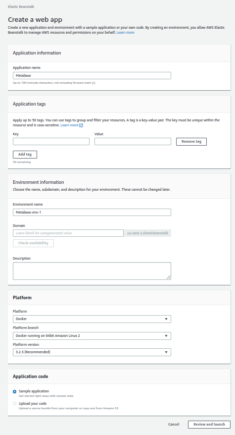
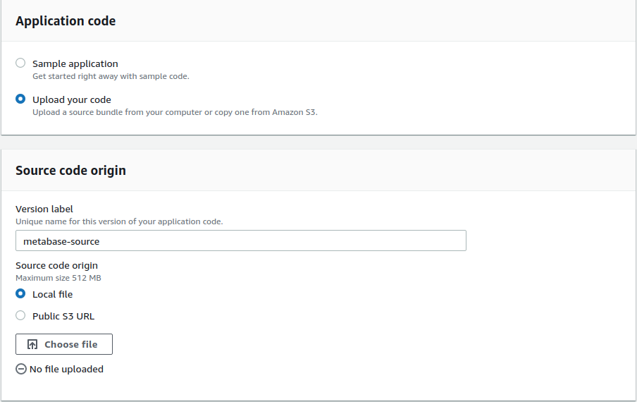
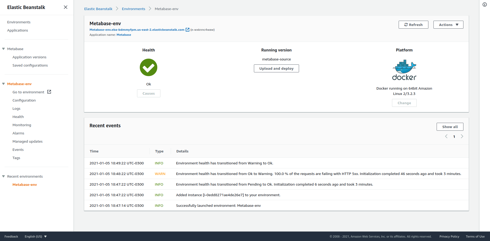
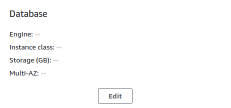

**Covered in this guide:**

- [Running Metabase on AWS Elastic Beanstalk](#running-metabase-on-aws-elastic-beanstalk)
  - [Quick Launch](#quick-launch)
  - [Step 1 - Creating the Application](#step-1---creating-the-application)
    - [Application information](#application-information)
    - [Environment information](#environment-information)
    - [Platform](#platform)
  - [Step 2 - Configure the basic Metabase architecture](#step-2---configure-the-basic-metabase-architecture)
    - [2.1 Enabling enhanced health checks](#21-enabling-enhanced-health-checks)
    - [2.2 Enabling VPC](#22-enabling-vpc)
    - [2.3 Final step and deploy](#23-final-step-and-deploy)
  - [Step 3 - Wait for your environment to start](#step-3---wait-for-your-environment-to-start)
- [Optional extras](#optional-extras)
  - [Instance Details](#instance-details)
  - [Application Database creation inside Elastic Beanstalk configuration (not recommended)](#application-database-creation-inside-elastic-beanstalk-configuration-not-recommended)
  - [Permissions](#permissions)
  - [Set or change environment variables](#set-or-change-environment-variables)
  - [Notifications](#notifications)
- [Deploying New Versions of Metabase on Elastic Beanstalk](#deploying-new-versions-of-metabase-on-elastic-beanstalk)

# Running Metabase on AWS Elastic Beanstalk

This quick launch setup is intended for testing purposes only, and is not intended for production use. We'll focus on deploying Metabase with a single instance and the embedded H2 database with the following components:
- a region (where your Metabase application will exist)
- a network (where your application will reside and interact with other applications or servers if needed)
- a security group (a firewall, for keeping everything secure)
- a load balancer (to make this deployment future proof and also provide features like HTTPS or Web Application Firewall security features)
If you want to see a high-level architectural diagram of what you will achieve once you follow this guide, [click here](images/Metabase-AWS-H2.png).

If you would like a reliable, scalable and fully managed Metabase, please consider [Metabase Cloud](https://www.metabase.com/start/hosted/).

## Quick Launch

Download the [Metabase Community Edition AWS source bundle file](https://downloads.metabase.com/{{ site.latest_version }}/metabase-aws-eb.zip) to upload to Elastic Beanstalk. 

Metabase provides several pre-configured Elastic Beanstalk launch URLs to help you get started. Open one of the links below in a new tab to create an Elastic Beanstalk deployment with a few choices pre-filled. Then just follow the step-by-step instructions below to complete your installation. 

Choose your region based on the proximity of your users, or if you have strict regulatory requirements that don't let you spin up servers in other countries:

- US-East-1 [North Virginia](https://console.aws.amazon.com/elasticbeanstalk/home?region=us-east-1#/newApplication?applicationName=Metabase&platform=Docker&environmentType=LoadBalancing&tierName=WebServer&instanceType=t3a.small&withVpc=true)
- US-East-2 [Ohio](https://console.aws.amazon.com/elasticbeanstalk/home?region=us-east-2#/newApplication?applicationName=Metabase&platform=Docker&environmentType=LoadBalancing&tierName=WebServer&instanceType=t3a.small&withVpc=true)
- US-West-1 [North California](https://console.aws.amazon.com/elasticbeanstalk/home?region=us-west-1#/newApplication?applicationName=Metabase&platform=Docker&environmentType=LoadBalancing&tierName=WebServer&instanceType=t3a.small&withVpc=true)
- US-west-2 [Oregon](https://console.aws.amazon.com/elasticbeanstalk/home?region=us-west-2#/newApplication?applicationName=Metabase&platform=Docker&environmentType=LoadBalancing&tierName=WebServer&instanceType=t3a.small&withVpc=true)
- CA-Central-1 [Canada](https://console.aws.amazon.com/elasticbeanstalk/home?region=ca-central-1#/newApplication?applicationName=Metabase&platform=Docker&environmentType=LoadBalancing&tierName=WebServer&instanceType=t3a.small&withVpc=true)
- EU-north-1 [Stockholm](https://console.aws.amazon.com/elasticbeanstalk/home?region=eu-north-1#/newApplication?applicationName=Metabase&platform=Docker&environmentType=LoadBalancing&tierName=WebServer&instanceType=t3a.small&withVpc=true)
- EU-West-3 [Paris](https://console.aws.amazon.com/elasticbeanstalk/home?region=eu-west-3#/newApplication?applicationName=Metabase&platform=Docker&environmentType=LoadBalancing&tierName=WebServer&instanceType=t3a.small&withVpc=true)
- EU-West-2 [London](https://console.aws.amazon.com/elasticbeanstalk/home?region=eu-west-2#/newApplication?applicationName=Metabase&platform=Docker&environmentType=LoadBalancing&tierName=WebServer&instanceType=t3a.small&withVpc=true)
- EU-West-1 [Ireland](https://console.aws.amazon.com/elasticbeanstalk/home?region=eu-west-1#/newApplication?applicationName=Metabase&platform=Docker&environmentType=LoadBalancing&tierName=WebServer&instanceType=t3a.small&withVpc=true)
- EU-Central-1 [Frankfurt](https://console.aws.amazon.com/elasticbeanstalk/home?region=eu-central-1#/newApplication?applicationName=Metabase&platform=Docker&environmentType=LoadBalancing&tierName=WebServer&instanceType=t3a.small&withVpc=true)
- AP-South-1 [Mumbai](https://console.aws.amazon.com/elasticbeanstalk/home?region=ap-south-1#/newApplication?applicationName=Metabase&platform=Docker&environmentType=LoadBalancing&tierName=WebServer&instanceType=t3a.small&withVpc=true)
- AP-Northeast-1 [Tokyo](https://console.aws.amazon.com/elasticbeanstalk/home?region=ap-northeast-1#/newApplication?applicationName=Metabase&platform=Docker&environmentType=LoadBalancing&tierName=WebServer&instanceType=t3a.small&withVpc=true)
- AP-Northeast-2 [Seoul](https://console.aws.amazon.com/elasticbeanstalk/home?region=ap-northeast-2#/newApplication?applicationName=Metabase&platform=Docker&environmentType=LoadBalancing&tierName=WebServer&instanceType=t3a.small&withVpc=true)
- AP-Southeast-1 [Singapore](https://console.aws.amazon.com/elasticbeanstalk/home?region=ap-southeast-1#/newApplication?applicationName=Metabase&platform=Docker&environmentType=LoadBalancing&tierName=WebServer&instanceType=t3a.small&withVpc=true)
- AP-Southeast-2 [Sydney](https://console.aws.amazon.com/elasticbeanstalk/home?region=ap-southeast-1#/newApplication?applicationName=Metabase&platform=Docker&environmentType=LoadBalancing&tierName=WebServer&instanceType=t3a.small&withVpc=true)
- SA-east-1 [São Paulo](https://console.aws.amazon.com/elasticbeanstalk/home?region=sa-east-1#/newApplication?applicationName=Metabase&platform=Docker&environmentType=LoadBalancing&tierName=WebServer&instanceType=t3a.small&withVpc=true)

After clicking any launch URL, you should see a screen that looks like this:

## Step 1 - Creating the Application

### Application information

Elastic Beanstalk is organized into Applications and Environments, so to get started we need to create a new application. You can customize the application name in case you need other than the default one.

### Environment information

Here's where you can pick the environment name and the domain URL that you want to use for your Metabase instance. The environment name is simply the label you're assigning to this instance of Metabase.

As for the domain URL, Feel free to get creative — just remember that the URL for your Metabase instance must be unique across all AWS Elastic Beanstalk deployments, so you'll have to pick something that nobody else is already using. We often recommend something like `mycompanyname-metabase`. If you don't care about the URL you can simply leave it to whatever Amazon inputs by default. Just be aware that this can't be changed later.

### Platform

While most of the fields here will be correctly pre-filled by following the launch URL above, you'll just need to do two things:

1. Make sure **Platform** is set to `Docker`, with the platform branch dropdown set to `Docker running on 64bit Amazon Linux 2`, and Platform version to the one that has a `(Recommended)` tag.
2. Change the **Application code** setting to `Upload your code`.

- In the **Source code origin** section click the `Choose file` button with the `Local File` radio button selected and upload the file you dowloaded at the very beginning of this guide (`metabase-aws-eb.zip`):

These settings will run the Metabase application using the [official Metabase Docker image on Dockerhub](https://hub.docker.com/r/metabase/metabase/).

Click **Review and launch**.  You'll be directed to a page to configure and launch your instance.

## Step 2 - Configure the basic Metabase architecture

### 2.1 Enabling enhanced health checks

To set up your load balancer, you'll need to enable enhanced health checks for your Elastic Beanstalk environment. 

Click on the `Edit` link under the Load Balancer section as seen here:

Select `Application Load Balancer` in the ***Load Balancer type*** if not already selected.

In the **Processes** section, select the default process and click on `Actions` → Edit.

The **Health check path** is where the Load balancer asks the application if its healthy so it can send traffic to. Set this path to `/api/health`

After configuring this health check you can click on `Save` at the bottom of the page.

### 2.2 Enabling VPC

A Virtual Private Cloud (VPC) is a virtual network you can use to isolate resources. Inside these VPC's, you can create subnets, firewall rules, route tables and many more. It's one of the foundational features of AWS, and you can learn more about it [here](https://aws.amazon.com/vpc/faqs/).

You must configure your Application launch in a VPC, otherwise you'll receive an error when creating it as AWS no longer supports launching instances outside VPC's. To use a VPC, head to the **Network** section in the configuration and click on the `Edit` button.

Once inside the Network configuration, you need to select the VPC where the Application will exist. If you haven't created a VPC, then AWS creates a `default` VPC per region that you can use.

You need to select __at least__ 2 zones where the Load Balancer will balance the traffic, and  __at least__ 1 zone where the instance will exist. For the load balancer to send traffic to a living instance, there has to be a zone in common.

After configuring the zones for both the load balancer and the application, click **Save** at the bottom of the page. 

### 2.3 Final step and deploy

Now go to the Capacity section and click **Edit**.

The only change you need to do here is to reduce the number of Instances from 4 (the default number) to 1, as we still haven't created a centralized database where Metabase will save all of its configurations and will be using only the embedded H2 database which lives __inside__ the Metabase container and [is *not recommended* for production workloads](configuring-application-database.html) as there will be no way to backup and maintain that database. **When your instance is restarted for any reason you'll lose all your Metabase data**. If you are just doing a quick trial of Metabase that may be okay but otherwise you would like to start [creating your database engine in RDS separately](creating-RDS-database-on-AWS.html) or deploy one a separate server. You can take a look at the [Metabase at Scale](https://www.metabase.com/learn/data-diet/analytics/metabase-at-scale.html) article we wrote about how you can build redundant and scalable Metabase architectures.

Now click on `Save` at the bottom of the page and you can now click on `Create App` at the end of the Configuration page to start creating the environment.

## Step 3 - Wait for your environment to start

This can take a little while depending on AWS. It’s not uncommon to see this take 10-15 minutes, so feel free to do something else and come back to check on it. What's happening here is each part of the environment is being provisioned with AWS's infrastructure automation functionality named CloudFormation (so you can see the detailed progress for the creation of your environment if you open CloudFormation in another tab).

When it's all done you should see something like this:

To see your new Metabase instance, simply click on the link under your environment name in the top-left (it will end with `.elasticbeanstalk.com`)

Now that you’ve installed Metabase, it’s time to [set it up and connect it to your database](../setting-up-metabase.md).

# Optional extras

There are many ways to customize your Elastic Beanstalk deployment, but commonly modified settings include:

## Instance Details

- `Instance type` (`Instances` block) is for picking the size of AWS instance you want to run. We recommend **at least** `t3a.small` for most uses. You can always [scale](https://www.metabase.com/learn/data-diet/analytics/metabase-at-scale.html) vertically by changing this configuration.
- `EC2 key pair` (`Security` block) is only needed if you want to SSH into your instance directly which is **not recommended**.

## Application Database creation inside Elastic Beanstalk configuration (not recommended)

When you hit the `Create App` button, AWS Elastic Beanstalk creates a CloudFormation template.  This template means that the database will be created with the Elastic Beanstalk stack, and removed when you remove the application.

If you want to use a production-grade database based on best practices to persist all Metabase configurations you have to [create one in RDS separately](creating-RDS-database-on-AWS.html) or manage your own on a separate server and then connect the Elastic Beanstalk instance/s with the RDS database through [environment variables](#set-or-change-environment-variables).

If you want to continue on this path and you know what you are doing, then: look for the **Database** configuration pane as below. and click on the `Edit` button.

The database settings screen will give you a number of options for your application database. Regarding individual settings, we recommend:

- `Snapshot` should be left as `None`.
- `Engine` should be set to `postgres`. Metabase also supports MySQL/Maria DB as backing databases, but **only** on a separate running RDS connected via [environment variables](#set-or-change-environment-variables). Trying to follow these steps and selecting MySQL will result in an error.
- `Engine version` can simply be left on the default, which should be the latest version.
- For `Instance class` you can choose any size, but we recommend `db.t2.small` or larger for production installs. Metabase is pretty efficient so there is no need to make this a big instance.
- You can safely leave `Storage` to the default size.
- Pick a `Username` and `Password` for your database. We suggest you hold onto these credentials in a password manager, as they can be useful for things like backups or troubleshooting. These settings will be automatically made available to your Metabase instance.
- You can safely leave the `Retention setting` as `Create snapshot`.
- Under `Availability` we recommend the default value of `Low (one AZ)` for most circumstances.

Once you've entered a password and clicked `Save`, a message will appear saying that an RDS database should have at least 2 Avalability Zones selected, so you will have to go again to the Network options and select at least 2 Availability Zones for the Database. We recommend using the same Availability Zone as where the instance resides since you will be charged for cross-zone traffic otherwise.

## Permissions

If this is your first time creating an application for Elastic Beanstalk then you will be prompted to create a new IAM role for your launched application. We recommend simply leaving these choices to their defaults.

When you click `Next` a new tab will open in your browser and you will be prompted to create a new IAM role for use with Elastic Beanstalk. Again, just accept the defaults and click `Allow` at the bottom of the page.

## Set or change environment variables

In order to configure environment variables for your Elastic Beanstalk deployment (e.g., [to connect the deployment to a separate RDS database](creating-RDS-database-on-AWS.html)), click on your Metabase environment in Elastic Beanstak, go to Configuration → Software, and look for the Environment Properties in the bottom. 

In the Environment Properties section, you'll be able to set or change the variables for [configuring your Metabase deployment](https://metabase.com/docs/latest/operations-guide/environment-variables.html).

## Notifications

For a simple way to keep tabs on your application, enter an email address  in the **Notifications** block to get notifications about your deployment and any changes to your application.

---
# Deploying New Versions of Metabase on Elastic Beanstalk

Upgrading to the next version of Metabase is a very simple process where you will grab the latest published Elastic Beanstalk deployment file from Metabase and upload it to your `Application Versions` listing. From there it's a couple clicks and you're upgraded.

Here's each step:

- Go to Elastic Beanstalk and select your `Metabase` application.
- Click on `Application Versions` on the left nav (you can also choose `Application Versions` from the dropdown at the top of the page).
- Download the latest Metabase Elastic Beanstalk deployment file:
  - [https://downloads.metabase.com/{{ site.latest_version }}/metabase-aws-eb.zip](https://downloads.metabase.com/{{ site.latest_version }}/metabase-aws-eb.zip)
- Upload a new Application Version:
  - Click the `Upload` button on the upper right side of the listing.
  - Give the new version a name, ideally including the Metabase version number (e.g. {{ site.latest_version }}).
  - Select `Choose File` and navigate to the file you just downloaded.
  - Click the `Upload` button to upload the file.
  - After the upload completes make sure you see your new version in the Application Versions listing.
- Deploy the new Version:
  - Click the checkbox next to the version you wish to deploy.
  - Click the `Deploy` button in the upper right side of the page.
  - Select the Environment you wish to deploy the version to using the dropdown list.
  - Click the `Deploy` button to begin the deployment.
  - Wait until all deployment activities are completed, then verify the deployment by accessing the Metabase application URL.

Once a new version is deployed, you can safely delete the old Application Version. We recommend keeping at least one previous version available for a while in case you want to revert for any reason.
