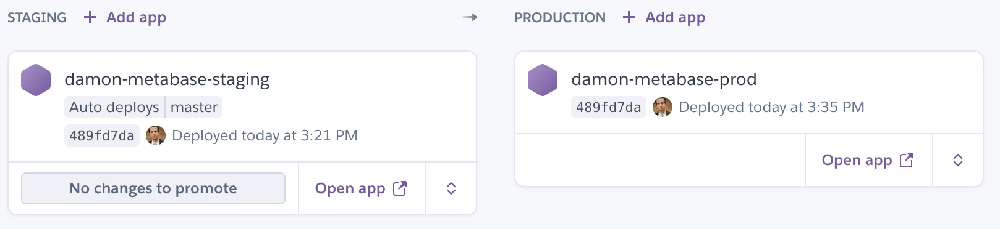

# Running Metabase on Heroku

Heroku is a great place to evaluate Metabase and take it for a quick spin with just a click of a button and a couple minutes of waiting time.  If you decide to keep your Metabase running long term we recommend some upgrades as noted below to avoid limitations of the Heroku free tier.


### Launching Metabase

Before doing anything you should make sure you have a [Heroku](http://www.heroku.com) account that you can access.

If you've got a Heroku account then all there is to do is follow this one-click deployment button

[](https://downloads.metabase.com/launch-heroku.html)

This will launch a Heroku deployment using a GitHub repository that Metabase maintains.

It should only take a few minutes for Metabase to start. You can check on the progress by viewing the logs at [https://dashboard.heroku.com/apps/YOUR_APPLICATION_NAME/logs](https://dashboard.heroku.com/apps/YOUR_APPLICATION_NAME/logs) or using the Heroku command line tool with the `heroku logs -t -a YOUR_APPLICATION_NAME` command.


### Upgrading beyond the `Free` tier

Heroku is very kind and offers a free tier to be used for very small/non-critical workloads which is great if you just want to evaluate Metabase and see what it looks like.  If you like what you see and decide to use Metabase as an ongoing part of your analytics workflow we recommend these upgrades which are quite affordable and will allow you to fully utilize all of Metabase's capabilities without running into annoying limitations.

1. Upgrade your dyno to the `Hobby` tier or one of the professional `Standard` 1x/2x dynos.  The most important reason for this is that your dyno will never sleep and that allows Metabase to run all of its background work such as sending Pulses, syncing metadata, etc, in a reliable fashion.

2. Upgrade your Postgres database to the `Basic` package or for more peace of mind go for the `Standard 0` package.  The primary reason for this upgrade is to get more than the minimum number of database rows offered in the free tier (10k), which we've had some users exhaust within a week.  You'll also get better overall performance along with backups, which we think is worth it.


### Known Limitations

 * Heroku’s 30 second timeouts on all web requests can cause a few issues if you happen to have longer running database queries.  Most people don’t run into this but be aware that it’s possible.
 * When using the `free` tier, if you don’t access the application for a while Heroku will sleep your Metabase environment.  This prevents things like Pulses and Metabase background tasks from running when scheduled and at times makes the app appear to be slow when really it's just Heroku reloading your app.  You can resolve this by upgrading to the `hobby` tier or higher.
 * Sometimes Metabase may run out of memory and you will see messages like `Error R14 (Memory quota exceeded)` in the Heroku logs. If this happens regularly we recommend upgrading to the `standard-2x` tier dyno.

Now that you’ve installed Metabase, it’s time to [set it up and connect it to your database](../setting-up-metabase.md).


### Troubleshooting

* If your Metabase instance is getting stuck part way through the initialization process and only every shows roughly 30% completion on the loading progress.
    * The most likely culprit here is a stale database migrations lock that was not cleared.  This can happen if for some reason Heroku kills your Metabase dyno at the wrong time during startup.  __To fix it:__ you can either clear the lock using the built-in [release-locks](../troubleshooting-guide/application-database.md) command line function, or if needed you can login to your Metabase application database directly and delete the row in the `DATABASECHANGELOGLOCK` table.  Then just restart Metabase.


## Deploying New Versions of Metabase

We currently use a Heroku buildpack for deploying Metabase. The [metabase-deploy](https://github.com/metabase/metabase-deploy) repository is an app that relies on the buildpack and configures various properties for running Metabase on Heroku.

In order to upgrade to the latest version of Metabase on Heroku, you need to trigger a rebuild of your app. Typically this is done by pushing to the Heroku app's Git repository, but because we create the app using a Heroku Button, you'll need to link your app to our repo and push an empty commit.

Here's each step:

* Clone the metabase-deploy repo to your local machine:

```bash
git clone https://github.com/metabase/metabase-deploy.git  
cd metabase-deploy
```

* Add a git remote with your Metabase setup:

```bash
git remote add heroku https://git.heroku.com/<YOUR-APP-NAME>.git
```

* If you are upgrading from a version that is lower than 0.25, add the Metabase buildpack to your Heroku app:

```bash
heroku buildpacks:add https://github.com/metabase/metabase-buildpack
```

* If there have been no new changes to the `metabase-deploy` repository since the last time you deployed Metabase, you will need to add an empty commit. This triggers Heroku to re-deploy the code, fetching the newest version of Metabase in the process.

```bash
git commit --allow-empty -m "empty commit"
git push heroku master
```

* Wait for the deploy to finish

## Testing New Versions using Heroku Pipelines

[Heroku pipelines](https://devcenter.heroku.com/articles/pipelines) are a feature that allow you to share the same codebase across multiple Heroku apps and maintain a continuous delivery pipeline. You can use this feature to test new versions of Metabase before deploying them to production.

In order to do this, you would create two different Metabase apps on Heroku and then create a pipeline with one app in staging and the other in production.



In order to trigger automatic deploys to your staging app, you will need to fork the [metabase-deploy](https://github.com/metabase/metabase-deploy) repository into your own GitHub user or organization and then enable [GitHub Sync](https://devcenter.heroku.com/articles/pipelines#github-sync) on that repository. To do this, connect the pipeline to your forked repository in the pipeline settings, then enable automatic deploys in the app you added to the staging environment.

Now, when you push to master on your forked `metabase-deploy` repository, the changes will automatically be deployed to your staging app! Once you're happy that everything is OK, you can promote the staging app to production using the Heroku UI or CLI.

Similar to the instructions above, to deploy a new version you just need to push an empty commit and the build will pick up the new version.

```bash
git commit --allow-empty -m "Upgrade Metabase"
git push master
```

### Database Syncs

You may want to ensure that your staging database is synced with production before you deploy a new version. Luckily with Heroku you can restore a backup from one app to another. 

For example, assuming your production app is named `awesome-metabase-prod`, this command will create a backup:

```bash
heroku pg:backups:capture --app awesome-metabase-prod
```

Note the backup ID referenced in the above command and use that to restore the database to your staging app, `awesome-metabase-staging`.

```bash
heroku pg:backups:restore awesome-metabase-prod::b101 DATABASE_URL --app awesome-metabase-staging
```

This will restore backup ID `b101` from your prod app to your staging app.

Once this is done, restart your staging app and begin testing.

### Pinning Metabase versions

For whatever reason, should you want to pin Metabase to a specific version, you can append the version number to the buildpack URL (as long as that tag exists in the [`metabase-buildpack`](https://github.com/metabase/metabase-buildpack) repository). 

If you haven't cloned the `metabase-deploy` repository, this can be done with the Heroku CLI:

```bash
heroku buildpacks:set --index 2 https://github.com/metabase/metabase-buildpack#0.34.1 \ 
  --app <YOUR-APP-NAME>
```

If you are using pipelines as shown above, you can modify the `app.json` file in your forked `metabase-deploy` repository to use a tagged buildpack URL for the Metabase buildpack. You can then commit and push that change and promote your app when ready.

```json
  "buildpacks": [
    {
      "url": "heroku/jvm"
    },
    {
      "url": "https://github.com/metabase/metabase-buildpack#0.34.1"
    }
  ]
```