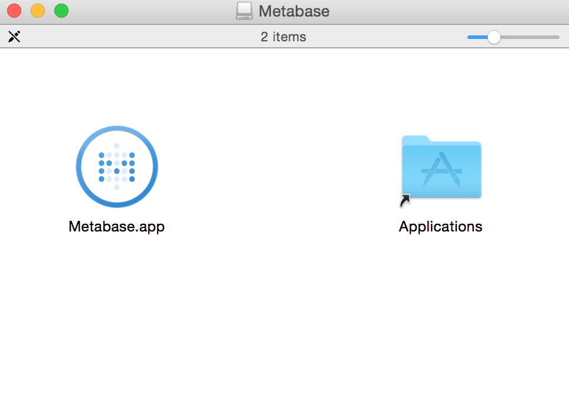
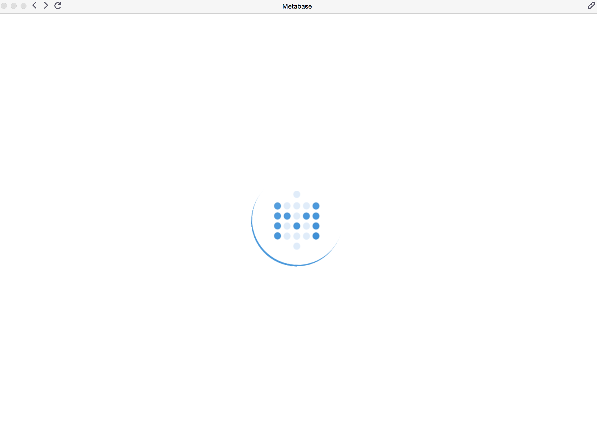
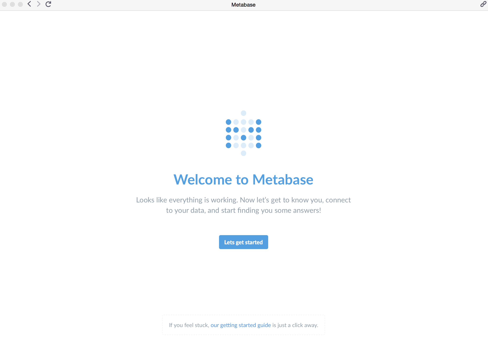

# Running the Metabase Mac Application

The Mac Application is the easiest way to setup Metabase locally on macOS for personal use.
Note that currently the Mac Application is not setup for shared use, so some Metabase features which involve the rest of your team won't be possible.

### Installing the Mac Application

Start off by downloading the [Metabase Mac Application](https://metabase.com/start/mac.html) if you haven't done so already.
Once the download is complete go ahead and double click the file to open it up. You should see something like this:

Next simply click and drag the Metabase.app icon over to the `Applications` folder icon on the left.  That will install Metabase into your main `Applications` folder.

### Launching Metabase

To launch Metabase open the Mac Finder application and click on `Applications` on the left.  Then scroll down your applications list until you see Metabase.app and double click it.

The Metabase application should now have opened and you should see the loading screen in the application window with a spinner going.

Give the application a moment to finish initializing and then you should see the screen change to the Metabase Welcome page.  That's it!  Installation Complete.

Now that you’ve installed Metabase, it’s time to [set it up and connect it to your database](../setting-up-metabase.md).

### The application database

The application database lives on your filesystem, at
`~/Library/Application Support/Metabase/metabase.db.h2.db`

If you want to delete it, back it up, or replace it with an old backup, shut down the application and then delete, copy or replace the file.

Note: depending on when you first started using Metabase the file may be called
`~/Library/Application Support/Metabase/metabase.db.mv.db`
