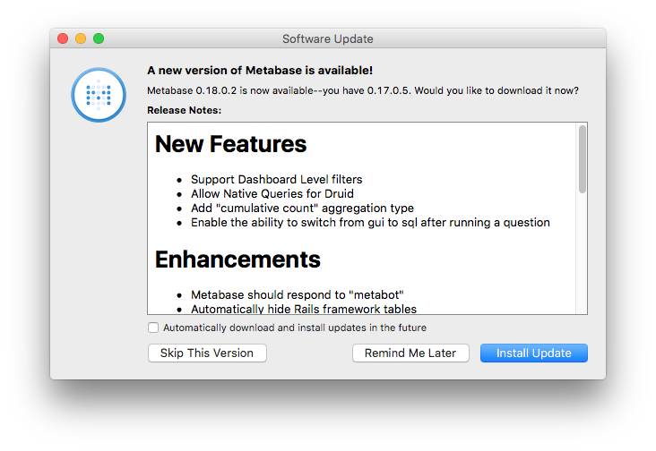

**Covered in this guide:**

*  [How to install Metabase](#installing-and-running-metabase)
*  [How to upgrade Metabase](#upgrading-metabase)
*  [Configuring the application database](#configuring-the-metabase-application-database)
*  [Migrating from using the H2 database to MySQL or Postgres](#migrating-from-using-the-h2-database-to-mysql-or-postgres)
*  [Running database migrations manually](#running-metabase-database-migrations-manually)
*  [Backing up Metabase Application Data](#backing-up-metabase-application-data)
*  [Encrypting your database connection details at rest](#encrypting-your-database-connection-details-at-rest)
*  [Customizing the Metabase Jetty Webserver](#customizing-the-metabase-jetty-webserver)
*  [Changing password complexity](#changing-metabase-password-complexity)
*  [Handling Timezones](#handling-timezones-in-metabase)
*  [Configuring Emoji Logging](#configuring-emoji-logging)
*  [Configuring Logging Level](#configuring-logging-level)
*  [How to setup monitoring via JMX](#monitoring-via-jmx)
*  [A word on Java versions](#java-versions)

# Installing and Running Metabase

Metabase is built and packaged as a Java jar file and can be run anywhere that Java is available.  Below we provide detailed instructions on how to install and run Metabase in a variety of common configurations.

#### [Running the Jar File](running-the-metabase-jar-file.md)
This is the simplest and most basic way of running Metabase.  Here we'll cover the general requirements for running Metabase and provide some information about how to customize your installation for any scenario.

#### [Running the Mac Application](running-the-metabase-mac-app.md)
Metabase provides a binary Mac OS X application for users who are interested in trying Metabase on a Mac system.

#### [Running on Docker](running-metabase-on-docker.md)
If you are using Docker containers and prefer to manage your Metabase installation that way then we've got you covered.  This guide discusses how to use the Metabase Docker image to launch a container running Metabase.

### Cloud Platforms

#### [Running on AWS Elastic Beanstalk](running-metabase-on-elastic-beanstalk.md)
Step-by-step instructions on how to deploy Metabase on Elastic Beanstalk using RDS.  This is the most common way to run Metabase in production.

#### [Running on Heroku](running-metabase-on-heroku.md)
Currently in beta.  We've run Metabase on Heroku and it works just fine, but it's not hardened for production use just yet.  If you're up for it then give it a shot and let us know how we can make it better!

#### [Running on Cloud66](running-metabase-on-cloud66.md)
Community support only at this time, but we have reports of Metabase instances running on Cloud66!

#### [Running on Debian as a service](running-metabase-on-debian.md)
Community support only at this time, but learn how to deploy Metabase as a service on Debian (and Debian-based) systems. Simple, guided, step-by-step approach that will work on any VPS.

#### [Running on Kubernetes](running-metabase-on-kubernetes.md)
Community Helm chart for running Metabase on Kubernetes

# Upgrading Metabase

Before you attempt to upgrade Metabase, you should make a backup of the application database just in case. While it is unlikely you will need to roll back, it will do wonders for your peace of mind.

How you upgrade Metabase depends on how you are running it. See below for information on how to update Metabase on managed platforms.

### Specific Platforms


#### Docker Image
If you are running Metabase via docker, then you simply need to kill the Docker process and start a new container with the latest Metabase image. On startup, Metabase will perform any upgrade tasks it needs to perform, and once it's finished you'll be running the new version.

#### Jar file
If you are running the JVM Jar file directly, then you simply kill the process, replace the .jar file with the newer version and restart the server. On startup, Metabase will perform any upgrade tasks it needs to perform, and once it's finished you'll be running the new version.


#### macOS Application
If you are using the Metabase macOS app, you will be notified when there is a new version available. You will see a dialog displaying the changes in the latest version and prompting you to upgrade.



#### [Upgrading AWS Elastic Beanstalk deployments](running-metabase-on-elastic-beanstalk.html#deploying-new-versions-of-metabase)
Step-by-step instructions on how to upgrade Metabase running on Elastic Beanstalk using RDS.

#### [Upgrading Heroku deployments](running-metabase-on-heroku.html#deploying-new-versions-of-metabase)
Step-by-step instructions on how to upgrade Metabase running on Heroku.

# Configuring the Metabase Application Database

The application database is where Metabase stores information about users, saved questions, dashboards, and any other data needed to run the application.  The default settings use an embedded H2 database, but this is configurable.

**NOTE:** you cannot change the application database while the application is running.  these values are read only once when the application starts up and will remain constant throughout the running of the application.

**NOTE:** currently Metabase does not provide automated support for migrating data from one application database to another, so if you start with H2 and then want to move to Postgres you'll have to dump the data from H2 and import it into Postgres before relaunching the application.

#### [H2](http://www.h2database.com/) (default)

To use the H2 database for your Metabase instance you don't need to do anything at all.  When the application is first launched it will attempt to create a new H2 database in the same filesystem location the application is launched from.

You can see these database files from the terminal:

    ls metabase.*

You should see the following files:

    metabase.db.h2.db  # Or metabase.db.mv.db depending on when you first started using Metabase.
    metabase.db.trace.db

If for any reason you want to use an H2 database file in a separate location from where you launch Metabase you can do so using an environment variable.  For example:

    export MB_DB_TYPE=h2
    export MB_DB_FILE=/the/path/to/my/h2.db
    java -jar metabase.jar

Note that H2 automatically appends `.mv.db` or `.h2.db` to the path you specify; do not include those in you path! In other words, `MB_DB_FILE` should be something like `/path/to/metabase.db`, rather than something like `/path/to/metabase.db.mv.db` (even though this is the file that actually gets created).

#### [Postgres](http://www.postgresql.org/)

**For production installations of Metabase we recommend that users replace the H2 database with a more robust option such as Postgres.** This offers a greater degree of performance and reliability when Metabase is running with many users.

You can change the application database to use Postgres using a few simple environment variables. For example:

    export MB_DB_TYPE=postgres
    export MB_DB_DBNAME=metabase
    export MB_DB_PORT=5432
    export MB_DB_USER=<username>
    export MB_DB_PASS=<password>
    export MB_DB_HOST=localhost
    java -jar metabase.jar

This will tell Metabase to look for its application database using the supplied Postgres connection information.


#### [MySQL](http://www.mysql.com/)
If you prefer to use MySQL we've got you covered.  You can change the application database to use MySQL using these environment variables. For example:

    export MB_DB_TYPE=mysql
    export MB_DB_DBNAME=metabase
    export MB_DB_PORT=3306
    export MB_DB_USER=<username>
    export MB_DB_PASS=<password>
    export MB_DB_HOST=localhost
    java -jar metabase.jar

This will tell Metabase to look for its application database using the supplied MySQL connection information.


# Migrating from using the H2 database to MySQL or Postgres

If you decide to use the default application database (H2) when you initially start using Metabase, but later decide that you'd like to switch to a more production-ready database such as MySQL or Postgres, we make the transition easy for you.

Metabase provides a custom migration command for upgrading H2 application database files by copying their data to a new database. Here's what you'll want to do:

1. Shutdown your Metabase instance so that it's not running. This ensures no accidental data gets written to the db while migrating.
2. Make a backup copy of your H2 application database by following the instructions in [Backing up Metabase Application Data](#backing-up-metabase-application-data). Safety first!
3. Run the Metabase data migration command using the appropriate environment variables for the target database you want to migrate to.  You can find details about specifying MySQL and Postgres databases at [Configuring the application database](#configuring-the-metabase-application-database). Here's an example of migrating to Postgres:

```
export MB_DB_TYPE=postgres
export MB_DB_DBNAME=metabase
export MB_DB_PORT=5432
export MB_DB_USER=<username>
export MB_DB_PASS=<password>
export MB_DB_HOST=localhost
java -jar metabase.jar load-from-h2 /path/to/metabase.db # do not include .mv.db or .h2.db suffix
```

It is expected that you will run the command against a brand-new (empty!) database; Metabase will handle all of the work of creating the database schema and migrating the data for you.

###### Notes

*  It is required that you can connect to the target MySQL or Postgres database in whatever environment you are running this migration command in. So, if you are attempting to move the data to a cloud database, make sure you take that into consideration.
*  The code that handles these migrations uses a Postgres SQL command that is only available in Postgres 9.4 or newer versions. Please make sure you Postgres database is version 9.4 or newer.
*  H2 automatically adds a `.h2.db` or `.mv.db` extension to the database path you specify, so make sure the path to the DB file you pass to the command *does not* include it. For example, if you have a file named `/path/to/metabase.db.h2.db`, call the command with `load-from-h2 /path/to/metabase.db`.


# Running Metabase database migrations manually

When Metabase is starting up, it will typically attempt to determine if any changes are required to the application database, and, if so, will execute those changes automatically.  If for some reason you wanted to see what these changes are and run them manually on your database then we let you do that.

Simply set the following environment variable before launching Metabase:

    export MB_DB_AUTOMIGRATE=false

When the application launches, if there are necessary database changes, you'll receive a message like the following which will indicate that the application cannot continue starting up until the specified upgrades are made:

    2015-12-01 12:45:45,805 [INFO ] metabase.db :: Database Upgrade Required

    NOTICE: Your database requires updates to work with this version of Metabase.  Please execute the following sql commands on your database before proceeding.

    -- *********************************************************************
    -- Update Database Script
    -- *********************************************************************
    -- Change Log: migrations/liquibase.yaml
    -- Ran at: 12/1/15 12:45 PM
    -- Against: @jdbc:h2:file:/Users/agilliland/workspace/metabase/metabase/metabase.db
    -- Liquibase version: 3.4.1
    -- *********************************************************************

    -- Create Database Lock Table
    CREATE TABLE PUBLIC.DATABASECHANGELOGLOCK (ID INT NOT NULL, LOCKED BOOLEAN NOT NULL, LOCKGRANTED TIMESTAMP, LOCKEDBY VARCHAR(255), CONSTRAINT PK_DATABASECHANGELOGLOCK PRIMARY KEY (ID));

    ...

    Once your database is updated try running the application again.

    2015-12-01 12:46:39,489 [INFO ] metabase.core :: Metabase Shutting Down ...

You can then take the supplied SQL script and apply it to your database manually.  Once that's done just restart Metabase and everything should work normally.


# Backing up Metabase Application Data

If you are using Metabase in a production environment or simply want to make sure you don't lose any of the work that you've done, then backups are what you need.

Metabase uses a single SQL database for all of its runtime application data, so all you need to do is backup that database and you're good to go.  From a database back-up you can restore any Metabase installation.

### H2 Embedded Database (default)
If you launched Metabase on a laptop or PC the application will create an embedded H2 database in the directory it is being run in.  Navigate to the directory where you started Metabase from and find the file named `metabase.db.h2.db` or `metabase.db.mv.db` (you will see one of the two depending on when you first started using Metabase).  Simply copy that file somewhere safe and you are all backed up!

NOTE: If your Metabase is currently running it's best to shut down the Metabase process before making a backup copy of the file.  Then, restart the application.

### Amazon RDS for the Database Application
Amazon has its own best practices on how to backup and restore RDS databases, so we'll defer to them.  We recommend that you enable automated RDS Backups.

Instructions can be found in the [Amazon RDS User Guide](http://docs.aws.amazon.com/AmazonRDS/latest/UserGuide/USER_WorkingWithAutomatedBackups.html).

### Self-managed PostgreSQL or MySQL database
Simply follow the same instructions you would use for making any normal database backup.  It's a large topic more fit for a DBA to answer, but as long as you have a dump of the Metabase database you'll be good to go.


# Encrypting your database connection details at rest

Metabase stores connection information for the various databases you add in the Metabase application database. To prevent bad actors from being able to access these details if they were to gain access to
the application DB, Metabase can automatically encrypt them when they are saved, and decrypt them on-the-fly whenever they are needed. The only thing you need to do is set the environment variable
`MB_ENCRYPTION_SECRET_KEY`.

Your secret key must be at least 16 characters (longer is even better!), and we recommend using a secure random key generator to generate it. `openssl` is a good choice:

    openssl rand -base64 32

This gives you a cryptographically-secure, randomly-generated 32-character key that will look something like `IYqrSi5QDthvFWe4/WdAxhnra5DZC3RKx3ZSrOJDKsM=`. Set it as an environment variable and
start Metabase as usual:

    MB_ENCRYPTION_SECRET_KEY='IYqrSi5QDthvFWe4/WdAxhnra5DZC3RKx3ZSrOJDKsM=' java -jar metabase.jar

Metabase will securely encrypt and store the connection details for any new Databases you add. (Connection details for existing databases will be encrypted as well if you save them in the admin panel).
Existing databases with unencrypted details will continue to work normally.

Take care not to lose this key because you can't decrypt connection details without it. If you lose (or change) it, you'll have to reset all of the connection details that have been encrypted with it in the Admin Panel.


# Customizing the Metabase Jetty webserver

In most cases there will be no reason to modify any of the settings around how Metabase runs its embedded Jetty webserver to host the application, but if you wish to run HTTPS directly with your Metabase server or if you need to run on another port, that's all configurable.

### Running Metabase on another port

By default Metabase will launch on port 3000, but if you prefer to run the application on another port you can do so by setting the following environment variable:

    export MB_JETTY_PORT=12345
    java -jar metabase.jar

In this example once the application starts up you will access it on port `12345` instead of the default port of 3000.


### Listening on a specific network interface

By default, Metabase will be listening on `localhost`.  In some production environments you may want to listen on a different interface, which can be done by using the `MB_JETTY_HOST` environment variable:

    export MB_JETTY_HOST=0.0.0.0
    java -jar metabase.jar


### Using HTTPS with Metabase

If you have an ssl certificate and would prefer to have Metabase run over HTTPS directly using its webserver you can do so by using the following environment variables:

    export MB_JETTY_SSL="true"
    export MB_JETTY_SSL_Port="8443"
    export MB_JETTY_SSL_Keystore="path/to/keystore.jks"
    export MB_JETTY_SSL_Keystore_Password="storepass"
    java -jar metabase.jar

With the above settings applied you will be running Metabase on port 8443 over HTTPS using the supplied certificate.  #secured


# Changing Metabase password complexity

Metabase offers a couple controls for administrators who prefer to increase the password requirements on their user accounts.

    export MB_PASSWORD_COMPLEXITY=strong
    export MB_PASSWORD_LENGTH=10

The settings above can be used independently, so it's fine to use only one or the other.  By default Metabase use complexity = `normal` and a password length of 6.  The following options are available for complexity choice:

* `weak` = no character constraints
* `normal` = at least 1 digit
* `strong` = minimum 8 characters w/ 2 lowercase, 2 uppercase, 1 digit, and 1 special character


# Handling timezones in Metabase

Metabase does its best to ensure proper and accurate reporting in whatever timezone you desire, but timezones are a complicated beast so it's important to abide by some recommendations listed below to ensure your reports come out as intended.

The following places where timezones are set can all impact the data you see:

* `Database` - includes global database timezone settings, specific column type settings, and even individual data values.
* `OS & JVM` - on whatever system is running Metabase the timezone settings of the Operating System as well as the Java Virtual Machine can impact your reports.
* `Metabase` - inside Metabase the reporting timezone setting (if set) will influence how your data is reported.

To ensure proper reporting it's important that timezones be set consistently in all places.  Metabase recommends the following settings:

* Make sure all of your database columns are properly setup to include timezone awareness.
* Unless you have a special need it's best to set your database reporting timezone to UTC and store all of your date/time related values in UTC.
* Configure your JVM to use the same timezone you want to use for reporting, which ideally should also match the timezone of your database.
* Set the Metabase `Report Timezone` to match the timezone you want to see your reports in, again, this should match the rest of the timezone settings you've made.


Common Pitfalls:

1. Your database is using date/time columns without any timezone information.  Typically when this happens your database will assume all the data is from whatever timezone the database is configured in or possible just default to UTC (check your database vendor to be sure).
2. Your JVM timezone is not the same as your Metabase `Report Timezone` choice.  This is a very common issue and can be corrected by launching java with the `-Duser.timezone=<timezone>` option properly set to match your Metabase report timezone.


# Configuring Emoji Logging

By default Metabase will include emoji characters in logs. You can disable this by using the following environment variable:

    export MB_EMOJI_IN_LOGS="false"
    java -jar metabase.jar

# Configuring Logging Level

By default, Metabase logs quite a bit of information. Luckily, Metabase uses [Log4j](http://logging.apache.org/log4j) under the hood, meaning the logging is completely configurable.

Metabase's default logging configuration can be found [here](https://github.com/metabase/metabase/blob/master/resources/log4j.properties). You can override this properties file and tell
Metabase to use your own logging configuration file by passing a `-Dlog4j.configuration` argument when running Metabase:

    java -Dlog4j.configuration=file:/path/to/custom/log4j.properties -jar metabase.jar

The easiest way to get started customizing logging would be to use a copy of default `log4j.properties` file linked to above and adjust that to meet your needs. Keep in mind that you'll need to restart Metabase for changes to the file to take effect.

# [Monitoring via JMX](enable-jmx.md)

Diagnosing performance related issues can be a challenge. Luckily the JVM ships with tools that can help diagnose many common issues. Enabling JMX and using a tool like VisualVM can help diagnose issues related to running out of memory, a hung Metabase instance and slow response times. See [Monitoring via JMX](enable-jmx.md) for more information on setting this up.

# Java Versions

Metabase will run on Java version 8 or greater; Java 8 is the easiest and most common choice.

## Running on Java 8

Running on Java 8 is the easiest path to running Metabase. There are no additional parameters required, if launching from a Jar the below invocation will work:

    java -jar metabase.jar

## Running on Java 9 or Newer

To use Metabase on Java 9 with Oracle, Vertica, SparkSQL, or other drivers that require external dependencies,
you'll need to tweak the way you launch Metabase.

Java version 9 has introduced a new module system that places some additional restrictions on class loading. To use
Metabase drivers that require extra external dependencies, you'll need to include them as part of the classpath at
launch time. Run Metabase as follows:

```bash
# Unix
java -cp metabase.jar:plugins/* metabase.core
```

On Windows, use a semicolon instead:

```powershell
# Windows
java -cp metabase.jar;plugins/* metabase.core
```

The default Docker images use Java 8 so this step is only needed when running the JAR directly.
