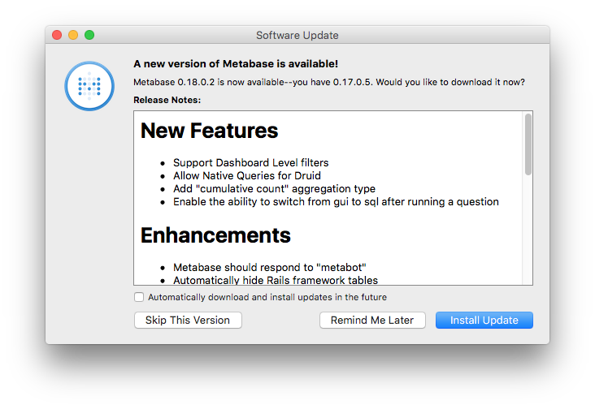

# Upgrading Metabase

Before you attempt to upgrade Metabase, you should make a backup of the application database just in case. While it is unlikely you will need to roll back, it will do wonders for your peace of mind.

How you upgrade Metabase depends on how you are running it. See below for information on how to update Metabase on managed platforms.

### Specific Platforms

#### Docker Image

If you are running Metabase via docker, then you simply need to kill the Docker process and start a new container with the latest Metabase image. On startup, Metabase will perform any upgrade tasks it needs to perform, and once it's finished you'll be running the new version.

To pull the latest Metabase:

    $ docker pull metabase/metabase:latest

#### Jar file

If you are running the JVM Jar file directly, then you simply kill the process, replace the .jar file with the newer version and restart the server. On startup, Metabase will perform any upgrade tasks it needs to perform, and once it's finished you'll be running the new version.

#### macOS Application

If you are using the Metabase macOS app, you will be notified when there is a new version available. You will see a dialog displaying the changes in the latest version and prompting you to upgrade.

#### [Upgrading AWS Elastic Beanstalk deployments](running-metabase-on-elastic-beanstalk.html#deploying-new-versions-of-metabase)

Step-by-step instructions on how to upgrade Metabase running on Elastic Beanstalk using RDS.

#### [Upgrading Heroku deployments](running-metabase-on-heroku.html#deploying-new-versions-of-metabase)

Step-by-step instructions on how to upgrade Metabase running on Heroku.
